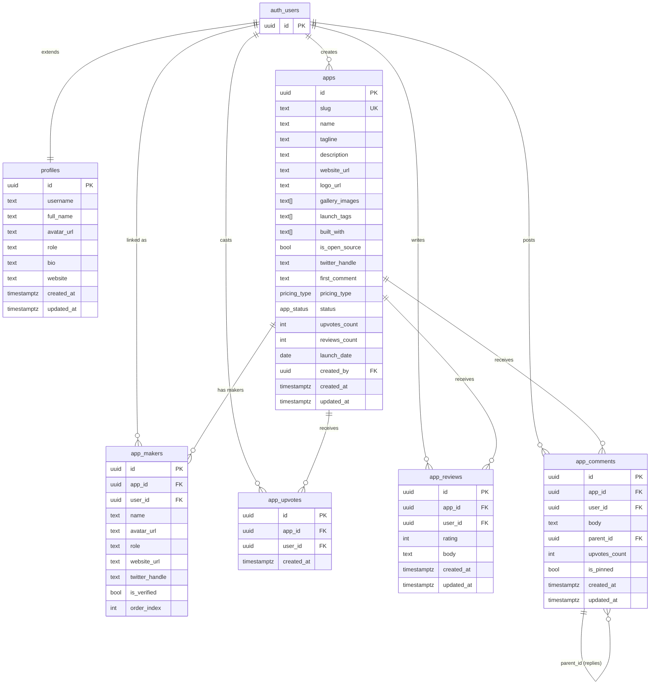

# Phase 1 — Database Schema: Apphunt (Product Hunt Clone)

> **Project:** Apphunt — Platform penemuan aplikasi buatan developer Indonesia  
> **Migration file:** `supabase/migrations/003_apps.sql`  
> **Depends on:** `000_profiles.sql` (auth, profiles, `handle_updated_at()`), `001_bansos.sql`  
> **Status:** Ready for implementation  
> **Last updated:** 2026-06-28

---

## Table of Contents

1. [Overview & Goals](#1-overview--goals)
2. [Entity Relationship Diagram](#2-entity-relationship-diagram)
3. [Full SQL Migration — `003_apps.sql`](#3-full-sql-migration--003_appssql)
4. [Row Level Security Policies](#4-row-level-security-policies)
5. [Supabase Storage Setup](#5-supabase-storage-setup)
6. [Cached Counter Strategy](#6-cached-counter-strategy)
7. [Slug Generation Logic](#7-slug-generation-logic)
8. [Seed Data](#8-seed-data)
9. [Rollback Script](#9-rollback-script)
10. [Definition of Done Checklist](#10-definition-of-done-checklist)
11. [Performance Considerations](#11-performance-considerations)
12. [Migration Execution Instructions](#12-migration-execution-instructions)

---

## 1. Overview & Goals

### What Phase 1 Delivers

Phase 1 establishes the **complete data foundation** for the Apphunt feature — a Product Hunt-style app discovery platform built for the Indonesian developer ecosystem. When this migration is applied, the database will be fully capable of powering:

- App submission and review workflow (pending → live → rejected)
- Public app listing with sort-by-upvotes and sort-by-date
- Upvoting system with one-vote-per-user enforcement
- Star ratings and text reviews
- Threaded comments with nested replies
- Multiple makers per app (team submissions)
- Asset storage for logos and gallery screenshots
- Cached counters for high-performance read queries

### Design Principles

| Principle | Decision |
|---|---|
| **Correctness over cleverness** | All constraints enforced at DB level, not just app level |
| **Read-heavy optimization** | Cached `upvotes_count` + `reviews_count` avoids `COUNT(*)` joins on every list render |
| **RLS as the security layer** | No row can be read/written by the wrong user, regardless of client code |
| **Additive migrations** | `003_apps.sql` adds only new objects; it never touches `000_profiles.sql` or `001_bansos.sql` |
| **Slug uniqueness** | Auto-generated at DB level via function; collisions resolved with `-2`, `-3` suffixes |
| **Indonesian-first** | `launch_tags`, `built_with`, and seed data all use Indonesian context |

### Scope Boundaries

**In scope for Phase 1:**
- All 5 tables: `apps`, `app_makers`, `app_upvotes`, `app_reviews`, `app_comments`
- Enums, indexes, triggers, RLS policies
- Storage bucket `app-assets` with upload policies
- Seed data (5 sample apps)

**Out of scope (future phases):**
- App submission form UI (Phase 2)
- App detail page UI (Phase 2)
- Notification system on upvotes/comments
- Featured/sponsored app slots
- Tag taxonomy table (currently `text[]` for simplicity)
- Search via `pg_trgm` full-text (Phase 3)

---

## 2. Entity Relationship Diagram



### Relationship Notes

| Relationship | Cardinality | Notes |
|---|---|---|
| `auth.users` → `profiles` | 1:1 | Auto-created via `handle_new_user()` trigger from `000_profiles.sql` |
| `auth.users` → `apps` | 1:N | One user can submit many apps |
| `apps` → `app_makers` | 1:N | One app can have multiple maker credits |
| `app_makers` → `auth.users` | N:0..1 | `user_id` is **nullable** — makers can be listed without a platform account |
| `apps` → `app_upvotes` | 1:N | UNIQUE(app_id, user_id) enforces one vote per user |
| `apps` → `app_reviews` | 1:N | One review per user per app (enforced via UNIQUE constraint) |
| `apps` → `app_comments` | 1:N | Flat list; `parent_id` self-reference enables threaded replies |
| `app_comments` → `app_comments` | 1:N (self) | Max recommended nesting depth: 2 levels (enforced in app logic, not DB) |

---

## 3. Full SQL Migration — `003_apps.sql`

The complete migration is designed to be **idempotent** — safe to re-run using `IF NOT EXISTS` and `CREATE OR REPLACE` guards throughout. Copy the entire block below into `supabase/migrations/003_apps.sql`.

```sql
-- ============================================================
-- 003_apps.sql
-- Apphunt: App discovery platform (Product Hunt clone)
-- Requires: 000_profiles.sql (profiles table, handle_updated_at())
-- Tables: apps, app_makers, app_upvotes, app_reviews, app_comments
-- ============================================================

-- ── Enums ────────────────────────────────────────────────────

DO $$ BEGIN
  CREATE TYPE public.pricing_type AS ENUM (
    'free',
    'paid',
    'freemium',
    'free_options'
  );
EXCEPTION
  WHEN duplicate_object THEN NULL;
END $$;

DO $$ BEGIN
  CREATE TYPE public.app_status AS ENUM (
    'pending',
    'live',
    'rejected'
  );
EXCEPTION
  WHEN duplicate_object THEN NULL;
END $$;

-- ── apps ─────────────────────────────────────────────────────

CREATE TABLE IF NOT EXISTS public.apps (
  id               uuid          PRIMARY KEY DEFAULT gen_random_uuid(),
  slug             text          UNIQUE NOT NULL,
  name             text          NOT NULL CHECK (char_length(name) BETWEEN 2 AND 60),
  tagline          text          NOT NULL CHECK (char_length(tagline) BETWEEN 10 AND 120),
  description      text          CHECK (char_length(description) <= 5000),
  website_url      text          CHECK (website_url ~* '^https?://'),
  logo_url         text,
  gallery_images   text[]        NOT NULL DEFAULT '{}',
  launch_tags      text[]        NOT NULL DEFAULT '{}'
                                 CHECK (array_length(launch_tags, 1) IS NULL
                                        OR array_length(launch_tags, 1) <= 3),
  built_with       text[]        NOT NULL DEFAULT '{}',
  is_open_source   boolean       NOT NULL DEFAULT false,
  twitter_handle   text          CHECK (twitter_handle ~* '^@?[A-Za-z0-9_]{1,15}$'),
  first_comment    text          CHECK (char_length(first_comment) <= 1000),
  pricing_type     public.pricing_type NOT NULL DEFAULT 'free',
  status           public.app_status   NOT NULL DEFAULT 'pending',
  upvotes_count    integer       NOT NULL DEFAULT 0 CHECK (upvotes_count >= 0),
  reviews_count    integer       NOT NULL DEFAULT 0 CHECK (reviews_count >= 0),
  launch_date      date          NOT NULL DEFAULT CURRENT_DATE,
  created_by       uuid          NOT NULL REFERENCES auth.users(id) ON DELETE CASCADE,
  created_at       timestamptz   NOT NULL DEFAULT now(),
  updated_at       timestamptz   NOT NULL DEFAULT now()
);

CREATE TRIGGER apps_updated_at
  BEFORE UPDATE ON public.apps
  FOR EACH ROW EXECUTE PROCEDURE public.handle_updated_at();

-- ── app_makers ───────────────────────────────────────────────

CREATE TABLE IF NOT EXISTS public.app_makers (
  id              uuid          PRIMARY KEY DEFAULT gen_random_uuid(),
  app_id          uuid          NOT NULL REFERENCES public.apps(id) ON DELETE CASCADE,
  user_id         uuid          REFERENCES auth.users(id) ON DELETE SET NULL,
  name            text          NOT NULL CHECK (char_length(name) BETWEEN 1 AND 80),
  avatar_url      text,
  role            text          NOT NULL DEFAULT 'Maker'
                                CHECK (char_length(role) BETWEEN 1 AND 60),
  website_url     text          CHECK (website_url ~* '^https?://'),
  twitter_handle  text          CHECK (twitter_handle ~* '^@?[A-Za-z0-9_]{1,15}$'),
  is_verified     boolean       NOT NULL DEFAULT false,
  order_index     integer       NOT NULL DEFAULT 0
);

-- ── app_upvotes ──────────────────────────────────────────────

CREATE TABLE IF NOT EXISTS public.app_upvotes (
  id          uuid          PRIMARY KEY DEFAULT gen_random_uuid(),
  app_id      uuid          NOT NULL REFERENCES public.apps(id) ON DELETE CASCADE,
  user_id     uuid          NOT NULL REFERENCES auth.users(id) ON DELETE CASCADE,
  created_at  timestamptz   NOT NULL DEFAULT now(),
  CONSTRAINT app_upvotes_unique UNIQUE (app_id, user_id)
);

-- ── app_reviews ──────────────────────────────────────────────

CREATE TABLE IF NOT EXISTS public.app_reviews (
  id          uuid          PRIMARY KEY DEFAULT gen_random_uuid(),
  app_id      uuid          NOT NULL REFERENCES public.apps(id) ON DELETE CASCADE,
  user_id     uuid          NOT NULL REFERENCES auth.users(id) ON DELETE CASCADE,
  rating      integer       NOT NULL CHECK (rating BETWEEN 1 AND 5),
  body        text          CHECK (char_length(body) <= 2000),
  created_at  timestamptz   NOT NULL DEFAULT now(),
  updated_at  timestamptz   NOT NULL DEFAULT now(),
  CONSTRAINT app_reviews_unique UNIQUE (app_id, user_id)
);

CREATE TRIGGER app_reviews_updated_at
  BEFORE UPDATE ON public.app_reviews
  FOR EACH ROW EXECUTE PROCEDURE public.handle_updated_at();

-- ── app_comments ─────────────────────────────────────────────

CREATE TABLE IF NOT EXISTS public.app_comments (
  id             uuid          PRIMARY KEY DEFAULT gen_random_uuid(),
  app_id         uuid          NOT NULL REFERENCES public.apps(id) ON DELETE CASCADE,
  user_id        uuid          NOT NULL REFERENCES auth.users(id) ON DELETE CASCADE,
  body           text          NOT NULL CHECK (char_length(body) BETWEEN 1 AND 2000),
  parent_id      uuid          REFERENCES public.app_comments(id) ON DELETE CASCADE,
  upvotes_count  integer       NOT NULL DEFAULT 0 CHECK (upvotes_count >= 0),
  is_pinned      boolean       NOT NULL DEFAULT false,
  created_at     timestamptz   NOT NULL DEFAULT now(),
  updated_at     timestamptz   NOT NULL DEFAULT now()
);

CREATE TRIGGER app_comments_updated_at
  BEFORE UPDATE ON public.app_comments
  FOR EACH ROW EXECUTE PROCEDURE public.handle_updated_at();
```


### 3.1 Indexes

```sql
-- ── Indexes ──────────────────────────────────────────────────

-- apps: primary lookup patterns
CREATE INDEX IF NOT EXISTS apps_slug_idx          ON public.apps(slug);
CREATE INDEX IF NOT EXISTS apps_created_by_idx    ON public.apps(created_by);
CREATE INDEX IF NOT EXISTS apps_status_idx        ON public.apps(status);
CREATE INDEX IF NOT EXISTS apps_launch_date_idx   ON public.apps(launch_date DESC);
CREATE INDEX IF NOT EXISTS apps_upvotes_count_idx ON public.apps(upvotes_count DESC);
-- Composite: the most common list query — live apps sorted by upvotes
CREATE INDEX IF NOT EXISTS apps_status_upvotes_idx
  ON public.apps(status, upvotes_count DESC)
  WHERE status = 'live';
-- Composite: live apps by date (Today's launches feed)
CREATE INDEX IF NOT EXISTS apps_status_date_idx
  ON public.apps(status, launch_date DESC)
  WHERE status = 'live';

-- app_makers
CREATE INDEX IF NOT EXISTS app_makers_app_id_idx   ON public.app_makers(app_id);
CREATE INDEX IF NOT EXISTS app_makers_user_id_idx  ON public.app_makers(user_id);
CREATE INDEX IF NOT EXISTS app_makers_order_idx    ON public.app_makers(app_id, order_index);

-- app_upvotes
CREATE INDEX IF NOT EXISTS app_upvotes_app_id_idx  ON public.app_upvotes(app_id);
CREATE INDEX IF NOT EXISTS app_upvotes_user_id_idx ON public.app_upvotes(user_id);

-- app_reviews
CREATE INDEX IF NOT EXISTS app_reviews_app_id_idx  ON public.app_reviews(app_id);
CREATE INDEX IF NOT EXISTS app_reviews_user_id_idx ON public.app_reviews(user_id);
CREATE INDEX IF NOT EXISTS app_reviews_rating_idx  ON public.app_reviews(rating);

-- app_comments
CREATE INDEX IF NOT EXISTS app_comments_app_id_idx    ON public.app_comments(app_id);
CREATE INDEX IF NOT EXISTS app_comments_user_id_idx   ON public.app_comments(user_id);
CREATE INDEX IF NOT EXISTS app_comments_parent_id_idx ON public.app_comments(parent_id);
-- Pinned comment fast lookup (only one per app expected)
CREATE INDEX IF NOT EXISTS app_comments_pinned_idx
  ON public.app_comments(app_id, is_pinned)
  WHERE is_pinned = true;
```

### 3.2 Slug Generation Function

```sql
-- ── Slug generation ──────────────────────────────────────────

CREATE OR REPLACE FUNCTION public.generate_app_slug(p_name text)
RETURNS text
LANGUAGE plpgsql
AS $$
DECLARE
  v_base_slug  text;
  v_slug       text;
  v_counter    integer := 2;
BEGIN
  -- 1. Lowercase
  v_base_slug := lower(p_name);

  -- 2. Replace Indonesian/accented characters
  v_base_slug := translate(v_base_slug,
    'àáâãäåæçèéêëìíîïðñòóôõöøùúûüýþÿ',
    'aaaaaaaceeeeiiiidnoooooouuuuyby'
  );

  -- 3. Replace any non-alphanumeric characters (spaces, symbols) with hyphens
  v_base_slug := regexp_replace(v_base_slug, '[^a-z0-9]+', '-', 'g');

  -- 4. Trim leading/trailing hyphens
  v_base_slug := trim(both '-' from v_base_slug);

  -- 5. Truncate to 60 chars max before suffix
  v_base_slug := left(v_base_slug, 60);

  -- 6. Attempt slug, resolve collisions with -2, -3, ...
  v_slug := v_base_slug;
  WHILE EXISTS (SELECT 1 FROM public.apps WHERE slug = v_slug) LOOP
    v_slug := v_base_slug || '-' || v_counter;
    v_counter := v_counter + 1;
  END LOOP;

  RETURN v_slug;
END;
$$;

-- Trigger: auto-generate slug on INSERT if not supplied
CREATE OR REPLACE FUNCTION public.handle_app_slug()
RETURNS trigger
LANGUAGE plpgsql
AS $$
BEGIN
  IF NEW.slug IS NULL OR trim(NEW.slug) = '' THEN
    NEW.slug := public.generate_app_slug(NEW.name);
  END IF;
  RETURN NEW;
END;
$$;

DROP TRIGGER IF EXISTS apps_auto_slug ON public.apps;
CREATE TRIGGER apps_auto_slug
  BEFORE INSERT ON public.apps
  FOR EACH ROW EXECUTE PROCEDURE public.handle_app_slug();
```

### 3.3 Cached Counter Trigger Functions

```sql
-- ── Cached counter: upvotes_count ────────────────────────────

CREATE OR REPLACE FUNCTION public.handle_upvote_count()
RETURNS trigger
LANGUAGE plpgsql
SECURITY DEFINER SET search_path = public
AS $$
BEGIN
  IF TG_OP = 'INSERT' THEN
    UPDATE public.apps
    SET upvotes_count = upvotes_count + 1
    WHERE id = NEW.app_id;
    RETURN NEW;
  ELSIF TG_OP = 'DELETE' THEN
    UPDATE public.apps
    SET upvotes_count = GREATEST(upvotes_count - 1, 0)
    WHERE id = OLD.app_id;
    RETURN OLD;
  END IF;
  RETURN NULL;
END;
$$;

DROP TRIGGER IF EXISTS app_upvotes_count_trigger ON public.app_upvotes;
CREATE TRIGGER app_upvotes_count_trigger
  AFTER INSERT OR DELETE ON public.app_upvotes
  FOR EACH ROW EXECUTE PROCEDURE public.handle_upvote_count();

-- ── Cached counter: reviews_count ────────────────────────────

CREATE OR REPLACE FUNCTION public.handle_review_count()
RETURNS trigger
LANGUAGE plpgsql
SECURITY DEFINER SET search_path = public
AS $$
BEGIN
  IF TG_OP = 'INSERT' THEN
    UPDATE public.apps
    SET reviews_count = reviews_count + 1
    WHERE id = NEW.app_id;
    RETURN NEW;
  ELSIF TG_OP = 'DELETE' THEN
    UPDATE public.apps
    SET reviews_count = GREATEST(reviews_count - 1, 0)
    WHERE id = OLD.app_id;
    RETURN OLD;
  END IF;
  RETURN NULL;
END;
$$;

DROP TRIGGER IF EXISTS app_reviews_count_trigger ON public.app_reviews;
CREATE TRIGGER app_reviews_count_trigger
  AFTER INSERT OR DELETE ON public.app_reviews
  FOR EACH ROW EXECUTE PROCEDURE public.handle_review_count();
```

---

## 4. Row Level Security Policies

All five tables have RLS enabled. Policies follow the same naming convention as `000_profiles.sql` and `001_bansos.sql`. The guiding rules are:

- **Anyone** (including anonymous) can read `live` apps and all associated public data
- **Authenticated users** can submit apps (which land in `pending`)
- **Owners** (the `created_by` user) can edit and delete their own apps
- **Admins** (profiles.role = 'admin') can change `status` (approve/reject) — enforced via a separate UPDATE policy
- Upvote, review, and comment writes are always scoped to `auth.uid()`

```sql
-- ============================================================
-- Row Level Security
-- ============================================================

-- ── apps ─────────────────────────────────────────────────────
ALTER TABLE public.apps ENABLE ROW LEVEL SECURITY;

-- Anyone can view live apps
CREATE POLICY "Live apps are publicly viewable"
  ON public.apps FOR SELECT
  USING (status = 'live');

-- Owners can view their own apps regardless of status (to see pending/rejected)
CREATE POLICY "Owners can view their own apps"
  ON public.apps FOR SELECT
  USING (auth.uid() = created_by);

-- Admins can view all apps (to moderate pending submissions)
CREATE POLICY "Admins can view all apps"
  ON public.apps FOR SELECT
  USING (
    EXISTS (
      SELECT 1 FROM public.profiles
      WHERE id = auth.uid() AND role = 'admin'
    )
  );

-- Authenticated users can submit new apps
CREATE POLICY "Authenticated users can submit apps"
  ON public.apps FOR INSERT
  WITH CHECK (
    auth.uid() IS NOT NULL
    AND auth.uid() = created_by
    AND status = 'pending'
  );

-- Owners can update their own apps (but cannot change status themselves)
CREATE POLICY "Owners can update their own apps"
  ON public.apps FOR UPDATE
  USING (auth.uid() = created_by)
  WITH CHECK (
    auth.uid() = created_by
    AND status = 'pending'
  );

-- Admins can update any app (including changing status)
CREATE POLICY "Admins can update any app"
  ON public.apps FOR UPDATE
  USING (
    EXISTS (
      SELECT 1 FROM public.profiles
      WHERE id = auth.uid() AND role = 'admin'
    )
  );

-- Owners can delete their own pending apps
CREATE POLICY "Owners can delete their own pending apps"
  ON public.apps FOR DELETE
  USING (
    auth.uid() = created_by
    AND status = 'pending'
  );

-- Admins can delete any app
CREATE POLICY "Admins can delete any app"
  ON public.apps FOR DELETE
  USING (
    EXISTS (
      SELECT 1 FROM public.profiles
      WHERE id = auth.uid() AND role = 'admin'
    )
  );

-- ── app_makers ───────────────────────────────────────────────
ALTER TABLE public.app_makers ENABLE ROW LEVEL SECURITY;

-- Anyone can view makers of live apps
CREATE POLICY "App makers are publicly viewable for live apps"
  ON public.app_makers FOR SELECT
  USING (
    EXISTS (
      SELECT 1 FROM public.apps
      WHERE id = app_makers.app_id AND status = 'live'
    )
  );

-- Owners can view makers of their own apps regardless of status
CREATE POLICY "Owners can view makers of their own apps"
  ON public.app_makers FOR SELECT
  USING (
    EXISTS (
      SELECT 1 FROM public.apps
      WHERE id = app_makers.app_id AND created_by = auth.uid()
    )
  );

-- App owner can manage makers for their app
CREATE POLICY "App owner can insert makers"
  ON public.app_makers FOR INSERT
  WITH CHECK (
    EXISTS (
      SELECT 1 FROM public.apps
      WHERE id = app_makers.app_id AND created_by = auth.uid()
    )
  );

CREATE POLICY "App owner can update makers"
  ON public.app_makers FOR UPDATE
  USING (
    EXISTS (
      SELECT 1 FROM public.apps
      WHERE id = app_makers.app_id AND created_by = auth.uid()
    )
  );

CREATE POLICY "App owner can delete makers"
  ON public.app_makers FOR DELETE
  USING (
    EXISTS (
      SELECT 1 FROM public.apps
      WHERE id = app_makers.app_id AND created_by = auth.uid()
    )
  );

-- ── app_upvotes ──────────────────────────────────────────────
ALTER TABLE public.app_upvotes ENABLE ROW LEVEL SECURITY;

-- Anyone can select upvotes (needed for count display and checking own vote)
CREATE POLICY "Upvotes are publicly viewable"
  ON public.app_upvotes FOR SELECT
  USING (true);

-- Authenticated users can upvote a live app
CREATE POLICY "Authenticated users can upvote live apps"
  ON public.app_upvotes FOR INSERT
  WITH CHECK (
    auth.uid() IS NOT NULL
    AND auth.uid() = user_id
    AND EXISTS (
      SELECT 1 FROM public.apps
      WHERE id = app_upvotes.app_id AND status = 'live'
    )
  );

-- Users can remove their own upvote
CREATE POLICY "Users can remove their own upvote"
  ON public.app_upvotes FOR DELETE
  USING (auth.uid() = user_id);

-- ── app_reviews ──────────────────────────────────────────────
ALTER TABLE public.app_reviews ENABLE ROW LEVEL SECURITY;

-- Anyone can view reviews on live apps
CREATE POLICY "Reviews on live apps are publicly viewable"
  ON public.app_reviews FOR SELECT
  USING (
    EXISTS (
      SELECT 1 FROM public.apps
      WHERE id = app_reviews.app_id AND status = 'live'
    )
  );

-- Authenticated users can write a review on a live app
CREATE POLICY "Authenticated users can review live apps"
  ON public.app_reviews FOR INSERT
  WITH CHECK (
    auth.uid() IS NOT NULL
    AND auth.uid() = user_id
    AND EXISTS (
      SELECT 1 FROM public.apps
      WHERE id = app_reviews.app_id AND status = 'live'
    )
  );

-- Users can update their own review
CREATE POLICY "Users can update their own review"
  ON public.app_reviews FOR UPDATE
  USING (auth.uid() = user_id)
  WITH CHECK (auth.uid() = user_id);

-- Users can delete their own review
CREATE POLICY "Users can delete their own review"
  ON public.app_reviews FOR DELETE
  USING (auth.uid() = user_id);

-- Admins can delete any review
CREATE POLICY "Admins can delete any review"
  ON public.app_reviews FOR DELETE
  USING (
    EXISTS (
      SELECT 1 FROM public.profiles
      WHERE id = auth.uid() AND role = 'admin'
    )
  );

-- ── app_comments ─────────────────────────────────────────────
ALTER TABLE public.app_comments ENABLE ROW LEVEL SECURITY;

-- Anyone can view comments on live apps
CREATE POLICY "Comments on live apps are publicly viewable"
  ON public.app_comments FOR SELECT
  USING (
    EXISTS (
      SELECT 1 FROM public.apps
      WHERE id = app_comments.app_id AND status = 'live'
    )
  );

-- Authenticated users can comment on live apps
CREATE POLICY "Authenticated users can comment on live apps"
  ON public.app_comments FOR INSERT
  WITH CHECK (
    auth.uid() IS NOT NULL
    AND auth.uid() = user_id
    AND EXISTS (
      SELECT 1 FROM public.apps
      WHERE id = app_comments.app_id AND status = 'live'
    )
  );

-- Users can update their own comment body
CREATE POLICY "Users can update their own comment"
  ON public.app_comments FOR UPDATE
  USING (auth.uid() = user_id)
  WITH CHECK (
    auth.uid() = user_id
    AND is_pinned = false
  );

-- Users can delete their own comment
CREATE POLICY "Users can delete their own comment"
  ON public.app_comments FOR DELETE
  USING (auth.uid() = user_id);

-- App owner can pin/unpin a comment (is_pinned = true for first_comment)
CREATE POLICY "App owner can pin comments on their app"
  ON public.app_comments FOR UPDATE
  USING (
    EXISTS (
      SELECT 1 FROM public.apps
      WHERE id = app_comments.app_id AND created_by = auth.uid()
    )
  );

-- Admins can delete any comment
CREATE POLICY "Admins can delete any comment"
  ON public.app_comments FOR DELETE
  USING (
    EXISTS (
      SELECT 1 FROM public.profiles
      WHERE id = auth.uid() AND role = 'admin'
    )
  );
```

---

## 5. Supabase Storage Setup

The `app-assets` bucket stores all app-related media. It follows the same public-bucket pattern used by `avatars` and `bansos-images` in the existing migrations.

### Folder Structure Convention

```
app-assets/
└── {user_id}/
    └── {app_id}/
        ├── logo.webp            ← app logo (max 2 MB)
        ├── gallery-0.webp       ← gallery screenshot 1 (max 5 MB each)
        ├── gallery-1.webp
        └── gallery-2.webp
```

This structure means every upload path starts with the uploader's `user_id`, which lets storage policies enforce ownership using `(storage.foldername(name))[1]` — exactly the same pattern as the `avatars` bucket.

### Storage SQL

```sql
-- ── Storage: app-assets bucket ───────────────────────────────

INSERT INTO storage.buckets (id, name, public, file_size_limit, allowed_mime_types)
VALUES (
  'app-assets',
  'app-assets',
  true,
  5242880,   -- 5 MB hard ceiling (logo policy enforces 2 MB at app level)
  ARRAY[
    'image/jpeg',
    'image/png',
    'image/webp',
    'image/gif'
  ]
)
ON CONFLICT DO NOTHING;

-- Anyone can read files in the public bucket
CREATE POLICY "App assets are publicly accessible"
  ON storage.objects FOR SELECT
  USING (bucket_id = 'app-assets');

-- Authenticated users can upload to their own user_id folder
CREATE POLICY "Users can upload their own app assets"
  ON storage.objects FOR INSERT
  WITH CHECK (
    bucket_id = 'app-assets'
    AND auth.uid() IS NOT NULL
    AND auth.uid()::text = (storage.foldername(name))[1]
  );

-- Users can update (replace) files in their own folder
CREATE POLICY "Users can update their own app assets"
  ON storage.objects FOR UPDATE
  USING (
    bucket_id = 'app-assets'
    AND auth.uid()::text = (storage.foldername(name))[1]
  )
  WITH CHECK (
    bucket_id = 'app-assets'
    AND auth.uid()::text = (storage.foldername(name))[1]
  );

-- Users can delete files in their own folder
CREATE POLICY "Users can delete their own app assets"
  ON storage.objects FOR DELETE
  USING (
    bucket_id = 'app-assets'
    AND auth.uid()::text = (storage.foldername(name))[1]
  );

-- Admins can delete any app asset (for moderation)
CREATE POLICY "Admins can delete any app asset"
  ON storage.objects FOR DELETE
  USING (
    bucket_id = 'app-assets'
    AND EXISTS (
      SELECT 1 FROM public.profiles
      WHERE id = auth.uid() AND role = 'admin'
    )
  );
```

### File Size Enforcement in the React Client

The `file_size_limit` on the bucket is a hard server-side ceiling of 5 MB. Logo uploads should be validated in the React upload handler before calling `supabase.storage`:

```js
// src/lib/uploadAppAsset.js
import { supabase } from './supabase';

const LOGO_MAX_BYTES    = 2 * 1024 * 1024;  // 2 MB
const GALLERY_MAX_BYTES = 5 * 1024 * 1024;  // 5 MB
const ALLOWED_TYPES     = ['image/jpeg', 'image/png', 'image/webp', 'image/gif'];

/**
 * Upload a logo or gallery image to the app-assets bucket.
 * @param {File}   file     - The File object from an <input type="file">
 * @param {string} userId   - auth.uid()
 * @param {string} appId    - UUID of the app being submitted
 * @param {'logo'|'gallery'} type
 * @param {number} [galleryIndex] - 0-based index for gallery images
 * @returns {Promise<string>} Public URL of the uploaded file
 */
export async function uploadAppAsset(file, userId, appId, type, galleryIndex = 0) {
  if (!ALLOWED_TYPES.includes(file.type)) {
    throw new Error(`Tipe file tidak didukung: ${file.type}`);
  }

  const maxBytes = type === 'logo' ? LOGO_MAX_BYTES : GALLERY_MAX_BYTES;
  if (file.size > maxBytes) {
    const limitMB = maxBytes / 1024 / 1024;
    throw new Error(`Ukuran file melebihi batas ${limitMB} MB`);
  }

  const ext      = file.name.split('.').pop().toLowerCase();
  const filename = type === 'logo'
    ? `logo.${ext}`
    : `gallery-${galleryIndex}.${ext}`;
  const path     = `${userId}/${appId}/${filename}`;

  const { error } = await supabase.storage
    .from('app-assets')
    .upload(path, file, { upsert: true });

  if (error) throw error;

  const { data } = supabase.storage.from('app-assets').getPublicUrl(path);
  return data.publicUrl;
}
```

---

## 6. Cached Counter Strategy

### Why Cache Instead of Counting Live?

The two most expensive read patterns on a Product Hunt-style feed are:

1. **Sort by upvotes** — requires knowing each app's vote count on every list render
2. **Display review count** — shown as a badge next to the star rating on every card

A naïve implementation would use:

```sql
-- SLOW: requires a sequential scan + GROUP BY on every page load
SELECT a.*, COUNT(u.id) AS upvotes_count
FROM apps a
LEFT JOIN app_upvotes u ON u.app_id = a.id
WHERE a.status = 'live'
GROUP BY a.id
ORDER BY upvotes_count DESC;
```

With 10,000 apps and 500,000 upvotes, this query is unacceptably slow. A partial index on `(status, upvotes_count DESC)` cannot help a `COUNT(*)` across a join.

### The Cached Column Approach

`apps.upvotes_count` and `apps.reviews_count` are integer columns on the `apps` table itself, kept in sync by database triggers:

| Event | Trigger | Action |
|---|---|---|
| `INSERT` on `app_upvotes` | `app_upvotes_count_trigger` | `upvotes_count + 1` |
| `DELETE` on `app_upvotes` | `app_upvotes_count_trigger` | `upvotes_count - 1` (floor 0) |
| `INSERT` on `app_reviews` | `app_reviews_count_trigger` | `reviews_count + 1` |
| `DELETE` on `app_reviews` | `app_reviews_count_trigger` | `reviews_count - 1` (floor 0) |

The read query becomes a simple indexed column scan:

```sql
-- FAST: uses apps_status_upvotes_idx partial index
SELECT * FROM apps
WHERE status = 'live'
ORDER BY upvotes_count DESC
LIMIT 20;
```

### Counter Drift & Repair

In the rare case that a trigger fails mid-transaction (e.g., a force-killed connection), counters can drift. Run this repair query periodically or after any bulk data operation:

```sql
-- Recalculate upvotes_count from source of truth
UPDATE public.apps a
SET upvotes_count = (
  SELECT COUNT(*) FROM public.app_upvotes u WHERE u.app_id = a.id
);

-- Recalculate reviews_count from source of truth
UPDATE public.apps a
SET reviews_count = (
  SELECT COUNT(*) FROM public.app_reviews r WHERE r.app_id = a.id
);
```

This is safe to run at any time — it is idempotent and produces no side-effect triggers (triggers fire on row-level changes, not on no-op UPDATEs where the value doesn't change).

---

## 7. Slug Generation Logic

### Requirements

| Requirement | Implementation |
|---|---|
| URL-safe characters only | `regexp_replace` strips everything except `[a-z0-9-]` |
| Lowercase | `lower()` |
| No leading/trailing hyphens | `trim(both '-' from ...)` |
| Max length | Truncated to 60 chars before suffix to leave room for `-99` |
| Uniqueness | WHILE loop checks `apps` table; appends `-2`, `-3`, ... |
| Auto-generated on INSERT | `BEFORE INSERT` trigger `apps_auto_slug` |
| Overridable | If caller supplies a non-empty `slug`, the trigger skips generation |
| Indonesian characters | `translate()` maps accented chars to ASCII equivalents |

### Slug Examples

| App Name | Generated Slug |
|---|---|
| `KasirKu Pro` | `kasirku-pro` |
| `Dompet Digital 2.0` | `dompet-digital-20` |
| `Toko Online #1` | `toko-online-1` |
| `Café & Co.` | `cafe-co` |
| `KasirKu Pro` (2nd submission) | `kasirku-pro-2` |
| `KasirKu Pro` (3rd submission) | `kasirku-pro-3` |

### Function Reference

The full `generate_app_slug()` function and `apps_auto_slug` trigger are defined in [Section 3.2](#32-slug-generation-function) above. The function is also callable directly from the React client to preview a slug before submission:

```js
// Preview slug before form submit (read-only RPC call)
const { data, error } = await supabase
  .rpc('generate_app_slug', { p_name: appName });

console.log(data); // e.g. "kasirku-pro-2"
```

---

## 8. Seed Data

Five sample Indonesian apps for development and testing. These cover all `pricing_type` values and realistic Indonesian SaaS/indie app scenarios. Save as `supabase/migrations/003_apps_seed.sql` and run after the main migration.

> **Note:** Replace `v_dev_user_id` with a real `auth.users.id` from your local instance before running. The seed script auto-detects the first user as a fallback.

```sql
-- ============================================================
-- 003_apps_seed.sql
-- Seed: 5 sample Indonesian apps for development/testing
-- Run AFTER 003_apps.sql
-- ============================================================

DO $$
DECLARE
  v_dev_user_id uuid;
  v_app1_id     uuid := gen_random_uuid();
  v_app2_id     uuid := gen_random_uuid();
  v_app3_id     uuid := gen_random_uuid();
  v_app4_id     uuid := gen_random_uuid();
  v_app5_id     uuid := gen_random_uuid();
BEGIN
  -- Get the first user in auth.users as the seed owner.
  -- In production replace this with a specific admin user UUID.
  SELECT id INTO v_dev_user_id FROM auth.users LIMIT 1;

  IF v_dev_user_id IS NULL THEN
    RAISE EXCEPTION
      'No users found in auth.users. Create a user first, then run seed.';
  END IF;

  -- App 1: KasirKu Pro (freemium, live)
  INSERT INTO public.apps (
    id, slug, name, tagline, description,
    website_url, logo_url, gallery_images,
    launch_tags, built_with, is_open_source,
    twitter_handle, first_comment, pricing_type,
    status, upvotes_count, reviews_count,
    launch_date, created_by
  ) VALUES (
    v_app1_id,
    'kasirku-pro',
    'KasirKu Pro',
    'Aplikasi kasir modern untuk UMKM Indonesia',
    'KasirKu Pro adalah solusi point-of-sale berbasis web untuk UMKM Indonesia. '
    'Mendukung multi-outlet, laporan penjualan harian, manajemen stok, dan integrasi '
    'printer thermal. Mode offline tersedia — tidak butuh koneksi internet terus-menerus.',
    'https://kasirkupro.id',
    null,
    ARRAY[]::text[],
    ARRAY['pos', 'umkm', 'fintech'],
    ARRAY['React', 'Node.js', 'PostgreSQL', 'PWA'],
    false,
    'KasirKuPro',
    'Halo semua! Saya Budi, pembuat KasirKu Pro. Kami membangun ini karena frustrasi '
    'melihat warung dan toko kecil masih pakai buku catatan. Feedback sangat kami harapkan!',
    'freemium',
    'live',
    142, 18,
    CURRENT_DATE - INTERVAL '14 days',
    v_dev_user_id
  );

  INSERT INTO public.app_makers
    (app_id, user_id, name, role, twitter_handle, is_verified, order_index)
  VALUES
    (v_app1_id, v_dev_user_id, 'Budi Santoso',
     'Founder & Developer', 'KasirKuPro', true, 0),
    (v_app1_id, null, 'Rina Dewi',
     'UI/UX Designer', null, false, 1);

  -- App 2: Dompet Pelajar (free, live)
  INSERT INTO public.apps (
    id, slug, name, tagline, description,
    website_url, logo_url, gallery_images,
    launch_tags, built_with, is_open_source,
    twitter_handle, first_comment, pricing_type,
    status, upvotes_count, reviews_count,
    launch_date, created_by
  ) VALUES (
    v_app2_id,
    'dompet-pelajar',
    'Dompet Pelajar',
    'Kelola uang jajan dengan cerdas, khusus pelajar SMP-SMA',
    'Dompet Pelajar membantu siswa SMP dan SMA belajar mengelola keuangan sejak dini. '
    'Fitur: pencatatan pengeluaran harian, target tabungan dengan visualisasi progress, '
    'laporan mingguan ke orang tua via WhatsApp, dan tantangan menabung gamifikasi.',
    'https://dompetpelajar.app',
    null,
    ARRAY[]::text[],
    ARRAY['edtech', 'fintech', 'mobile'],
    ARRAY['Flutter', 'Supabase', 'WhatsApp API'],
    false,
    'DompetPelajar',
    'Aplikasi ini lahir dari skripsi saya yang kemudian berkembang jadi produk nyata. '
    'Target kami adalah 10.000 pelajar aktif di akhir tahun ini!',
    'free',
    'live',
    89, 12,
    CURRENT_DATE - INTERVAL '7 days',
    v_dev_user_id
  );

  INSERT INTO public.app_makers
    (app_id, user_id, name, role, twitter_handle, is_verified, order_index)
  VALUES
    (v_app2_id, v_dev_user_id, 'Agus Prasetyo',
     'Solo Developer', 'DompetPelajar', true, 0);

  -- App 3: LaporPak (free, open-source, live)
  INSERT INTO public.apps (
    id, slug, name, tagline, description,
    website_url, logo_url, gallery_images,
    launch_tags, built_with, is_open_source,
    twitter_handle, first_comment, pricing_type,
    status, upvotes_count, reviews_count,
    launch_date, created_by
  ) VALUES (
    v_app3_id,
    'laporpak',
    'LaporPak',
    'Laporkan masalah lingkungan sekitarmu langsung ke instansi terkait',
    'LaporPak adalah platform civic tech yang memungkinkan warga melaporkan masalah '
    'infrastruktur (jalan berlubang, sampah liar, lampu mati) langsung ke dinas terkait. '
    'Laporan dilengkapi foto, lokasi GPS, dan status tracking real-time. '
    'Open source dan gratis untuk pemerintah daerah.',
    'https://github.com/laporpak/laporpak',
    null,
    ARRAY[]::text[],
    ARRAY['civictech', 'open-source', 'pemerintah'],
    ARRAY['Next.js', 'Supabase', 'Mapbox', 'TypeScript'],
    true,
    'LaporPakID',
    'LaporPak adalah proyek open source — semua kode ada di GitHub. '
    'Kami mencari kontributor dan pemda yang ingin mengadopsi platform ini secara gratis.',
    'free',
    'live',
    214, 31,
    CURRENT_DATE - INTERVAL '30 days',
    v_dev_user_id
  );

  INSERT INTO public.app_makers
    (app_id, user_id, name, role, twitter_handle, is_verified, order_index)
  VALUES
    (v_app3_id, v_dev_user_id, 'Citra Ningrum',
     'Co-founder & Backend', 'LaporPakID', true, 0),
    (v_app3_id, null, 'Doni Firmansyah',
     'Co-founder & Frontend', null, false, 1),
    (v_app3_id, null, 'Siti Rahayu',
     'Community Manager', null, false, 2);

  -- App 4: JadwalDokter.id (free_options, live)
  INSERT INTO public.apps (
    id, slug, name, tagline, description,
    website_url, logo_url, gallery_images,
    launch_tags, built_with, is_open_source,
    twitter_handle, first_comment, pricing_type,
    status, upvotes_count, reviews_count,
    launch_date, created_by
  ) VALUES (
    v_app4_id,
    'jadwaldokter-id',
    'JadwalDokter.id',
    'Booking dokter spesialis tanpa antre panjang di klinik swasta',
    'JadwalDokter.id menghubungkan pasien dengan dokter spesialis di klinik swasta '
    'seluruh Indonesia. Pasien bisa lihat jadwal real-time, booking slot, dan dapat '
    'reminder via WhatsApp. Klinik mendapat dashboard manajemen jadwal dan rekam '
    'medis digital. Tersedia paket gratis untuk klinik kapasitas terbatas.',
    'https://jadwaldokter.id',
    null,
    ARRAY[]::text[],
    ARRAY['healthtech', 'marketplace', 'b2b'],
    ARRAY['Vue.js', 'Laravel', 'MySQL', 'Redis'],
    false,
    'JadwalDokterID',
    'Kami sudah onboard 47 klinik di Jabodetabek. Expansion ke Surabaya dan Medan '
    'sedang berjalan. Untuk klinik yang ingin bergabung, DM kami ya!',
    'free_options',
    'live',
    67, 9,
    CURRENT_DATE - INTERVAL '3 days',
    v_dev_user_id
  );

  INSERT INTO public.app_makers
    (app_id, user_id, name, role, twitter_handle, is_verified, order_index)
  VALUES
    (v_app4_id, v_dev_user_id, 'Hendra Wijaya',
     'CEO & Product', 'JadwalDokterID', true, 0),
    (v_app4_id, null, 'dr. Maulana Yusuf',
     'Medical Advisor', null, false, 1);

  -- App 5: GajianKu (paid, pending review)
  INSERT INTO public.apps (
    id, slug, name, tagline, description,
    website_url, logo_url, gallery_images,
    launch_tags, built_with, is_open_source,
    twitter_handle, first_comment, pricing_type,
    status, upvotes_count, reviews_count,
    launch_date, created_by
  ) VALUES (
    v_app5_id,
    'gajianku',
    'GajianKu',
    'Slip gaji digital dan payroll otomatis untuk startup Indonesia',
    'GajianKu menyederhanakan penggajian untuk startup dan UKM. Hitung PPh 21 otomatis, '
    'generate slip gaji PDF branded, transfer gaji ke semua bank sekaligus, dan integrasi '
    'BPJS Ketenagakerjaan. Cocok untuk tim 5-200 orang.',
    'https://gajianku.io',
    null,
    ARRAY[]::text[],
    ARRAY['hrtech', 'payroll', 'b2b'],
    ARRAY['React', 'Go', 'PostgreSQL', 'Xendit'],
    false,
    'GajianKuIO',
    'Masih dalam review — segera live! Daftar waiting list di website kami.',
    'paid',
    'pending',
    0, 0,
    CURRENT_DATE,
    v_dev_user_id
  );

  INSERT INTO public.app_makers
    (app_id, user_id, name, role, twitter_handle, is_verified, order_index)
  VALUES
    (v_app5_id, v_dev_user_id, 'Fajar Nugroho',
     'Founder', 'GajianKuIO', true, 0),
    (v_app5_id, null, 'Lestari Putri',
     'Finance & Compliance', null, false, 1);

END $$;
```

### Seed Coverage Summary

| App | Pricing | Status | Upvotes | Open Source |
|---|---|---|---|---|
| KasirKu Pro | freemium | live | 142 | No |
| Dompet Pelajar | free | live | 89 | No |
| LaporPak | free | live | 214 | Yes |
| JadwalDokter.id | free_options | live | 67 | No |
| GajianKu | paid | pending | 0 | No |

---
## 9. Rollback Script

Save as `supabase/migrations/003_apps_rollback.sql`. This completely undoes everything in `003_apps.sql` and `003_apps_seed.sql`. Run only in development — never against production without a backup.

```sql
-- ============================================================
-- 003_apps_rollback.sql
-- Rolls back 003_apps.sql and 003_apps_seed.sql completely.
-- WARNING: All app data will be permanently deleted.
-- Run: supabase db reset  (dev only)
--   or paste into Supabase SQL editor on staging.
-- ============================================================

-- ── Drop storage policies ────────────────────────────────────
DROP POLICY IF EXISTS "App assets are publicly accessible"    ON storage.objects;
DROP POLICY IF EXISTS "Users can upload their own app assets" ON storage.objects;
DROP POLICY IF EXISTS "Users can update their own app assets" ON storage.objects;
DROP POLICY IF EXISTS "Users can delete their own app assets" ON storage.objects;
DROP POLICY IF EXISTS "Admins can delete any app asset"       ON storage.objects;

-- ── Drop storage bucket ──────────────────────────────────────
-- Empties bucket first to avoid foreign key constraint errors
DELETE FROM storage.objects WHERE bucket_id = 'app-assets';
DELETE FROM storage.buckets WHERE id = 'app-assets';

-- ── Drop RLS policies: app_comments ─────────────────────────
DROP POLICY IF EXISTS "Comments on live apps are publicly viewable"  ON public.app_comments;
DROP POLICY IF EXISTS "Authenticated users can comment on live apps" ON public.app_comments;
DROP POLICY IF EXISTS "Users can update their own comment"           ON public.app_comments;
DROP POLICY IF EXISTS "Users can delete their own comment"           ON public.app_comments;
DROP POLICY IF EXISTS "App owner can pin comments on their app"      ON public.app_comments;
DROP POLICY IF EXISTS "Admins can delete any comment"                ON public.app_comments;

-- ── Drop RLS policies: app_reviews ──────────────────────────
DROP POLICY IF EXISTS "Reviews on live apps are publicly viewable" ON public.app_reviews;
DROP POLICY IF EXISTS "Authenticated users can review live apps"   ON public.app_reviews;
DROP POLICY IF EXISTS "Users can update their own review"          ON public.app_reviews;
DROP POLICY IF EXISTS "Users can delete their own review"          ON public.app_reviews;
DROP POLICY IF EXISTS "Admins can delete any review"               ON public.app_reviews;

-- ── Drop RLS policies: app_upvotes ──────────────────────────
DROP POLICY IF EXISTS "Upvotes are publicly viewable"              ON public.app_upvotes;
DROP POLICY IF EXISTS "Authenticated users can upvote live apps"   ON public.app_upvotes;
DROP POLICY IF EXISTS "Users can remove their own upvote"          ON public.app_upvotes;

-- ── Drop RLS policies: app_makers ───────────────────────────
DROP POLICY IF EXISTS "App makers are publicly viewable for live apps" ON public.app_makers;
DROP POLICY IF EXISTS "Owners can view makers of their own apps"       ON public.app_makers;
DROP POLICY IF EXISTS "App owner can insert makers"                    ON public.app_makers;
DROP POLICY IF EXISTS "App owner can update makers"                    ON public.app_makers;
DROP POLICY IF EXISTS "App owner can delete makers"                    ON public.app_makers;

-- ── Drop RLS policies: apps ─────────────────────────────────
DROP POLICY IF EXISTS "Live apps are publicly viewable"         ON public.apps;
DROP POLICY IF EXISTS "Owners can view their own apps"          ON public.apps;
DROP POLICY IF EXISTS "Admins can view all apps"                ON public.apps;
DROP POLICY IF EXISTS "Authenticated users can submit apps"     ON public.apps;
DROP POLICY IF EXISTS "Owners can update their own apps"        ON public.apps;
DROP POLICY IF EXISTS "Admins can update any app"               ON public.apps;
DROP POLICY IF EXISTS "Owners can delete their own pending apps" ON public.apps;
DROP POLICY IF EXISTS "Admins can delete any app"               ON public.apps;

-- ── Drop triggers ────────────────────────────────────────────
DROP TRIGGER IF EXISTS app_reviews_count_trigger ON public.app_reviews;
DROP TRIGGER IF EXISTS app_upvotes_count_trigger ON public.app_upvotes;
DROP TRIGGER IF EXISTS app_comments_updated_at   ON public.app_comments;
DROP TRIGGER IF EXISTS app_reviews_updated_at    ON public.app_reviews;
DROP TRIGGER IF EXISTS apps_updated_at           ON public.apps;
DROP TRIGGER IF EXISTS apps_auto_slug            ON public.apps;

-- ── Drop functions ───────────────────────────────────────────
DROP FUNCTION IF EXISTS public.handle_review_count();
DROP FUNCTION IF EXISTS public.handle_upvote_count();
DROP FUNCTION IF EXISTS public.handle_app_slug();
DROP FUNCTION IF EXISTS public.generate_app_slug(text);

-- ── Drop tables (order respects FK dependencies) ────────────
DROP TABLE IF EXISTS public.app_comments CASCADE;
DROP TABLE IF EXISTS public.app_reviews  CASCADE;
DROP TABLE IF EXISTS public.app_upvotes  CASCADE;
DROP TABLE IF EXISTS public.app_makers   CASCADE;
DROP TABLE IF EXISTS public.apps         CASCADE;

-- ── Drop enums ───────────────────────────────────────────────
DROP TYPE IF EXISTS public.app_status   CASCADE;
DROP TYPE IF EXISTS public.pricing_type CASCADE;
```

---

## 10. Definition of Done Checklist

Before marking Phase 1 as complete, every item below must be checked off.

### Database

- [ ] Migration `003_apps.sql` applied without errors in local Supabase
- [ ] Migration `003_apps.sql` applied without errors in staging Supabase
- [ ] Both enums `pricing_type` and `app_status` exist in `public` schema
- [ ] All 5 tables exist: `apps`, `app_makers`, `app_upvotes`, `app_reviews`, `app_comments`
- [ ] `apps.slug` column has UNIQUE constraint and is auto-populated via trigger on INSERT
- [ ] `app_upvotes` has UNIQUE(app_id, user_id) — duplicate vote insert raises constraint error
- [ ] `app_reviews` has UNIQUE(app_id, user_id) — duplicate review insert raises constraint error
- [ ] `app_comments.parent_id` self-references `app_comments.id` — cascade delete works
- [ ] All `updated_at` triggers fire on UPDATE for `apps`, `app_reviews`, `app_comments`
- [ ] `upvotes_count` increments by 1 when a row is inserted into `app_upvotes`
- [ ] `upvotes_count` decrements by 1 (floor 0) when a row is deleted from `app_upvotes`
- [ ] `reviews_count` increments by 1 when a row is inserted into `app_reviews`
- [ ] `reviews_count` decrements by 1 (floor 0) when a row is deleted from `app_reviews`
- [ ] Counter repair queries run and produce consistent results vs. COUNT(*) joins

### Indexes

- [ ] `apps_status_upvotes_idx` partial index exists (WHERE status = 'live')
- [ ] `apps_status_date_idx` partial index exists (WHERE status = 'live')
- [ ] `app_upvotes_app_id_idx` exists
- [ ] `app_comments_pinned_idx` partial index exists (WHERE is_pinned = true)

### Row Level Security

- [ ] RLS enabled on all 5 tables
- [ ] Anonymous user can SELECT live apps (status = 'live')
- [ ] Anonymous user CANNOT SELECT pending apps
- [ ] Authenticated user can INSERT an app with status = 'pending'
- [ ] Authenticated user CANNOT INSERT an app with status = 'live' directly
- [ ] App owner can UPDATE their own pending app
- [ ] App owner CANNOT UPDATE another user's app
- [ ] Admin can UPDATE any app (e.g., change status to 'live')
- [ ] Authenticated user can INSERT an upvote on a live app
- [ ] Authenticated user CANNOT INSERT an upvote on a pending app
- [ ] Authenticated user can DELETE their own upvote
- [ ] Authenticated user CANNOT DELETE another user's upvote
- [ ] Authenticated user can INSERT a review on a live app
- [ ] Authenticated user CANNOT submit two reviews on the same app
- [ ] App owner can INSERT/UPDATE/DELETE makers for their own app
- [ ] App owner CANNOT manage makers for another user's app

### Storage

- [ ] Bucket `app-assets` exists and is public
- [ ] Bucket `file_size_limit` is set to 5242880 (5 MB)
- [ ] Bucket `allowed_mime_types` includes jpeg, png, webp, gif
- [ ] Authenticated user can upload to `{their_user_id}/{app_id}/logo.webp`
- [ ] Authenticated user CANNOT upload to `{other_user_id}/{app_id}/logo.webp`
- [ ] Anyone can read `app-assets` objects via public URL

### Seed Data

- [ ] Seed script `003_apps_seed.sql` runs without errors against local Supabase
- [ ] 5 apps inserted: 4 live, 1 pending
- [ ] All `pricing_type` enum values represented in seed data
- [ ] `upvotes_count` and `reviews_count` on seed apps match their seeded values
- [ ] `app_makers` rows exist for all 5 apps

### Rollback

- [ ] Rollback script `003_apps_rollback.sql` runs without errors
- [ ] After rollback, all 5 tables are gone
- [ ] After rollback, both enums are gone
- [ ] After rollback, `app-assets` bucket is removed
- [ ] Re-applying `003_apps.sql` after rollback succeeds cleanly

---

## 11. Performance Considerations

### Index Strategy

| Index | Type | Purpose | Query pattern served |
|---|---|---|---|
| `apps_slug_idx` | B-tree | Fast app detail page lookup by slug | `WHERE slug = $1` |
| `apps_status_upvotes_idx` | Partial B-tree (WHERE status='live') | Homepage feed sorted by votes | `WHERE status='live' ORDER BY upvotes_count DESC` |
| `apps_status_date_idx` | Partial B-tree (WHERE status='live') | "Today's launches" feed | `WHERE status='live' AND launch_date = CURRENT_DATE` |
| `apps_created_by_idx` | B-tree | User's own submissions page | `WHERE created_by = auth.uid()` |
| `app_upvotes_app_id_idx` | B-tree | Fetch all voters for an app | `WHERE app_id = $1` |
| `app_upvotes_user_id_idx` | B-tree | Check if current user voted | `WHERE app_id = $1 AND user_id = auth.uid()` |
| `app_comments_parent_id_idx` | B-tree | Fetch replies to a comment | `WHERE parent_id = $1` |
| `app_comments_pinned_idx` | Partial B-tree (WHERE is_pinned=true) | Fetch maker's pinned comment | `WHERE app_id = $1 AND is_pinned = true` |

### Expected Query Patterns

**1. Homepage feed (most common read)**
```sql
SELECT id, slug, name, tagline, logo_url, pricing_type,
       upvotes_count, reviews_count, launch_date
FROM   public.apps
WHERE  status = 'live'
ORDER  BY upvotes_count DESC
LIMIT  20 OFFSET 0;
-- Uses: apps_status_upvotes_idx (partial index, index-only scan)
```

**2. App detail page**
```sql
SELECT * FROM public.apps WHERE slug = 'kasirku-pro';
-- Uses: apps_slug_idx (unique, single row lookup)
```

**3. Check if current user has upvoted**
```sql
SELECT id FROM public.app_upvotes
WHERE  app_id = $1 AND user_id = auth.uid();
-- Uses: app_upvotes_unique constraint index
```

**4. Load comments with author profile (join)**
```sql
SELECT c.*, p.username, p.avatar_url
FROM   public.app_comments c
JOIN   public.profiles p ON p.id = c.user_id
WHERE  c.app_id = $1 AND c.parent_id IS NULL
ORDER  BY c.is_pinned DESC, c.created_at ASC;
-- Uses: app_comments_app_id_idx, app_comments_pinned_idx
```

**5. User's submitted apps (profile page)**
```sql
SELECT id, slug, name, tagline, status, upvotes_count, launch_date
FROM   public.apps
WHERE  created_by = auth.uid()
ORDER  BY created_at DESC;
-- Uses: apps_created_by_idx
```

### Scaling Thresholds

| Milestone | Expected table size | Recommended action |
|---|---|---|
| Launch | < 500 apps | No changes needed |
| 5,000 apps | ~5K apps, ~50K upvotes | Monitor slow query log, verify partial index hit rate |
| 50,000 apps | ~50K apps, ~1M upvotes | Consider `pg_trgm` full-text search index on name + tagline |
| 500,000 apps | Partition `app_upvotes` by `app_id` hash; consider materialized view for feed | Add Redis caching layer in front of Supabase |

### Supabase Client Query Examples

```js
// src/lib/apphunt.js

import { supabase } from './supabase';

// Homepage feed — paginated, sorted by upvotes
export async function fetchLiveApps({ page = 0, pageSize = 20 } = {}) {
  const from = page * pageSize;
  const to   = from + pageSize - 1;

  const { data, error } = await supabase
    .from('apps')
    .select(`
      id, slug, name, tagline, logo_url,
      pricing_type, upvotes_count, reviews_count,
      launch_date, is_open_source,
      app_makers ( name, avatar_url, order_index )
    `)
    .eq('status', 'live')
    .order('upvotes_count', { ascending: false })
    .range(from, to);

  if (error) throw error;
  return data;
}

// Check current user's upvote status for a list of app IDs
export async function fetchUserUpvotes(appIds) {
  if (!appIds.length) return new Set();

  const { data, error } = await supabase
    .from('app_upvotes')
    .select('app_id')
    .in('app_id', appIds);

  if (error) throw error;
  return new Set(data.map(r => r.app_id));
}

// Toggle upvote — insert or delete
export async function toggleUpvote(appId, hasUpvoted) {
  if (hasUpvoted) {
    const { error } = await supabase
      .from('app_upvotes')
      .delete()
      .eq('app_id', appId);
    if (error) throw error;
  } else {
    const { error } = await supabase
      .from('app_upvotes')
      .insert({ app_id: appId });
    if (error) throw error;
  }
}
```

---

## 12. Migration Execution Instructions

### Prerequisites

- Supabase CLI installed: `npm install -g supabase`
- Logged in: `supabase login`
- Project linked: `supabase link --project-ref <your-project-ref>`
- `000_profiles.sql` and `001_bansos.sql` already applied

### Option A — Supabase CLI (Recommended for CI/CD)

```bash
# 1. Verify you are linked to the correct project
supabase projects list

# 2. Run the migration against your remote database
supabase db push

# This applies all pending migrations in supabase/migrations/
# in filename order. 003_apps.sql will run after 001_bansos.sql.

# 3. Verify the migration was recorded
supabase migration list
```

> **Local development:** Use `supabase db reset` to wipe and re-apply all migrations
> from scratch. This also re-runs any seed files in `supabase/seed.sql` if present.

```bash
# Local reset + re-seed (destroys all local data)
supabase db reset
```

### Option B — Supabase Dashboard SQL Editor

1. Open [https://supabase.com/dashboard](https://supabase.com/dashboard)
2. Select your project → **SQL Editor** → **New query**
3. Paste the full contents of `supabase/migrations/003_apps.sql`
4. Click **Run** (or press Ctrl+Enter)
5. Verify success: no red error output, query returns `Success`
6. Optional: paste and run `003_apps_seed.sql` in a second query tab

### Option C — Direct psql (Advanced)

```bash
# Get your DB connection string from Supabase Dashboard > Settings > Database
psql "postgresql://postgres:<password>@db.<project-ref>.supabase.co:5432/postgres" \
  -f supabase/migrations/003_apps.sql

# Then run the seed
psql "postgresql://postgres:<password>@db.<project-ref>.supabase.co:5432/postgres" \
  -f supabase/migrations/003_apps_seed.sql
```

### Post-Migration Verification Queries

Run these in the SQL Editor to confirm everything applied correctly:

```sql
-- 1. Confirm all tables exist
SELECT table_name
FROM   information_schema.tables
WHERE  table_schema = 'public'
  AND  table_name IN ('apps','app_makers','app_upvotes','app_reviews','app_comments')
ORDER  BY table_name;
-- Expected: 5 rows

-- 2. Confirm enums exist
SELECT typname FROM pg_type
WHERE  typname IN ('pricing_type', 'app_status');
-- Expected: 2 rows

-- 3. Confirm indexes exist
SELECT indexname FROM pg_indexes
WHERE  schemaname = 'public'
  AND  tablename IN ('apps','app_makers','app_upvotes','app_reviews','app_comments')
ORDER  BY indexname;
-- Expected: 15+ rows

-- 4. Confirm RLS is enabled
SELECT tablename, rowsecurity
FROM   pg_tables
WHERE  schemaname = 'public'
  AND  tablename IN ('apps','app_makers','app_upvotes','app_reviews','app_comments');
-- Expected: rowsecurity = true for all 5 rows

-- 5. Confirm triggers exist
SELECT trigger_name, event_object_table
FROM   information_schema.triggers
WHERE  trigger_schema = 'public'
ORDER  BY event_object_table, trigger_name;
-- Expected: apps_auto_slug, apps_updated_at, app_reviews_updated_at,
--           app_comments_updated_at, app_upvotes_count_trigger,
--           app_reviews_count_trigger

-- 6. Confirm storage bucket
SELECT id, name, public, file_size_limit, allowed_mime_types
FROM   storage.buckets
WHERE  id = 'app-assets';
-- Expected: 1 row, public = true, file_size_limit = 5242880

-- 7. Quick counter sanity check (after seeding)
SELECT name, upvotes_count, reviews_count FROM public.apps ORDER BY name;
-- Expected: matches seed values in Section 8
```

### Troubleshooting

| Error | Cause | Fix |
|---|---|---|
| `type "pricing_type" already exists` | Enum created by a previous partial run | The `DO $$ BEGIN ... EXCEPTION WHEN duplicate_object` block should suppress this. If not, run rollback first. |
| `function handle_updated_at() does not exist` | `000_profiles.sql` not applied yet | Apply `000_profiles.sql` first |
| `relation "public.profiles" does not exist` | Same as above | Apply `000_profiles.sql` first |
| `permission denied for table storage.buckets` | Running as anon role in SQL editor | Use the **service role** key or the Dashboard SQL editor (which runs as postgres) |
| Seed fails with `No users found in auth.users` | No users exist yet in local Supabase | Create a user via `supabase auth create-user` or sign up via the app UI first |

---

*Document generated for Apphunt Phase 1 — Database Schema*
*Project: Appverse ID | Stack: React + Vite + Supabase | Migration: 003_apps.sql*
