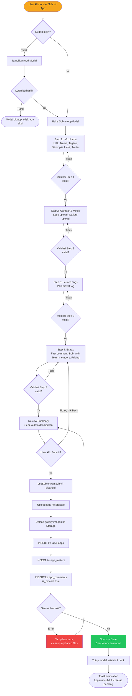

# PHASE 2 — SUBMIT APP FORM (Multi-Step Wizard)

> **Status:** Ready to implement
> **Prioritas:** Kedua — fitur inti Product Hunt clone, user-generated content pertama
> **Estimasi:** 4–6 jam implementasi penuh
> **Depends on:** Phase 0 (Foundation — `supabase.js`, `AuthContext`, `profiles` table)

---

## 1. Overview & Goals

Phase ini mengimplementasikan alur **"Submit a Product"** — fitur yang menjadi inti dari Product Hunt clone. User (harus login) mengisi wizard 4-langkah untuk mendaftarkan aplikasi mereka ke direktori Apphunt.

### Goals

| # | Goal |
|---|------|
| 1 | User bisa submit aplikasi baru lewat modal wizard 4-step |
| 2 | Upload logo + gallery ke Supabase Storage bucket `app-assets` |
| 3 | Data tersimpan di tabel `apps`, `app_makers`, `app_comments` |
| 4 | Zero UI regression — tidak ada perubahan pada layout `AppsList.jsx` yang sudah ada |
| 5 | App yang baru disubmit muncul di list dengan status `pending` |
| 6 | Form tidak pakai library eksternal — vanilla `useState` only |

### Prinsip yang Dipertahankan dari OVERVIEW.md

- **ZERO UI regression** — class CSS yang sudah ada tidak disentuh
- **Data flow satu arah:** form state → hook → Supabase
- **Fallback graceful:** jika Supabase tidak terkonfigurasi, modal tetap bisa dibuka tapi submit disabled dengan pesan jelas

---

## 2. User Flow Diagram



---

## 3. Component Architecture

```mermaid
flowchart TD
    SAM[SubmitAppModal\norchestrator — step state, formData, validation]

    SAM --> MH[ModalHeader\nstep indicator dots, judul step, close button]
    SAM --> SI[StepIndicator\n4 dots connected, amber = active, label bawah]

    SAM --> S1[Step1_MainInfo]
    S1 --> UF[URLFetcher\nauto-fetch metadata dari URL input]
    S1 --> NI[NameInput\ncontrolled, 0/40 char counter]
    S1 --> TI[TaglineInput\ncontrolled, 0/60 char counter]
    S1 --> LM[LinksManager\nadd/remove additional links array]
    S1 --> OS[OpenSourceToggle\ncheckbox styled sebagai toggle]
    S1 --> TW[TwitterInput\nat-sign prefix]
    S1 --> DT[DescriptionTextarea\n0/500 char counter, auto-resize]

    SAM --> S2[Step2_ImagesMedia]
    S2 --> LU[LogoUploader\nsingle image, 240x240, drag and drop]
    S2 --> GU[GalleryUploader\nmax 8 images, drag to reorder, individual delete]

    SAM --> S3[Step3_LaunchTags]
    S3 --> TS[TagSearch\nfilter input untuk available tags]
    S3 --> TSel[TagSelector\nchip grid, max 3 selected, amber highlight]

    SAM --> S4[Step4_Extras]
    S4 --> FC[FirstCommentEditor\ntextarea, min 50 chars, inspirasi maker]
    S4 --> BW[BuiltWithSelector\nmulti-select chip grid]
    S4 --> TM[TeamMembersManager\nadd/remove rows: name + role + URL opsional]
    S4 --> PS[PricingSelector\nradio: free / paid / freemium / free_options]

    SAM --> SB[SubmitButton + ValidationSummary\ndisabled if invalid, shows missing fields list]

    subgraph Reusable
        IU[ImageUploader.jsx\nvalue, onChange, maxSizeMB,\naccept, aspectRatio, placeholder]
    end

    LU --> IU
    GU --> IU
```



---

## 4. File yang Dibuat / Diubah

```
src/
  components/
    SubmitAppModal.jsx     <- BARU — orchestrator wizard modal
    SubmitAppModal.css     <- BARU — semua styles modal ini
    ImageUploader.jsx      <- BARU — reusable image upload component
  hooks/
    useSubmitApp.js        <- BARU — upload + insert logic
  AppsList.jsx             <- DIUBAH — tambah tombol "Submit App" + render modal

supabase/migrations/
  002_apps.sql             <- BARU — apps, app_makers, app_comments tables + RLS
  002_apps_storage.sql     <- BARU — app-assets bucket + storage policies
```

---

## 5. Database Schema

### Tabel: `apps`

```sql
-- ============================================================
-- 002_apps.sql
-- Apps: tabel utama product listing
-- Requires: 000_profiles.sql
-- ============================================================

CREATE TABLE IF NOT EXISTS public.apps (
  id              uuid        PRIMARY KEY DEFAULT gen_random_uuid(),
  slug            text        UNIQUE NOT NULL,
  name            text        NOT NULL CHECK (char_length(name) BETWEEN 2 AND 40),
  tagline         text        NOT NULL CHECK (char_length(tagline) BETWEEN 10 AND 60),
  description     text        CHECK (char_length(description) <= 500),
  website_url     text        NOT NULL,
  twitter_handle  text,
  is_open_source  boolean     NOT NULL DEFAULT false,
  logo_url        text,
  gallery_urls    text[]      NOT NULL DEFAULT '{}',
  launch_tags     text[]      NOT NULL DEFAULT '{}',
  built_with      text[]      NOT NULL DEFAULT '{}',
  pricing_type    text        NOT NULL DEFAULT 'free'
                              CHECK (pricing_type IN ('free','paid','freemium','free_options')),
  links           jsonb       NOT NULL DEFAULT '[]',
  status          text        NOT NULL DEFAULT 'pending'
                              CHECK (status IN ('pending','approved','rejected','featured')),
  upvote_count    integer     NOT NULL DEFAULT 0,
  comment_count   integer     NOT NULL DEFAULT 0,
  submitted_by    uuid        NOT NULL REFERENCES public.profiles(id) ON DELETE CASCADE,
  featured_at     timestamptz,
  created_at      timestamptz NOT NULL DEFAULT now(),
  updated_at      timestamptz NOT NULL DEFAULT now()
);

-- Indexes
CREATE INDEX IF NOT EXISTS apps_slug_idx        ON public.apps(slug);
CREATE INDEX IF NOT EXISTS apps_status_idx      ON public.apps(status);
CREATE INDEX IF NOT EXISTS apps_submitted_by_idx ON public.apps(submitted_by);
CREATE INDEX IF NOT EXISTS apps_created_at_idx  ON public.apps(created_at DESC);
CREATE INDEX IF NOT EXISTS apps_upvote_count_idx ON public.apps(upvote_count DESC);
CREATE INDEX IF NOT EXISTS apps_launch_tags_idx ON public.apps USING GIN(launch_tags);

-- updated_at trigger
CREATE TRIGGER apps_updated_at
  BEFORE UPDATE ON public.apps
  FOR EACH ROW EXECUTE PROCEDURE public.handle_updated_at();

-- RLS
ALTER TABLE public.apps ENABLE ROW LEVEL SECURITY;

-- Semua orang bisa lihat app yang approved/featured
CREATE POLICY "Apps approved are publicly viewable"
  ON public.apps FOR SELECT
  USING (status IN ('approved', 'featured'));

-- User bisa lihat app milik sendiri (termasuk pending/rejected)
CREATE POLICY "Users can view their own apps"
  ON public.apps FOR SELECT
  USING (auth.uid() = submitted_by);

-- User yang login bisa submit app baru
CREATE POLICY "Authenticated users can submit apps"
  ON public.apps FOR INSERT
  WITH CHECK (auth.uid() = submitted_by);

-- User hanya bisa update app milik sendiri dan hanya field tertentu
CREATE POLICY "Users can update their own apps"
  ON public.apps FOR UPDATE
  USING (auth.uid() = submitted_by)
  WITH CHECK (auth.uid() = submitted_by);

-- Admin bisa manage semua apps
CREATE POLICY "Admins can manage all apps"
  ON public.apps FOR ALL
  USING (
    EXISTS (
      SELECT 1 FROM public.profiles
      WHERE id = auth.uid() AND role = 'admin'
    )
  );
```

### Tabel: `app_makers`

```sql
-- Team members untuk setiap app
CREATE TABLE IF NOT EXISTS public.app_makers (
  id          uuid        PRIMARY KEY DEFAULT gen_random_uuid(),
  app_id      uuid        NOT NULL REFERENCES public.apps(id) ON DELETE CASCADE,
  user_id     uuid        REFERENCES public.profiles(id) ON DELETE SET NULL,
  name        text        NOT NULL,
  role        text        NOT NULL DEFAULT 'Maker',
  url         text,
  sort_order  integer     NOT NULL DEFAULT 0,
  created_at  timestamptz NOT NULL DEFAULT now()
);

CREATE INDEX IF NOT EXISTS app_makers_app_id_idx ON public.app_makers(app_id);

ALTER TABLE public.app_makers ENABLE ROW LEVEL SECURITY;

CREATE POLICY "App makers are publicly viewable"
  ON public.app_makers FOR SELECT USING (true);

CREATE POLICY "Authenticated users can add makers"
  ON public.app_makers FOR INSERT
  WITH CHECK (
    auth.uid() IS NOT NULL
    AND EXISTS (
      SELECT 1 FROM public.apps
      WHERE id = app_id AND submitted_by = auth.uid()
    )
  );

CREATE POLICY "App owners can manage makers"
  ON public.app_makers FOR ALL
  USING (
    EXISTS (
      SELECT 1 FROM public.apps
      WHERE id = app_id AND submitted_by = auth.uid()
    )
  );
```

### Tabel: `app_comments`

```sql
-- Komentar + first comment (pinned) dari maker
CREATE TABLE IF NOT EXISTS public.app_comments (
  id          uuid        PRIMARY KEY DEFAULT gen_random_uuid(),
  app_id      uuid        NOT NULL REFERENCES public.apps(id) ON DELETE CASCADE,
  user_id     uuid        NOT NULL REFERENCES public.profiles(id) ON DELETE CASCADE,
  body        text        NOT NULL CHECK (char_length(body) >= 10),
  is_pinned   boolean     NOT NULL DEFAULT false,
  parent_id   uuid        REFERENCES public.app_comments(id) ON DELETE CASCADE,
  created_at  timestamptz NOT NULL DEFAULT now(),
  updated_at  timestamptz NOT NULL DEFAULT now()
);

CREATE INDEX IF NOT EXISTS app_comments_app_id_idx    ON public.app_comments(app_id);
CREATE INDEX IF NOT EXISTS app_comments_user_id_idx   ON public.app_comments(user_id);
CREATE INDEX IF NOT EXISTS app_comments_is_pinned_idx ON public.app_comments(is_pinned);

CREATE TRIGGER app_comments_updated_at
  BEFORE UPDATE ON public.app_comments
  FOR EACH ROW EXECUTE PROCEDURE public.handle_updated_at();

ALTER TABLE public.app_comments ENABLE ROW LEVEL SECURITY;

CREATE POLICY "Comments on approved apps are publicly viewable"
  ON public.app_comments FOR SELECT
  USING (
    EXISTS (
      SELECT 1 FROM public.apps
      WHERE id = app_id AND status IN ('approved', 'featured')
    )
  );

CREATE POLICY "Authenticated users can comment"
  ON public.app_comments FOR INSERT
  WITH CHECK (auth.uid() = user_id);

CREATE POLICY "Users can update their own comments"
  ON public.app_comments FOR UPDATE
  USING (auth.uid() = user_id);

CREATE POLICY "Users can delete their own comments"
  ON public.app_comments FOR DELETE
  USING (auth.uid() = user_id);
```

### Storage: `app-assets` bucket

```sql
-- ============================================================
-- 002_apps_storage.sql
-- Storage policies untuk bucket app-assets
-- ============================================================

INSERT INTO storage.buckets (id, name, public)
VALUES ('app-assets', 'app-assets', true)
ON CONFLICT DO NOTHING;

-- Semua orang bisa lihat (public bucket)
CREATE POLICY "App assets are publicly accessible"
  ON storage.objects FOR SELECT
  USING (bucket_id = 'app-assets');

-- User hanya bisa upload ke folder mereka sendiri
-- Path pattern: app-assets/{userId}/logo/{uuid}.{ext}
-- Path pattern: app-assets/{userId}/gallery/{uuid}.{ext}
CREATE POLICY "Users can upload their own app assets"
  ON storage.objects FOR INSERT
  WITH CHECK (
    bucket_id = 'app-assets'
    AND auth.uid()::text = (storage.foldername(name))[1]
  );

CREATE POLICY "Users can update their own app assets"
  ON storage.objects FOR UPDATE
  USING (
    bucket_id = 'app-assets'
    AND auth.uid()::text = (storage.foldername(name))[1]
  );

CREATE POLICY "Users can delete their own app assets"
  ON storage.objects FOR DELETE
  USING (
    bucket_id = 'app-assets'
    AND auth.uid()::text = (storage.foldername(name))[1]
  );
```

---

## 6. Form Data Shape

Ini adalah shape lengkap `formData` yang mengalir dari UI ke hook, dan akhirnya ke Supabase. Shape ini harus konsisten di semua komponen.

```js
// formData shape — semua field yang dikelola oleh SubmitAppModal
const INITIAL_FORM_DATA = {
  // Step 1
  website_url:     "",          // string, required, valid URL
  name:            "",          // string, required, 2-40 chars
  tagline:         "",          // string, required, 10-60 chars
  description:     "",          // string, optional, max 500 chars
  links:           [],          // Array<{ label: string, url: string }>
  is_open_source:  false,       // boolean
  twitter_handle:  "",          // string, optional, tanpa "@"

  // Step 2
  logo_file:       null,        // File | null — diupload ke Storage
  gallery_files:   [],          // Array<File> — max 8, diupload ke Storage

  // Step 3
  launch_tags:     [],          // Array<string> — min 1, max 3

  // Step 4
  first_comment:   "",          // string, required, min 50 chars
  built_with:      [],          // Array<string>
  team_members:    [            // Array<{ name, role, url }>
    { name: "", role: "Maker", url: "" }
  ],
  pricing_type:    "free",      // "free" | "paid" | "freemium" | "free_options"
};
```

---

## 7. Available Launch Tags (40+ tags)

Tag ini ditampilkan di Step 3. Relevan untuk ekosistem developer Indonesia.

```js
// src/components/SubmitAppModal.jsx — LAUNCH_TAGS constant
export const LAUNCH_TAGS = [
  // Kategori utama
  "Produktivitas",
  "AI & Machine Learning",
  "Developer Tools",
  "Desain & Kreatif",
  "Keuangan & Fintech",
  "E-commerce",
  "Kesehatan & Medis",
  "Pendidikan & EdTech",
  "Marketing & SEO",
  "HR & Rekrutmen",
  "Legaltech",
  "Agritech",
  "Logistik & Supply Chain",
  "Food & Beverage Tech",
  "Properti & PropTech",
  "Transportasi",
  "Gaming",
  "Social Media",
  "Analytics & Data",
  "Keamanan & Cybersecurity",
  "Blockchain & Web3",
  "IoT & Hardware",
  "No-Code & Low-Code",
  "Open Source",
  "API & Integrasi",
  "Komunitas & Forum",
  "News & Media",
  "Travel & Hospitality",
  "Retail & POS",
  "CRM & Sales",
  "Customer Support",
  "Kolaborasi Tim",
  "Manajemen Proyek",
  "Cloud & Infrastructure",
  "Mobile App",
  "Browser Extension",
  "CLI Tool",
  "Bot & Otomasi",
  "Video & Multimedia",
  "Audio & Podcast",
  "Email & Komunikasi",
  "Pemerintahan & GovTech",
  "Lingkungan & CleanTech",
  "Aksesibilitas",
  "Parenting & Keluarga",
];
```

---

## 8. Validation Rules

### Per-Step Breakdown

| Step | Field | Aturan | Pesan Error |
|------|-------|--------|-------------|
| 1 | `website_url` | Required, harus valid URL (https://) | "URL wajib diisi dan harus dimulai dengan https://" |
| 1 | `name` | Required, min 2, max 40 karakter | "Nama wajib diisi (2–40 karakter)" |
| 1 | `tagline` | Required, min 10, max 60 karakter | "Tagline wajib diisi (10–60 karakter)" |
| 1 | `description` | Opsional, max 500 karakter | "Deskripsi maksimal 500 karakter" |
| 1 | `twitter_handle` | Opsional, tidak boleh mengandung "@" atau spasi | "Twitter handle tidak perlu awalan @" |
| 1 | `links[].url` | Jika diisi, harus valid URL | "Link harus berupa URL yang valid" |
| 2 | `logo_file` | Required, max 2MB, format: jpg/png/webp | "Logo wajib diupload (maks 2MB, JPG/PNG/WebP)" |
| 2 | `gallery_files` | Required min 1, max 8, masing-masing max 5MB | "Minimal 1 screenshot wajib diupload (maks 8)" |
| 3 | `launch_tags` | Required min 1, max 3 | "Pilih minimal 1 tag (maksimal 3)" |
| 4 | `first_comment` | Required, min 50 karakter | "Cerita maker wajib diisi (minimal 50 karakter)" |
| 4 | `pricing_type` | Required, salah satu dari 4 opsi | "Pilih tipe harga" |
| 4 | `team_members[].name` | Jika row ada, name required | "Nama anggota tim wajib diisi" |

### Fungsi Validator

```js
// Dipanggil oleh SubmitAppModal sebelum tombol Next/Submit aktif
function validateStep(step, formData) {
  const errors = {};

  if (step === 1) {
    if (!formData.website_url || !/^https?:\/\/.+/.test(formData.website_url)) {
      errors.website_url = "URL wajib diisi dan harus dimulai dengan https://";
    }
    if (!formData.name || formData.name.trim().length < 2) {
      errors.name = "Nama wajib diisi (minimal 2 karakter)";
    }
    if (formData.name && formData.name.length > 40) {
      errors.name = "Nama maksimal 40 karakter";
    }
    if (!formData.tagline || formData.tagline.trim().length < 10) {
      errors.tagline = "Tagline wajib diisi (minimal 10 karakter)";
    }
    if (formData.tagline && formData.tagline.length > 60) {
      errors.tagline = "Tagline maksimal 60 karakter";
    }
    if (formData.description && formData.description.length > 500) {
      errors.description = "Deskripsi maksimal 500 karakter";
    }
    if (formData.twitter_handle && /[@\s]/.test(formData.twitter_handle)) {
      errors.twitter_handle = "Jangan sertakan @ atau spasi";
    }
    formData.links.forEach((link, i) => {
      if (link.url && !/^https?:\/\/.+/.test(link.url)) {
        errors[`link_${i}`] = "Link harus URL yang valid";
      }
    });
  }

  if (step === 2) {
    if (!formData.logo_file) {
      errors.logo_file = "Logo wajib diupload";
    }
    if (formData.logo_file && formData.logo_file.size > 2 * 1024 * 1024) {
      errors.logo_file = "Logo maksimal 2MB";
    }
    if (!formData.gallery_files || formData.gallery_files.length === 0) {
      errors.gallery_files = "Minimal 1 screenshot wajib diupload";
    }
    if (formData.gallery_files && formData.gallery_files.length > 8) {
      errors.gallery_files = "Maksimal 8 screenshot";
    }
  }

  if (step === 3) {
    if (!formData.launch_tags || formData.launch_tags.length === 0) {
      errors.launch_tags = "Pilih minimal 1 tag";
    }
    if (formData.launch_tags && formData.launch_tags.length > 3) {
      errors.launch_tags = "Maksimal 3 tag";
    }
  }

  if (step === 4) {
    if (!formData.first_comment || formData.first_comment.trim().length < 50) {
      errors.first_comment = "Cerita maker minimal 50 karakter";
    }
    if (!formData.pricing_type) {
      errors.pricing_type = "Pilih tipe harga";
    }
    formData.team_members.forEach((member, i) => {
      if (member.role && !member.name.trim()) {
        errors[`member_${i}_name`] = "Nama anggota tim wajib diisi";
      }
    });
  }

  return errors; // {} = valid
}
```

---

## 9. Full Hook Code: `src/hooks/useSubmitApp.js`

```js
import { useState } from 'react';
import { supabase } from '../lib/supabase';

// Generates a URL-safe slug from an app name + short random suffix
async function generateUniqueSlug(name) {
  const base = name
    .toLowerCase()
    .trim()
    .replace(/[^a-z0-9\s-]/g, '')
    .replace(/\s+/g, '-')
    .replace(/-+/g, '-')
    .slice(0, 55);
  const suffix = Math.random().toString(36).slice(2, 7);
  return `${base}-${suffix}`;
}

function getExt(file) {
  return file.name.split('.').pop().toLowerCase();
}

function randomId() {
  if (typeof crypto !== 'undefined' && crypto.randomUUID) {
    return crypto.randomUUID();
  }
  return Math.random().toString(36).slice(2) + Date.now().toString(36);
}

export function useSubmitApp() {
  const [loading, setLoading]   = useState(false);
  const [error, setError]       = useState(null);
  const [progress, setProgress] = useState(0); // 0-100

  async function uploadFile(userId, folder, file, uploadedPaths) {
    const id   = randomId();
    const ext  = getExt(file);
    const path = `${userId}/${folder}/${id}.${ext}`;

    const { error: upErr } = await supabase.storage
      .from('app-assets')
      .upload(path, file, { upsert: false, contentType: file.type });

    if (upErr) throw new Error(`Upload gagal (${folder}): ${upErr.message}`);

    uploadedPaths.push(path);

    const { data } = supabase.storage.from('app-assets').getPublicUrl(path);
    return data.publicUrl;
  }

  async function cleanupOrphanedFiles(paths) {
    if (!paths.length) return;
    // Best-effort cleanup — ignore errors, do not block UI
    try {
      await supabase.storage.from('app-assets').remove(paths);
    } catch (_) {
      // silent — orphaned files will be cleaned up by a scheduled Edge Function
    }
  }

  async function submit(formData, userId) {
    if (!supabase) {
      setError('Supabase tidak terkonfigurasi. Hubungi administrator.');
      return null;
    }

    const uploadedPaths = []; // track for cleanup on partial failure
    setLoading(true);
    setError(null);
    setProgress(0);

    try {
      // ── Step 1: Upload logo (10% progress) ────────────────────
      setProgress(5);
      const logoUrl = await uploadFile(userId, 'logo', formData.logo_file, uploadedPaths);
      setProgress(15);

      // ── Step 2: Upload gallery images (15% → 55%) ─────────────
      const galleryUrls = [];
      const galleryCount = formData.gallery_files.length;
      for (let i = 0; i < galleryCount; i++) {
        const url = await uploadFile(userId, 'gallery', formData.gallery_files[i], uploadedPaths);
        galleryUrls.push(url);
        setProgress(15 + Math.round(((i + 1) / galleryCount) * 40));
      }

      // ── Step 3: Build slug ────────────────────────────────────
      setProgress(57);
      const slug = await generateUniqueSlug(formData.name);

      // ── Step 4: INSERT into apps ──────────────────────────────
      setProgress(60);
      const appPayload = {
        slug,
        name:           formData.name.trim(),
        tagline:        formData.tagline.trim(),
        description:    formData.description?.trim() || null,
        website_url:    formData.website_url.trim(),
        twitter_handle: formData.twitter_handle?.trim().replace(/^@/, '') || null,
        is_open_source: formData.is_open_source ?? false,
        logo_url:       logoUrl,
        gallery_urls:   galleryUrls,
        launch_tags:    formData.launch_tags,
        built_with:     formData.built_with ?? [],
        pricing_type:   formData.pricing_type,
        links:          formData.links.filter(l => l.url.trim()),
        status:         'pending',
        submitted_by:   userId,
      };

      const { data: appRow, error: appErr } = await supabase
        .from('apps')
        .insert(appPayload)
        .select('id, slug')
        .single();

      if (appErr) throw new Error(`Gagal menyimpan app: ${appErr.message}`);
      setProgress(75);

      const appId = appRow.id;

      // ── Step 5: INSERT app_makers ─────────────────────────────
      const validMembers = (formData.team_members ?? []).filter(m => m.name.trim());
      if (validMembers.length > 0) {
        const makersPayload = validMembers.map((m, i) => ({
          app_id:     appId,
          user_id:    null, // linked by admin later if username matches
          name:       m.name.trim(),
          role:       m.role?.trim() || 'Maker',
          url:        m.url?.trim() || null,
          sort_order: i,
        }));

        const { error: makersErr } = await supabase
          .from('app_makers')
          .insert(makersPayload);

        if (makersErr) throw new Error(`Gagal menyimpan tim: ${makersErr.message}`);
      }
      setProgress(88);

      // ── Step 6: INSERT first comment (pinned) ─────────────────
      const commentBody = formData.first_comment?.trim();
      if (commentBody && commentBody.length >= 50) {
        const { error: commentErr } = await supabase
          .from('app_comments')
          .insert({
            app_id:    appId,
            user_id:   userId,
            body:      commentBody,
            is_pinned: true,
          });

        if (commentErr) throw new Error(`Gagal menyimpan komentar: ${commentErr.message}`);
      }
      setProgress(100);

      return appRow; // { id, slug } — caller uses slug to show success

    } catch (err) {
      // Cleanup any files already uploaded before the failure
      await cleanupOrphanedFiles(uploadedPaths);
      setError(err.message ?? 'Terjadi kesalahan tidak terduga.');
      setProgress(0);
      return null;
    } finally {
      setLoading(false);
    }
  }

  return { loading, error, progress, submit };
}
```

---

## 10. Full Component Code: `src/components/ImageUploader.jsx`

```jsx
import { useRef, useState } from 'react';

/**
 * Reusable image uploader.
 * Props:
 *   value        — File | string (existing URL) | null
 *   onChange     — (File | null) => void
 *   maxSizeMB    — number (default 2)
 *   accept       — string (default "image/jpeg,image/png,image/webp")
 *   aspectRatio  — string CSS value e.g. "1/1" or "16/10" (default "1/1")
 *   placeholder  — string label shown in empty state
 *   disabled     — boolean
 */
export default function ImageUploader({
  value,
  onChange,
  maxSizeMB = 2,
  accept = 'image/jpeg,image/png,image/webp',
  aspectRatio = '1/1',
  placeholder = 'Klik atau seret gambar ke sini',
  disabled = false,
}) {
  const inputRef = useRef(null);
  const [dragOver, setDragOver] = useState(false);
  const [sizeError, setSizeError] = useState(null);

  // Derive preview URL from File object or existing string URL
  const previewUrl = value instanceof File
    ? URL.createObjectURL(value)
    : (typeof value === 'string' ? value : null);

  function validateAndSet(file) {
    setSizeError(null);
    if (!file) return;
    const maxBytes = maxSizeMB * 1024 * 1024;
    if (file.size > maxBytes) {
      setSizeError(`Ukuran file maksimal ${maxSizeMB}MB. File ini ${(file.size / 1024 / 1024).toFixed(1)}MB.`);
      return;
    }
    const allowed = accept.split(',').map(t => t.trim());
    if (!allowed.includes(file.type)) {
      setSizeError(`Format tidak didukung. Gunakan: ${allowed.map(t => t.split('/')[1]).join(', ')}`);
      return;
    }
    onChange(file);
  }

  function handleDrop(e) {
    e.preventDefault();
    setDragOver(false);
    if (disabled) return;
    const file = e.dataTransfer.files?.[0];
    validateAndSet(file);
  }

  function handleFileInput(e) {
    const file = e.target.files?.[0];
    validateAndSet(file);
    // Reset input so same file can be re-selected after remove
    e.target.value = '';
  }

  function handleRemove(e) {
    e.stopPropagation();
    setSizeError(null);
    onChange(null);
  }

  return (
    <div className="image-uploader-root">
      <div
        className={[
          'image-uploader-zone',
          dragOver   ? 'drag-over'  : '',
          sizeError  ? 'has-error'  : '',
          disabled   ? 'is-disabled': '',
          previewUrl ? 'has-preview': '',
        ].filter(Boolean).join(' ')}
        style={{ aspectRatio }}
        onClick={() => !disabled && inputRef.current?.click()}
        onDragOver={(e) => { e.preventDefault(); if (!disabled) setDragOver(true); }}
        onDragLeave={() => setDragOver(false)}
        onDrop={handleDrop}
        role="button"
        tabIndex={disabled ? -1 : 0}
        aria-label={placeholder}
        onKeyDown={(e) => { if (e.key === 'Enter' || e.key === ' ') inputRef.current?.click(); }}
      >
        {previewUrl ? (
          <>
            
            {!disabled && (
              <button
                type="button"
                className="image-uploader-remove"
                onClick={handleRemove}
                aria-label="Hapus gambar"
              >
                &times;
              </button>
            )}
          </>
        ) : (
          <div className="image-uploader-empty">
            <svg width="32" height="32" viewBox="0 0 24 24" fill="none"
              stroke="currentColor" strokeWidth="1.5" aria-hidden="true">
              <rect x="3" y="3" width="18" height="18" rx="3" />
              <circle cx="8.5" cy="8.5" r="1.5" />
              <path d="m21 15-5-5L5 21" />
            </svg>
            <span>{placeholder}</span>
            <span className="image-uploader-hint">
              {accept.split(',').map(t => t.split('/')[1]).join(', ')} — maks {maxSizeMB}MB
            </span>
          </div>
        )}
      </div>

      {sizeError && (
        <p className="image-uploader-error" role="alert">{sizeError}</p>
      )}

      <input
        ref={inputRef}
        type="file"
        accept={accept}
        onChange={handleFileInput}
        style={{ display: 'none' }}
        tabIndex={-1}
        aria-hidden="true"
      />
    </div>
  );
}
```

---

## 11. Full Component Code: `src/components/SubmitAppModal.jsx` (Part A — setup, Step 1, Step 2)

```jsx
import { useState, useEffect, useCallback } from 'react';
import { createPortal } from 'react-dom';
import { useAuth } from '../hooks/useAuth';
import { useSubmitApp } from '../hooks/useSubmitApp';
import ImageUploader from './ImageUploader';
import './SubmitAppModal.css';

// ── Constants ────────────────────────────────────────────────────────────────

export const LAUNCH_TAGS = [
  'Produktivitas', 'AI & Machine Learning', 'Developer Tools',
  'Desain & Kreatif', 'Keuangan & Fintech', 'E-commerce',
  'Kesehatan & Medis', 'Pendidikan & EdTech', 'Marketing & SEO',
  'HR & Rekrutmen', 'Legaltech', 'Agritech',
  'Logistik & Supply Chain', 'Food & Beverage Tech', 'Properti & PropTech',
  'Transportasi', 'Gaming', 'Social Media',
  'Analytics & Data', 'Keamanan & Cybersecurity', 'Blockchain & Web3',
  'IoT & Hardware', 'No-Code & Low-Code', 'Open Source',
  'API & Integrasi', 'Komunitas & Forum', 'News & Media',
  'Travel & Hospitality', 'Retail & POS', 'CRM & Sales',
  'Customer Support', 'Kolaborasi Tim', 'Manajemen Proyek',
  'Cloud & Infrastructure', 'Mobile App', 'Browser Extension',
  'CLI Tool', 'Bot & Otomasi', 'Video & Multimedia',
  'Audio & Podcast', 'Email & Komunikasi', 'Pemerintahan & GovTech',
  'Lingkungan & CleanTech', 'Aksesibilitas', 'Parenting & Keluarga',
];

const BUILT_WITH_OPTIONS = [
  'React', 'Vue', 'Next.js', 'Nuxt', 'SvelteKit', 'Angular',
  'Supabase', 'Firebase', 'PocketBase', 'Appwrite',
  'Node.js', 'Express', 'Fastify', 'NestJS',
  'Python', 'Django', 'FastAPI', 'Flask',
  'Go', 'Rust', 'PHP', 'Laravel',
  'PostgreSQL', 'MySQL', 'MongoDB', 'Redis',
  'Tailwind CSS', 'TypeScript', 'Vite', 'Docker',
  'Vercel', 'Netlify', 'Railway', 'Cloudflare',
];

const PRICING_OPTIONS = [
  { value: 'free',         label: 'Gratis',         desc: 'Selamanya gratis untuk semua fitur' },
  { value: 'freemium',     label: 'Freemium',        desc: 'Gratis dengan fitur premium berbayar' },
  { value: 'free_options', label: 'Ada Opsi Gratis', desc: 'Paket berbayar dengan trial/tier gratis' },
  { value: 'paid',         label: 'Berbayar',        desc: 'Hanya tersedia dengan berlangganan' },
];

const STEP_LABELS = [
  'Info Utama',
  'Media',
  'Kategori',
  'Detail',
];

const INITIAL_FORM_DATA = {
  website_url:    '',
  name:           '',
  tagline:        '',
  description:    '',
  links:          [],
  is_open_source: false,
  twitter_handle: '',
  logo_file:      null,
  gallery_files:  [],
  launch_tags:    [],
  first_comment:  '',
  built_with:     [],
  team_members:   [{ name: '', role: 'Maker', url: '' }],
  pricing_type:   'free',
};

// ── Validation ───────────────────────────────────────────────────────────────

function validateStep(step, formData) {
  const errors = {};
  if (step === 1) {
    if (!formData.website_url || !/^https?:\/\/.+/.test(formData.website_url))
      errors.website_url = 'URL wajib diisi dan harus dimulai dengan https://';
    if (!formData.name || formData.name.trim().length < 2)
      errors.name = 'Nama wajib diisi (minimal 2 karakter)';
    if (formData.name && formData.name.length > 40)
      errors.name = 'Nama maksimal 40 karakter';
    if (!formData.tagline || formData.tagline.trim().length < 10)
      errors.tagline = 'Tagline wajib diisi (minimal 10 karakter)';
    if (formData.tagline && formData.tagline.length > 60)
      errors.tagline = 'Tagline maksimal 60 karakter';
    if (formData.description && formData.description.length > 500)
      errors.description = 'Deskripsi maksimal 500 karakter';
    if (formData.twitter_handle && /[@\s]/.test(formData.twitter_handle))
      errors.twitter_handle = 'Jangan sertakan @ atau spasi';
    formData.links.forEach((link, i) => {
      if (link.url && !/^https?:\/\/.+/.test(link.url))
        errors[`link_${i}`] = 'Link harus URL yang valid';
    });
  }
  if (step === 2) {
    if (!formData.logo_file)
      errors.logo_file = 'Logo wajib diupload';
    if (formData.logo_file && formData.logo_file.size > 2 * 1024 * 1024)
      errors.logo_file = 'Logo maksimal 2MB';
    if (!formData.gallery_files || formData.gallery_files.length === 0)
      errors.gallery_files = 'Minimal 1 screenshot wajib diupload';
    if (formData.gallery_files && formData.gallery_files.length > 8)
      errors.gallery_files = 'Maksimal 8 screenshot';
  }
  if (step === 3) {
    if (!formData.launch_tags || formData.launch_tags.length === 0)
      errors.launch_tags = 'Pilih minimal 1 tag';
    if (formData.launch_tags && formData.launch_tags.length > 3)
      errors.launch_tags = 'Maksimal 3 tag';
  }
  if (step === 4) {
    if (!formData.first_comment || formData.first_comment.trim().length < 50)
      errors.first_comment = 'Cerita maker minimal 50 karakter';
    if (!formData.pricing_type)
      errors.pricing_type = 'Pilih tipe harga';
    formData.team_members.forEach((m, i) => {
      if ((m.role || m.url) && !m.name.trim())
        errors[`member_${i}_name`] = 'Nama anggota tim wajib diisi';
    });
  }
  return errors;
}

function hasData(formData) {
  return (
    formData.name.trim() ||
    formData.tagline.trim() ||
    formData.website_url.trim() ||
    formData.logo_file ||
    formData.gallery_files.length > 0
  );
}

// ── Sub-components ───────────────────────────────────────────────────────────

function FieldError({ message }) {
  if (!message) return null;
  return <span className="sam-field-error" role="alert">{message}</span>;
}

function CharCounter({ current, max }) {
  const near = current >= max * 0.85;
  const over = current > max;
  return (
    <span className={`sam-char-counter ${near ? 'near' : ''} ${over ? 'over' : ''}`}>
      {current}/{max}
    </span>
  );
}

function StepIndicator({ currentStep, totalSteps, labels }) {
  return (
    <div className="sam-step-indicator" role="list" aria-label="Langkah-langkah formulir">
      {Array.from({ length: totalSteps }, (_, i) => (
        <div
          key={i}
          className={`sam-step-item ${
            i + 1 === currentStep ? 'active' : i + 1 < currentStep ? 'done' : ''
          }`}
          role="listitem"
          aria-current={i + 1 === currentStep ? 'step' : undefined}
        >
          <div className="sam-step-dot">
            {i + 1 < currentStep ? (
              <svg width="10" height="10" viewBox="0 0 10 10" fill="none" aria-hidden="true">
                <path d="M2 5l2.5 2.5L8 3" stroke="currentColor" strokeWidth="1.5" strokeLinecap="round" strokeLinejoin="round"/>
              </svg>
            ) : (
              <span>{i + 1}</span>
            )}
          </div>
          <span className="sam-step-label">{labels[i]}</span>
          {i < totalSteps - 1 && <div className="sam-step-connector" aria-hidden="true" />}
        </div>
      ))}
    </div>
  );
}

// ── Step 1: Info Utama ────────────────────────────────────────────────────────

function Step1_MainInfo({ formData, setField, errors }) {
  const [fetchingMeta, setFetchingMeta] = useState(false);
  const [fetchError, setFetchError]     = useState(null);
  const [urlStarted, setUrlStarted]     = useState(false);

  async function handleFetchMeta() {
    if (!formData.website_url || !/^https?:\/\/.+/.test(formData.website_url)) return;
    setFetchingMeta(true);
    setFetchError(null);
    try {
      // Uses allorigins.win as a CORS proxy to fetch Open Graph metadata.
      // In production, replace with a Supabase Edge Function for reliability.
      const proxyUrl = `https://api.allorigins.win/get?url=${encodeURIComponent(formData.website_url)}`;
      const res = await fetch(proxyUrl);
      if (!res.ok) throw new Error('Gagal mengambil metadata');
      const json = await res.json();
      const parser = new DOMParser();
      const doc = parser.parseFromString(json.contents, 'text/html');

      const ogTitle = doc.querySelector('meta[property="og:title"]')?.getAttribute('content')
        || doc.querySelector('title')?.textContent || '';
      const ogDesc = doc.querySelector('meta[property="og:description"]')?.getAttribute('content')
        || doc.querySelector('meta[name="description"]')?.getAttribute('content') || '';
      const twitterSite = doc.querySelector('meta[name="twitter:site"]')?.getAttribute('content') || '';

      if (ogTitle && !formData.name) setField('name', ogTitle.slice(0, 40));
      if (ogDesc && !formData.tagline) setField('tagline', ogDesc.slice(0, 60));
      if (ogDesc && !formData.description) setField('description', ogDesc.slice(0, 500));
      if (twitterSite && !formData.twitter_handle)
        setField('twitter_handle', twitterSite.replace(/^@/, ''));
    } catch (err) {
      setFetchError('Tidak bisa mengambil metadata otomatis. Isi manual ya.');
    } finally {
      setFetchingMeta(false);
    }
  }

  function addLink() {
    setField('links', [...formData.links, { label: '', url: '' }]);
  }

  function updateLink(index, key, val) {
    const next = formData.links.map((l, i) => i === index ? { ...l, [key]: val } : l);
    setField('links', next);
  }

  function removeLink(index) {
    setField('links', formData.links.filter((_, i) => i !== index));
  }

  return (
    <div className="sam-step-content">
      <p className="sam-step-intro">
        Mulai dengan URL produk kamu. Kami akan coba mengambil info dasar secara otomatis.
      </p>

      {/* URL + Fetch button */}
      <div className="sam-field">
        <label className="sam-label" htmlFor="sam-url">URL Website <span className="sam-required">*</span></label>
        <div className="sam-url-row">
          <input
            id="sam-url"
            type="url"
            className={`sam-input ${errors.website_url ? 'is-error' : ''}`}
            placeholder="https://produkmu.com"
            value={formData.website_url}
            onChange={(e) => { setField('website_url', e.target.value); setUrlStarted(true); }}
            autoFocus
          />
          <button
            type="button"
            className="ghost-button sam-fetch-btn"
            onClick={handleFetchMeta}
            disabled={fetchingMeta || !formData.website_url}
          >
            {fetchingMeta ? 'Mengambil...' : 'Ambil info'}
          </button>
        </div>
        <FieldError message={errors.website_url} />
        {fetchError && <span className="sam-fetch-error">{fetchError}</span>}
      </div>

      {/* Name */}
      <div className="sam-field">
        <div className="sam-label-row">
          <label className="sam-label" htmlFor="sam-name">Nama Produk <span className="sam-required">*</span></label>
          <CharCounter current={formData.name.length} max={40} />
        </div>
        <input
          id="sam-name"
          type="text"
          className={`sam-input ${errors.name ? 'is-error' : ''}`}
          placeholder="Nama produkmu"
          value={formData.name}
          maxLength={42}
          onChange={(e) => setField('name', e.target.value)}
        />
        <FieldError message={errors.name} />
      </div>

      {/* Tagline */}
      <div className="sam-field">
        <div className="sam-label-row">
          <label className="sam-label" htmlFor="sam-tagline">Tagline <span className="sam-required">*</span></label>
          <CharCounter current={formData.tagline.length} max={60} />
        </div>
        <input
          id="sam-tagline"
          type="text"
          className={`sam-input ${errors.tagline ? 'is-error' : ''}`}
          placeholder="Deskripsikan produkmu dalam satu kalimat singkat"
          value={formData.tagline}
          maxLength={62}
          onChange={(e) => setField('tagline', e.target.value)}
        />
        <FieldError message={errors.tagline} />
      </div>

      {/* Description */}
      <div className="sam-field">
        <div className="sam-label-row">
          <label className="sam-label" htmlFor="sam-desc">Deskripsi</label>
          <CharCounter current={formData.description.length} max={500} />
        </div>
        <textarea
          id="sam-desc"
          className={`sam-textarea ${errors.description ? 'is-error' : ''}`}
          placeholder="Jelaskan apa yang dilakukan produkmu, masalah apa yang dipecahkan, dan siapa target penggunanya..."
          value={formData.description}
          maxLength={502}
          rows={4}
          onChange={(e) => setField('description', e.target.value)}
        />
        <FieldError message={errors.description} />
      </div>

      {/* Twitter */}
      <div className="sam-field sam-field--half">
        <label className="sam-label" htmlFor="sam-twitter">Twitter / X</label>
        <div className="sam-input-prefix-wrap">
          <span className="sam-input-prefix">@</span>
          <input
            id="sam-twitter"
            type="text"
            className={`sam-input sam-input--prefixed ${errors.twitter_handle ? 'is-error' : ''}`}
            placeholder="username"
            value={formData.twitter_handle}
            onChange={(e) => setField('twitter_handle', e.target.value.replace(/^@/, ''))}
          />
        </div>
        <FieldError message={errors.twitter_handle} />
      </div>

      {/* Open Source Toggle */}
      <div className="sam-field">
        <label className="sam-toggle-row" htmlFor="sam-opensource">
          <input
            id="sam-opensource"
            type="checkbox"
            className="sam-toggle-input"
            checked={formData.is_open_source}
            onChange={(e) => setField('is_open_source', e.target.checked)}
          />
          <span className="sam-toggle-track" aria-hidden="true" />
          <span className="sam-toggle-label">Produk ini Open Source</span>
        </label>
      </div>

      {/* Additional Links */}
      <div className="sam-field">
        <label className="sam-label">Link Tambahan</label>
        {formData.links.map((link, i) => (
          <div key={i} className="sam-link-row">
            <input
              type="text"
              className="sam-input sam-input--small"
              placeholder="Label (mis: Demo, Docs)"
              value={link.label}
              onChange={(e) => updateLink(i, 'label', e.target.value)}
            />
            <input
              type="url"
              className={`sam-input ${errors[`link_${i}`] ? 'is-error' : ''}`}
              placeholder="https://..."
              value={link.url}
              onChange={(e) => updateLink(i, 'url', e.target.value)}
            />
            <button
              type="button"
              className="sam-remove-btn"
              onClick={() => removeLink(i)}
              aria-label="Hapus link"
            >
              &times;
            </button>
            <FieldError message={errors[`link_${i}`]} />
          </div>
        ))}
        {formData.links.length < 5 && (
          <button type="button" className="ghost-button sam-add-btn" onClick={addLink}>
            + Tambah link
          </button>
        )}
      </div>
    </div>
  );
}

// ── Step 2: Gambar & Media ────────────────────────────────────────────────────

function Step2_ImagesMedia({ formData, setField, errors }) {
  function addGalleryFiles(files) {
    const remaining = 8 - formData.gallery_files.length;
    const toAdd = Array.from(files).slice(0, remaining);
    setField('gallery_files', [...formData.gallery_files, ...toAdd]);
  }

  function removeGalleryFile(index) {
    setField('gallery_files', formData.gallery_files.filter((_, i) => i !== index));
  }

  function moveGalleryFile(from, to) {
    const next = [...formData.gallery_files];
    const [item] = next.splice(from, 1);
    next.splice(to, 0, item);
    setField('gallery_files', next);
  }

  function handleGalleryDrop(e) {
    e.preventDefault();
    addGalleryFiles(e.dataTransfer.files);
  }

  return (
    <div className="sam-step-content">
      <p className="sam-step-intro">
        Upload logo dan screenshot produkmu. Gambar yang bagus meningkatkan upvote secara signifikan.
      </p>

      {/* Logo */}
      <div className="sam-field">
        <label className="sam-label">Logo <span className="sam-required">*</span></label>
        <p className="sam-field-hint">Ukuran ideal 240×240px. Format JPG, PNG, atau WebP. Maks 2MB.</p>
        <div className="sam-logo-uploader-wrap">
          <ImageUploader
            value={formData.logo_file}
            onChange={(file) => setField('logo_file', file)}
            maxSizeMB={2}
            accept="image/jpeg,image/png,image/webp"
            aspectRatio="1/1"
            placeholder="Upload logo"
          />
        </div>
        <FieldError message={errors.logo_file} />
      </div>

      {/* Gallery */}
      <div className="sam-field">
        <label className="sam-label">Screenshot & Media <span className="sam-required">*</span></label>
        <p className="sam-field-hint">Minimal 1, maksimal 8 gambar. Maks 5MB per gambar. Seret untuk mengurutkan ulang.</p>

        <div
          className={`sam-gallery-dropzone ${formData.gallery_files.length >= 8 ? 'is-full' : ''} ${errors.gallery_files ? 'is-error' : ''}`}
          onDragOver={(e) => e.preventDefault()}
          onDrop={handleGalleryDrop}
          onClick={() => {
            if (formData.gallery_files.length >= 8) return;
            const input = document.createElement('input');
            input.type = 'file';
            input.accept = 'image/jpeg,image/png,image/webp';
            input.multiple = true;
            input.onchange = (e) => addGalleryFiles(e.target.files);
            input.click();
          }}
          role="button"
          tabIndex={0}
          aria-label="Upload screenshot"
          onKeyDown={(e) => { if (e.key === 'Enter' || e.key === ' ') e.currentTarget.click(); }}
        >
          {formData.gallery_files.length === 0 ? (
            <div className="sam-gallery-empty">
              <svg width="36" height="36" viewBox="0 0 24 24" fill="none" stroke="currentColor" strokeWidth="1.5" aria-hidden="true">
                <rect x="3" y="3" width="18" height="18" rx="3"/>
                <circle cx="8.5" cy="8.5" r="1.5"/>
                <path d="m21 15-5-5L5 21"/>
              </svg>
              <span>Klik atau seret gambar ke sini</span>
              <span className="sam-gallery-hint">JPG, PNG, WebP — maks 5MB per file</span>
            </div>
          ) : (
            <div className="sam-gallery-grid">
              {formData.gallery_files.map((file, i) => (
                <div key={i} className="sam-gallery-thumb" draggable
                  onDragStart={(e) => e.dataTransfer.setData('text/plain', String(i))}
                  onDragOver={(e) => e.preventDefault()}
                  onDrop={(e) => {
                    e.stopPropagation();
                    const from = parseInt(e.dataTransfer.getData('text/plain'), 10);
                    if (!isNaN(from) && from !== i) moveGalleryFile(from, i);
                  }}
                >
                  
                  <button
                    type="button"
                    className="sam-gallery-thumb-remove"
                    onClick={(e) => { e.stopPropagation(); removeGalleryFile(i); }}
                    aria-label={`Hapus screenshot ${i + 1}`}
                  >
                    &times;
                  </button>
                  {i === 0 && <span className="sam-gallery-thumb-badge">Cover</span>}
                </div>
              ))}
              {formData.gallery_files.length < 8 && (
                <div className="sam-gallery-add-slot">
                  <span>+</span>
                </div>
              )}
            </div>
          )}
        </div>
        <FieldError message={errors.gallery_files} />
        {formData.gallery_files.length > 0 && (
          <p className="sam-field-hint" style={{ marginTop: 6 }}>
            {formData.gallery_files.length}/8 gambar. Gambar pertama menjadi cover.
          </p>
        )}
      </div>
    </div>
  );
}
```

---

## 11 (cont.) — Step 3, Step 4, and Main Orchestrator

```jsx
// ── Step 3: Launch Tags ──────────────────────────────────────────────────────

function Step3_LaunchTags({ formData, setField, errors }) {
  const [tagSearch, setTagSearch] = useState('');

  const filtered = LAUNCH_TAGS.filter(tag =>
    tag.toLowerCase().includes(tagSearch.toLowerCase())
  );

  function toggleTag(tag) {
    const selected = formData.launch_tags;
    if (selected.includes(tag)) {
      setField('launch_tags', selected.filter(t => t !== tag));
    } else {
      if (selected.length >= 3) return;
      setField('launch_tags', [...selected, tag]);
    }
  }

  return (
    <div className="sam-step-content">
      <p className="sam-step-intro">
        Pilih hingga 3 kategori yang paling mendeskripsikan produkmu.
        Kategori yang tepat membantu pengguna menemukan produkmu.
      </p>

      <div className="sam-field">
        <div className="sam-label-row">
          <label className="sam-label">Kategori <span className="sam-required">*</span></label>
          <span className="sam-tag-counter">
            {formData.launch_tags.length}/3 dipilih
          </span>
        </div>

        {/* Selected chips */}
        {formData.launch_tags.length > 0 && (
          <div className="sam-selected-tags">
            {formData.launch_tags.map(tag => (
              <button
                key={tag}
                type="button"
                className="sam-tag-chip sam-tag-chip--selected"
                onClick={() => toggleTag(tag)}
                aria-pressed="true"
              >
                {tag}
                <span className="sam-tag-chip-remove" aria-hidden="true">&times;</span>
              </button>
            ))}
          </div>
        )}

        {/* Search */}
        <input
          type="text"
          className="sam-input sam-tag-search"
          placeholder="Cari kategori..."
          value={tagSearch}
          onChange={(e) => setTagSearch(e.target.value)}
        />

        {/* Available tags grid */}
        <div className="sam-tags-grid" role="group" aria-label="Pilih kategori">
          {filtered.map(tag => {
            const isSelected = formData.launch_tags.includes(tag);
            const isDisabled = !isSelected && formData.launch_tags.length >= 3;
            return (
              <button
                key={tag}
                type="button"
                className={`sam-tag-chip ${
                  isSelected  ? 'sam-tag-chip--selected' : ''
                } ${
                  isDisabled  ? 'sam-tag-chip--disabled' : ''
                }`}
                onClick={() => toggleTag(tag)}
                disabled={isDisabled}
                aria-pressed={isSelected}
              >
                {tag}
              </button>
            );
          })}
          {filtered.length === 0 && (
            <p className="sam-tags-empty">Tidak ada kategori yang cocok.</p>
          )}
        </div>
        <FieldError message={errors.launch_tags} />
      </div>
    </div>
  );
}

// ── Step 4: Extras ───────────────────────────────────────────────────────────

function Step4_Extras({ formData, setField, errors }) {
  function addMember() {
    setField('team_members', [...formData.team_members, { name: '', role: 'Maker', url: '' }]);
  }

  function updateMember(index, key, val) {
    const next = formData.team_members.map((m, i) =>
      i === index ? { ...m, [key]: val } : m
    );
    setField('team_members', next);
  }

  function removeMember(index) {
    setField('team_members', formData.team_members.filter((_, i) => i !== index));
  }

  function toggleBuiltWith(tool) {
    const current = formData.built_with;
    if (current.includes(tool)) {
      setField('built_with', current.filter(t => t !== tool));
    } else {
      setField('built_with', [...current, tool]);
    }
  }

  return (
    <div className="sam-step-content">
      <p className="sam-step-intro">
        Ceritakan lebih banyak tentang produkmu. Informasi ini ditampilkan di halaman produk.
      </p>

      {/* First Comment */}
      <div className="sam-field">
        <div className="sam-label-row">
          <label className="sam-label" htmlFor="sam-first-comment">
            Cerita Maker <span className="sam-required">*</span>
          </label>
          <CharCounter current={formData.first_comment.length} max={1000} />
        </div>
        <p className="sam-field-hint">
          Apa yang menginspirasimu membuat produk ini? Bagikan cerita di balik layar.
          Komentar ini akan di-pin di halaman produkmu.
        </p>
        <textarea
          id="sam-first-comment"
          className={`sam-textarea sam-textarea--tall ${errors.first_comment ? 'is-error' : ''}`}
          placeholder="Halo komunitas Apphunt! Saya dengan bangga memperkenalkan..."
          value={formData.first_comment}
          rows={5}
          maxLength={1002}
          onChange={(e) => setField('first_comment', e.target.value)}
        />
        <FieldError message={errors.first_comment} />
      </div>

      {/* Pricing Type */}
      <div className="sam-field">
        <label className="sam-label">Model Harga <span className="sam-required">*</span></label>
        <div className="sam-pricing-grid">
          {PRICING_OPTIONS.map(opt => (
            <label
              key={opt.value}
              className={`sam-pricing-card ${
                formData.pricing_type === opt.value ? 'is-selected' : ''
              }`}
            >
              <input
                type="radio"
                name="pricing_type"
                value={opt.value}
                checked={formData.pricing_type === opt.value}
                onChange={() => setField('pricing_type', opt.value)}
                className="sam-pricing-radio"
              />
              <strong className="sam-pricing-label">{opt.label}</strong>
              <span className="sam-pricing-desc">{opt.desc}</span>
            </label>
          ))}
        </div>
        <FieldError message={errors.pricing_type} />
      </div>

      {/* Built With */}
      <div className="sam-field">
        <label className="sam-label">Dibangun Dengan</label>
        <p className="sam-field-hint">Pilih teknologi yang digunakan untuk membangun produkmu.</p>
        <div className="sam-builtwith-grid">
          {BUILT_WITH_OPTIONS.map(tool => {
            const isSelected = formData.built_with.includes(tool);
            return (
              <button
                key={tool}
                type="button"
                className={`sam-tag-chip ${
                  isSelected ? 'sam-tag-chip--selected' : ''
                }`}
                onClick={() => toggleBuiltWith(tool)}
                aria-pressed={isSelected}
              >
                {tool}
              </button>
            );
          })}
        </div>
      </div>

      {/* Team Members */}
      <div className="sam-field">
        <label className="sam-label">Anggota Tim</label>
        <p className="sam-field-hint">Tambahkan maker lain yang terlibat dalam pembuatan produk ini.</p>
        {formData.team_members.map((member, i) => (
          <div key={i} className="sam-member-row">
            <input
              type="text"
              className={`sam-input ${
                errors[`member_${i}_name`] ? 'is-error' : ''
              }`}
              placeholder="Nama"
              value={member.name}
              onChange={(e) => updateMember(i, 'name', e.target.value)}
            />
            <input
              type="text"
              className="sam-input sam-input--small"
              placeholder="Peran (mis: Designer)"
              value={member.role}
              onChange={(e) => updateMember(i, 'role', e.target.value)}
            />
            <input
              type="url"
              className="sam-input"
              placeholder="https://twitter.com/..."
              value={member.url}
              onChange={(e) => updateMember(i, 'url', e.target.value)}
            />
            {formData.team_members.length > 1 && (
              <button
                type="button"
                className="sam-remove-btn"
                onClick={() => removeMember(i)}
                aria-label="Hapus anggota tim"
              >
                &times;
              </button>
            )}
            <FieldError message={errors[`member_${i}_name`]} />
          </div>
        ))}
        {formData.team_members.length < 10 && (
          <button type="button" className="ghost-button sam-add-btn" onClick={addMember}>
            + Tambah anggota tim
          </button>
        )}
      </div>
    </div>
  );
}

// ── Review Summary ───────────────────────────────────────────────────────────

function ReviewSummary({ formData }) {
  const logoPreview = formData.logo_file instanceof File
    ? URL.createObjectURL(formData.logo_file) : null;

  const pricingLabel = PRICING_OPTIONS.find(
    p => p.value === formData.pricing_type
  )?.label ?? formData.pricing_type;

  return (
    <div className="sam-step-content sam-review">
      <p className="sam-step-intro">
        Periksa kembali informasi produkmu sebelum submit. Kamu masih bisa mengedit setelah submit melalui dashboard.
      </p>
      <div className="sam-review-header">
        {logoPreview && (
          
        )}
        <div>
          <h3 className="sam-review-name">{formData.name}</h3>
          <p className="sam-review-tagline">{formData.tagline}</p>
          <a
            href={formData.website_url}
            target="_blank"
            rel="noopener noreferrer"
            className="sam-review-url"
          >
            {formData.website_url}
          </a>
        </div>
      </div>
      {formData.description && (
        <p className="sam-review-desc">{formData.description}</p>
      )}
      <div className="sam-review-meta">
        <div className="sam-review-meta-item">
          <span className="sam-review-meta-label">Kategori</span>
          <div className="sam-review-chips">
            {formData.launch_tags.map(t => (
              <span key={t} className="sam-tag-chip sam-tag-chip--selected">{t}</span>
            ))}
          </div>
        </div>
        <div className="sam-review-meta-item">
          <span className="sam-review-meta-label">Model Harga</span>
          <span>{pricingLabel}</span>
        </div>
        {formData.twitter_handle && (
          <div className="sam-review-meta-item">
            <span className="sam-review-meta-label">Twitter</span>
            <span>@{formData.twitter_handle}</span>
          </div>
        )}
        <div className="sam-review-meta-item">
          <span className="sam-review-meta-label">Screenshot</span>
          <span>{formData.gallery_files.length} gambar</span>
        </div>
        {formData.built_with.length > 0 && (
          <div className="sam-review-meta-item">
            <span className="sam-review-meta-label">Dibangun dengan</span>
            <div className="sam-review-chips">
              {formData.built_with.map(t => (
                <span key={t} className="sam-tag-chip">{t}</span>
              ))}
            </div>
          </div>
        )}
      </div>
    </div>
  );
}

// ── Success State ────────────────────────────────────────────────────────────

function SuccessState({ appSlug }) {
  return (
    <div className="sam-success">
      <div className="sam-success-icon" aria-hidden="true">
        <svg viewBox="0 0 52 52" fill="none">
          <circle cx="26" cy="26" r="25" stroke="currentColor" strokeWidth="2"/>
          <path
            d="M14 26l8 8 16-16"
            stroke="currentColor"
            strokeWidth="2.5"
            strokeLinecap="round"
            strokeLinejoin="round"
          />
        </svg>
      </div>
      <h2 className="sam-success-title">Produkmu berhasil disubmit!</h2>
      <p className="sam-success-body">
        Tim Apphunt akan mereview produkmu dalam 1&ndash;2 hari kerja.
        Kamu akan mendapat notifikasi email setelah disetujui.
      </p>
      {appSlug && (
        <p className="sam-success-slug">
          Slug: <code>{appSlug}</code>
        </p>
      )}
    </div>
  );
}

// ── Main Orchestrator ────────────────────────────────────────────────────────

export default function SubmitAppModal({ onClose, onSuccess }) {
  const { user } = useAuth();
  const { loading, error, progress, submit } = useSubmitApp();

  const [step, setStep]           = useState(1);
  const [formData, setFormData]   = useState(INITIAL_FORM_DATA);
  const [errors, setErrors]       = useState({});
  const [submitted, setSubmitted] = useState(false);
  const [appSlug, setAppSlug]     = useState(null);
  const [confirmClose, setConfirmClose] = useState(false);

  const TOTAL_STEPS = 4;

  // Lock body scroll
  useEffect(() => {
    document.body.style.overflow = 'hidden';
    return () => { document.body.style.overflow = ''; };
  }, []);

  // Keyboard: Escape closes (with confirmation if dirty)
  const handleEscape = useCallback((e) => {
    if (e.key !== 'Escape') return;
    if (submitted) { onClose(); return; }
    if (hasData(formData)) {
      setConfirmClose(true);
    } else {
      onClose();
    }
  }, [formData, submitted, onClose]);

  useEffect(() => {
    document.addEventListener('keydown', handleEscape);
    return () => document.removeEventListener('keydown', handleEscape);
  }, [handleEscape]);

  function setField(key, value) {
    setFormData(prev => ({ ...prev, [key]: value }));
    // Clear error for this field when user edits
    if (errors[key]) setErrors(prev => { const n = { ...prev }; delete n[key]; return n; });
  }

  function handleNext() {
    const stepErrors = validateStep(step, formData);
    if (Object.keys(stepErrors).length > 0) {
      setErrors(stepErrors);
      return;
    }
    setErrors({});
    setStep(s => s + 1);
  }

  function handleBack() {
    setErrors({});
    setStep(s => s - 1);
  }

  async function handleSubmit() {
    // Validate step 4 one final time
    const stepErrors = validateStep(4, formData);
    if (Object.keys(stepErrors).length > 0) {
      setErrors(stepErrors);
      return;
    }
    const result = await submit(formData, user.id);
    if (result) {
      setAppSlug(result.slug);
      setSubmitted(true);
      // Auto-close after 3 seconds and call onSuccess
      setTimeout(() => {
        onClose();
        if (onSuccess) onSuccess(result);
      }, 3000);
    }
  }

  function handleBackdropClick(e) {
    if (e.target !== e.currentTarget) return;
    if (submitted) { onClose(); return; }
    if (hasData(formData)) {
      setConfirmClose(true);
    } else {
      onClose();
    }
  }

  const stepTitles = [
    'Info Utama',
    'Gambar & Media',
    'Kategori',
    'Detail Tambahan',
  ];

  const modal = (
    <div className="sam-backdrop" onClick={handleBackdropClick}>
      <div
        className="sam-window"
        role="dialog"
        aria-modal="true"
        aria-label={`Submit produk — ${submitted ? 'Berhasil' : stepTitles[step - 1]}`}
        onClick={(e) => e.stopPropagation()}
      >
        {/* Confirm close dialog */}
        {confirmClose && (
          <div className="sam-confirm-close">
            <p>Tutup form? Data yang sudah kamu isi akan hilang.</p>
            <div className="sam-confirm-close-actions">
              <button type="button" className="ghost-button" onClick={() => setConfirmClose(false)}>
                Lanjut mengisi
              </button>
              <button type="button" className="cta-button" onClick={onClose}
                style={{ background: '#ef4444', borderColor: '#b91c1c', boxShadow: 'inset 0 -2px 0 #991b1b' }}>
                Tutup
              </button>
            </div>
          </div>
        )}

        {submitted ? (
          <SuccessState appSlug={appSlug} />
        ) : (
          <>
            {/* Header */}
            <div className="sam-header">
              <div className="sam-header-left">
                <h2 className="sam-title">Submit produk</h2>
                <p className="sam-subtitle">{stepTitles[step - 1]}</p>
              </div>
              <button
                type="button"
                className="sam-close-btn"
                onClick={handleBackdropClick}
                aria-label="Tutup"
              >
                &times;
              </button>
            </div>

            {/* Step Indicator */}
            <div className="sam-step-indicator-wrap">
              <StepIndicator
                currentStep={step}
                totalSteps={TOTAL_STEPS}
                labels={STEP_LABELS}
              />
            </div>

            {/* Step Content */}
            <div className="sam-body">
              {step === 1 && (
                <Step1_MainInfo
                  formData={formData}
                  setField={setField}
                  errors={errors}
                />
              )}
              {step === 2 && (
                <Step2_ImagesMedia
                  formData={formData}
                  setField={setField}
                  errors={errors}
                />
              )}
              {step === 3 && (
                <Step3_LaunchTags
                  formData={formData}
                  setField={setField}
                  errors={errors}
                />
              )}
              {step === 4 && (
                <Step4_Extras
                  formData={formData}
                  setField={setField}
                  errors={errors}
                />
              )}
            </div>

            {/* Upload progress bar (visible during submit) */}
            {loading && (
              <div className="sam-progress-bar-wrap">
                <div
                  className="sam-progress-bar"
                  style={{ width: `${progress}%` }}
                  role="progressbar"
                  aria-valuenow={progress}
                  aria-valuemin={0}
                  aria-valuemax={100}
                  aria-label="Upload progress"
                />
                <span className="sam-progress-label">
                  {progress < 55 ? 'Mengupload gambar...' : progress < 75 ? 'Menyimpan produk...' : 'Menyelesaikan...'}
                </span>
              </div>
            )}

            {/* Global submit error */}
            {error && (
              <div className="sam-global-error" role="alert">
                <svg width="16" height="16" viewBox="0 0 16 16" fill="none" aria-hidden="true">
                  <circle cx="8" cy="8" r="7" stroke="currentColor" strokeWidth="1.5"/>
                  <path d="M8 5v3.5M8 11h.01" stroke="currentColor" strokeWidth="1.5" strokeLinecap="round"/>
                </svg>
                {error}
              </div>
            )}

            {/* Footer Navigation */}
            <div className="sam-footer">
              {step > 1 ? (
                <button
                  type="button"
                  className="ghost-button"
                  onClick={handleBack}
                  disabled={loading}
                >
                  Kembali
                </button>
              ) : (
                <button
                  type="button"
                  className="ghost-button"
                  onClick={handleBackdropClick}
                  disabled={loading}
                >
                  Batal
                </button>
              )}

              <div className="sam-footer-right">
                {step < TOTAL_STEPS ? (
                  <button
                    type="button"
                    className="cta-button"
                    onClick={handleNext}
                    disabled={loading}
                  >
                    Lanjut
                  </button>
                ) : (
                  <button
                    type="button"
                    className="cta-button"
                    onClick={handleSubmit}
                    disabled={loading}
                  >
                    {loading ? `Menyimpan... ${progress}%` : 'Submit Produk'}
                  </button>
                )}
              </div>
            </div>
          </>
        )}
      </div>
    </div>
  );

  return createPortal(modal, document.body);
}
```

---

## 12. Full CSS: `src/components/SubmitAppModal.css` (Part A)

```css
/* ============================================================
   SubmitAppModal.css
   Semua token mengacu pada design system Apphunt.
   Tidak ada warna baru di luar yang terdefinisi di STYLING_GUIDE.
   ============================================================ */

/* -- Backdrop ------------------------------------------------ */
.sam-backdrop {
  position: fixed;
  inset: 0;
  background: rgba(13, 29, 56, 0.55);
  backdrop-filter: blur(4px);
  -webkit-backdrop-filter: blur(4px);
  display: flex;
  align-items: center;
  justify-content: center;
  z-index: 9000;
  padding: 16px;
}

/* -- Modal window -------------------------------------------- */
.sam-window {
  position: relative;
  width: 100%;
  max-width: 680px;
  max-height: calc(100vh - 32px);
  background: #fffdf8;
  border: 1.5px solid #d9d1c2;
  border-radius: 16px;
  box-shadow:
    0 4px 6px rgba(13, 29, 56, 0.06),
    0 12px 40px rgba(13, 29, 56, 0.14),
    0 32px 80px rgba(13, 29, 56, 0.1);
  display: flex;
  flex-direction: column;
  overflow: hidden;
}

/* -- Header -------------------------------------------------- */
.sam-header {
  display: flex;
  align-items: flex-start;
  justify-content: space-between;
  padding: 20px 24px 0;
  flex-shrink: 0;
}

.sam-title {
  font-size: 18px;
  font-weight: 700;
  color: #0d1d38;
  letter-spacing: -0.02em;
  margin: 0 0 2px;
}

.sam-subtitle {
  font-size: 13px;
  font-weight: 500;
  color: #55606d;
  margin: 0;
}

.sam-close-btn {
  width: 32px;
  height: 32px;
  border-radius: 8px;
  border: 1.5px solid #d9d1c2;
  background: #fffdf8;
  color: #55606d;
  font-size: 18px;
  line-height: 1;
  cursor: pointer;
  display: flex;
  align-items: center;
  justify-content: center;
  flex-shrink: 0;
  transition: background 120ms ease, color 120ms ease;
}
.sam-close-btn:hover {
  background: #f5ecd9;
  color: #0d1d38;
}

/* -- Step Indicator ----------------------------------------- */
.sam-step-indicator-wrap {
  padding: 16px 24px 12px;
  flex-shrink: 0;
}

.sam-step-indicator {
  display: flex;
  align-items: flex-start;
  gap: 0;
}

.sam-step-item {
  display: flex;
  flex-direction: column;
  align-items: center;
  flex: 1;
  position: relative;
}

.sam-step-dot {
  width: 28px;
  height: 28px;
  border-radius: 50%;
  border: 2px solid #d9d1c2;
  background: #fffdf8;
  display: flex;
  align-items: center;
  justify-content: center;
  font-size: 12px;
  font-weight: 700;
  color: #7b8594;
  transition: border-color 200ms ease, background 200ms ease, color 200ms ease;
  position: relative;
  z-index: 1;
}

.sam-step-item.active .sam-step-dot {
  border-color: #f6a61e;
  background: #f6a61e;
  color: #fff;
}

.sam-step-item.done .sam-step-dot {
  border-color: #f6a61e;
  background: #fff8ec;
  color: #f6a61e;
}

.sam-step-label {
  font-size: 11px;
  font-weight: 600;
  color: #7b8594;
  margin-top: 4px;
  text-align: center;
  white-space: nowrap;
}

.sam-step-item.active .sam-step-label,
.sam-step-item.done .sam-step-label {
  color: #29405f;
}

.sam-step-connector {
  position: absolute;
  top: 14px;
  left: calc(50% + 14px);
  right: calc(-50% + 14px);
  height: 2px;
  background: #d9d1c2;
  z-index: 0;
}

.sam-step-item.done .sam-step-connector {
  background: #f6a61e;
}

/* -- Scrollable body ----------------------------------------- */
.sam-body {
  flex: 1;
  overflow-y: auto;
  padding: 4px 24px 8px;
  scroll-behavior: smooth;
}

.sam-body::-webkit-scrollbar { width: 6px; }
.sam-body::-webkit-scrollbar-track { background: transparent; }
.sam-body::-webkit-scrollbar-thumb {
  background: #d9d1c2;
  border-radius: 3px;
}

/* -- Step content -------------------------------------------- */
.sam-step-content { padding-bottom: 8px; }

.sam-step-intro {
  font-size: 13px;
  font-weight: 500;
  color: #55606d;
  margin: 0 0 20px;
  line-height: 1.5;
}

/* -- Fields -------------------------------------------------- */
.sam-field {
  margin-bottom: 18px;
}

.sam-field--half {
  max-width: 300px;
}

.sam-label-row {
  display: flex;
  align-items: center;
  justify-content: space-between;
  margin-bottom: 5px;
}

.sam-label {
  display: block;
  font-size: 12px;
  font-weight: 700;
  color: #55606d;
  letter-spacing: 0.01em;
  margin-bottom: 5px;
}

.sam-label-row .sam-label { margin-bottom: 0; }

.sam-required {
  color: #ef4444;
  font-weight: 700;
}

.sam-field-hint {
  font-size: 12px;
  font-weight: 500;
  color: #7b8594;
  margin: 0 0 8px;
  line-height: 1.4;
}

/* -- Inputs -------------------------------------------------- */
.sam-input {
  width: 100%;
  height: 38px;
  padding: 0 12px;
  border-radius: 8px;
  border: 1.5px solid #d9d1c2;
  background: #faf8f4;
  font-size: 14px;
  font-weight: 600;
  color: #0d1d38;
  outline: none;
  box-sizing: border-box;
  transition: border-color 120ms ease, box-shadow 120ms ease;
}

.sam-input:focus {
  border-color: #f6a61e;
  box-shadow: 0 0 0 3px rgba(246, 166, 30, 0.15);
  background: #fffdf8;
}

.sam-input.is-error {
  border-color: #ef4444;
  box-shadow: 0 0 0 3px rgba(239, 68, 68, 0.1);
}

.sam-input--small { flex: 0 0 140px; width: 140px; }

.sam-input-prefix-wrap {
  position: relative;
  display: flex;
  align-items: center;
}

.sam-input-prefix {
  position: absolute;
  left: 12px;
  font-size: 14px;
  font-weight: 700;
  color: #7b8594;
  pointer-events: none;
  z-index: 1;
}

.sam-input--prefixed { padding-left: 26px; }

.sam-textarea {
  width: 100%;
  padding: 10px 12px;
  border-radius: 8px;
  border: 1.5px solid #d9d1c2;
  background: #faf8f4;
  font-size: 14px;
  font-weight: 500;
  color: #0d1d38;
  outline: none;
  box-sizing: border-box;
  resize: vertical;
  line-height: 1.5;
  font-family: inherit;
  transition: border-color 120ms ease, box-shadow 120ms ease;
}

.sam-textarea:focus {
  border-color: #f6a61e;
  box-shadow: 0 0 0 3px rgba(246, 166, 30, 0.15);
  background: #fffdf8;
}

.sam-textarea.is-error {
  border-color: #ef4444;
  box-shadow: 0 0 0 3px rgba(239, 68, 68, 0.1);
}

.sam-textarea--tall { min-height: 120px; }

/* -- Character counter --------------------------------------- */
.sam-char-counter {
  font-size: 11px;
  font-weight: 600;
  color: #7b8594;
  letter-spacing: 0.01em;
  flex-shrink: 0;
}
.sam-char-counter.near { color: #f6a61e; }
.sam-char-counter.over { color: #ef4444; }

/* -- URL row ------------------------------------------------- */
.sam-url-row {
  display: flex;
  gap: 8px;
  align-items: flex-start;
}
.sam-url-row .sam-input { flex: 1; }
.sam-fetch-btn { flex-shrink: 0; height: 38px; }
.sam-fetch-error { font-size: 12px; color: #f6a61e; margin-top: 4px; display: block; }

/* -- Toggle -------------------------------------------------- */
.sam-toggle-row {
  display: flex;
  align-items: center;
  gap: 10px;
  cursor: pointer;
  user-select: none;
}
.sam-toggle-input { position: absolute; opacity: 0; width: 0; height: 0; }
.sam-toggle-track {
  width: 36px;
  height: 20px;
  border-radius: 10px;
  background: #d9d1c2;
  flex-shrink: 0;
  position: relative;
  transition: background 150ms ease;
}
.sam-toggle-track::after {
  content: '';
  position: absolute;
  top: 3px;
  left: 3px;
  width: 14px;
  height: 14px;
  border-radius: 50%;
  background: #fff;
  transition: transform 150ms ease;
  box-shadow: 0 1px 3px rgba(0,0,0,0.2);
}
.sam-toggle-input:checked + .sam-toggle-track { background: #f6a61e; }
.sam-toggle-input:checked + .sam-toggle-track::after { transform: translateX(16px); }
.sam-toggle-label { font-size: 13px; font-weight: 600; color: #29405f; }

/* -- Link rows ----------------------------------------------- */
.sam-link-row {
  display: flex;
  gap: 8px;
  align-items: flex-start;
  margin-bottom: 8px;
  flex-wrap: wrap;
}
.sam-link-row .sam-input { flex: 1; min-width: 120px; }

.sam-remove-btn {
  width: 32px;
  height: 38px;
  border-radius: 8px;
  border: 1.5px solid #d9d1c2;
  background: #fffdf8;
  color: #7b8594;
  font-size: 18px;
  cursor: pointer;
  display: flex;
  align-items: center;
  justify-content: center;
  flex-shrink: 0;
  transition: background 120ms, color 120ms;
}
.sam-remove-btn:hover { background: #fef2f2; color: #ef4444; border-color: #fca5a5; }

.sam-add-btn { height: 34px; font-size: 13px; margin-top: 4px; }

/* -- Field error --------------------------------------------- */
.sam-field-error {
  display: block;
  font-size: 12px;
  font-weight: 600;
  color: #ef4444;
  margin-top: 4px;
}

/* -- Image uploader ------------------------------------------ */
.image-uploader-root { width: 100%; }

.image-uploader-zone {
  width: 100%;
  border: 2px dashed #d9d1c2;
  border-radius: 12px;
  background: #faf8f4;
  display: flex;
  align-items: center;
  justify-content: center;
  cursor: pointer;
  overflow: hidden;
  position: relative;
  transition: border-color 150ms ease, background 150ms ease;
}
.image-uploader-zone:hover,
.image-uploader-zone.drag-over {
  border-color: #f6a61e;
  background: #fff8ec;
}
.image-uploader-zone.has-error { border-color: #ef4444; }
.image-uploader-zone.is-disabled { opacity: 0.5; cursor: not-allowed; }

.image-uploader-empty {
  display: flex;
  flex-direction: column;
  align-items: center;
  gap: 8px;
  padding: 24px;
  color: #7b8594;
  text-align: center;
}
.image-uploader-empty svg { color: #d9d1c2; }
.image-uploader-empty span { font-size: 13px; font-weight: 600; color: #55606d; }
.image-uploader-hint { font-size: 11px; font-weight: 500; color: #7b8594; }

.image-uploader-preview {
  width: 100%;
  height: 100%;
  object-fit: cover;
  display: block;
}

.image-uploader-remove {
  position: absolute;
  top: 6px;
  right: 6px;
  width: 24px;
  height: 24px;
  border-radius: 50%;
  border: none;
  background: rgba(13,29,56,0.7);
  color: #fff;
  font-size: 14px;
  cursor: pointer;
  display: flex;
  align-items: center;
  justify-content: center;
  transition: background 120ms;
}
.image-uploader-remove:hover { background: #ef4444; }
.image-uploader-error {
  font-size: 12px;
  font-weight: 600;
  color: #ef4444;
  margin-top: 4px;
}

/* -- Logo uploader wrap ------------------------------------- */
.sam-logo-uploader-wrap { width: 120px; height: 120px; }
.sam-logo-uploader-wrap .image-uploader-zone { border-radius: 16px; }

/* -- Gallery dropzone --------------------------------------- */
.sam-gallery-dropzone {
  width: 100%;
  min-height: 120px;
  border: 2px dashed #d9d1c2;
  border-radius: 12px;
  background: #faf8f4;
  cursor: pointer;
  transition: border-color 150ms, background 150ms;
  overflow: hidden;
}
.sam-gallery-dropzone:hover,
.sam-gallery-dropzone:focus-visible {
  border-color: #f6a61e;
  background: #fff8ec;
  outline: none;
}
.sam-gallery-dropzone.is-full { cursor: default; border-style: solid; }
.sam-gallery-dropzone.is-error { border-color: #ef4444; }

.sam-gallery-empty {
  display: flex;
  flex-direction: column;
  align-items: center;
  justify-content: center;
  gap: 8px;
  padding: 32px;
  color: #7b8594;
  text-align: center;
  min-height: 120px;
}
.sam-gallery-empty svg { color: #d9d1c2; }
.sam-gallery-empty span { font-size: 13px; font-weight: 600; color: #55606d; }
.sam-gallery-hint { font-size: 11px; font-weight: 500; color: #7b8594; }

.sam-gallery-grid {
  display: grid;
  grid-template-columns: repeat(auto-fill, minmax(120px, 1fr));
  gap: 8px;
  padding: 10px;
}

.sam-gallery-thumb {
  position: relative;
  aspect-ratio: 16/10;
  border-radius: 8px;
  overflow: hidden;
  border: 1.5px solid #d9d1c2;
  cursor: grab;
  background: #f0ede6;
}
.sam-gallery-thumb:active { cursor: grabbing; }
.sam-gallery-thumb-img { width: 100%; height: 100%; object-fit: cover; display: block; }

.sam-gallery-thumb-remove {
  position: absolute;
  top: 4px;
  right: 4px;
  width: 20px;
  height: 20px;
  border-radius: 50%;
  border: none;
  background: rgba(13,29,56,0.7);
  color: #fff;
  font-size: 12px;
  cursor: pointer;
  display: none;
  align-items: center;
  justify-content: center;
}
.sam-gallery-thumb:hover .sam-gallery-thumb-remove { display: flex; }
.sam-gallery-thumb-remove:hover { background: #ef4444; }

.sam-gallery-thumb-badge {
  position: absolute;
  bottom: 4px;
  left: 4px;
  font-size: 10px;
  font-weight: 700;
  background: #f6a61e;
  color: #fff;
  padding: 2px 6px;
  border-radius: 4px;
  letter-spacing: 0.03em;
}

.sam-gallery-add-slot {
  aspect-ratio: 16/10;
  border-radius: 8px;
  border: 2px dashed #d9d1c2;
  display: flex;
  align-items: center;
  justify-content: center;
  font-size: 24px;
  color: #d9d1c2;
  background: transparent;
  cursor: pointer;
  transition: border-color 150ms, color 150ms;
}
.sam-gallery-add-slot:hover { border-color: #f6a61e; color: #f6a61e; }

/* -- Tags ---------------------------------------------------- */
.sam-tag-counter {
  font-size: 11px;
  font-weight: 600;
  color: #7b8594;
}

.sam-selected-tags {
  display: flex;
  flex-wrap: wrap;
  gap: 6px;
  margin-bottom: 10px;
}

.sam-tag-search {
  margin-bottom: 10px;
}

.sam-tags-grid {
  display: flex;
  flex-wrap: wrap;
  gap: 6px;
  max-height: 220px;
  overflow-y: auto;
  padding: 2px;
}
.sam-tags-grid::-webkit-scrollbar { width: 4px; }
.sam-tags-grid::-webkit-scrollbar-thumb { background: #d9d1c2; border-radius: 2px; }

.sam-tags-empty { font-size: 13px; color: #7b8594; padding: 8px 0; }

.sam-tag-chip {
  display: inline-flex;
  align-items: center;
  gap: 4px;
  padding: 5px 10px;
  border-radius: 20px;
  border: 1.5px solid #d9d1c2;
  background: #faf8f4;
  color: #29405f;
  font-size: 12px;
  font-weight: 600;
  cursor: pointer;
  transition: border-color 120ms, background 120ms, color 120ms;
  white-space: nowrap;
}
.sam-tag-chip:hover { border-color: #f6a61e; background: #fff8ec; color: #0d1d38; }
.sam-tag-chip--selected {
  border-color: #f6a61e;
  background: #fff3d6;
  color: #0d1d38;
}
.sam-tag-chip--disabled { opacity: 0.4; cursor: not-allowed; }
.sam-tag-chip-remove { font-size: 14px; line-height: 1; color: #f6a61e; }

/* -- Pricing grid ------------------------------------------- */
.sam-pricing-grid {
  display: grid;
  grid-template-columns: repeat(2, 1fr);
  gap: 8px;
}

.sam-pricing-card {
  display: flex;
  flex-direction: column;
  gap: 2px;
  padding: 12px 14px;
  border-radius: 10px;
  border: 1.5px solid #d9d1c2;
  background: #faf8f4;
  cursor: pointer;
  transition: border-color 120ms, background 120ms;
}
.sam-pricing-card:hover { border-color: #c7820e; background: #fff8ec; }
.sam-pricing-card.is-selected { border-color: #f6a61e; background: #fff3d6; }
.sam-pricing-radio { display: none; }
.sam-pricing-label { font-size: 13px; font-weight: 700; color: #0d1d38; }
.sam-pricing-desc { font-size: 11px; font-weight: 500; color: #55606d; line-height: 1.4; }

/* -- Built with grid ---------------------------------------- */
.sam-builtwith-grid {
  display: flex;
  flex-wrap: wrap;
  gap: 6px;
}

/* -- Team member rows --------------------------------------- */
.sam-member-row {
  display: flex;
  gap: 8px;
  align-items: flex-start;
  margin-bottom: 8px;
  flex-wrap: wrap;
}
.sam-member-row .sam-input { flex: 1; min-width: 100px; }

/* -- Progress bar ------------------------------------------- */
.sam-progress-bar-wrap {
  padding: 10px 24px 0;
  flex-shrink: 0;
}
.sam-progress-bar {
  height: 4px;
  border-radius: 2px;
  background: #f6a61e;
  transition: width 300ms ease;
  max-width: 100%;
}
.sam-progress-label {
  display: block;
  font-size: 11px;
  font-weight: 600;
  color: #55606d;
  margin-top: 4px;
}

/* -- Global error ------------------------------------------- */
.sam-global-error {
  display: flex;
  align-items: flex-start;
  gap: 8px;
  margin: 10px 24px 0;
  padding: 10px 12px;
  border-radius: 8px;
  border: 1.5px solid #fca5a5;
  background: #fef2f2;
  font-size: 13px;
  font-weight: 500;
  color: #b91c1c;
  flex-shrink: 0;
}

/* -- Footer ------------------------------------------------- */
.sam-footer {
  display: flex;
  align-items: center;
  justify-content: space-between;
  padding: 14px 24px 18px;
  border-top: 1px solid #d9d1c2;
  flex-shrink: 0;
  background: #fffdf8;
}
.sam-footer-right { display: flex; align-items: center; gap: 10px; }

/* -- Confirm close overlay ---------------------------------- */
.sam-confirm-close {
  position: absolute;
  inset: 0;
  background: rgba(255,253,248,0.95);
  backdrop-filter: blur(2px);
  display: flex;
  flex-direction: column;
  align-items: center;
  justify-content: center;
  gap: 20px;
  z-index: 10;
  padding: 32px;
  border-radius: 16px;
  text-align: center;
}
.sam-confirm-close p {
  font-size: 16px;
  font-weight: 600;
  color: #0d1d38;
  margin: 0;
  max-width: 320px;
  line-height: 1.4;
}
.sam-confirm-close-actions { display: flex; gap: 10px; }

/* -- Review ------------------------------------------------- */
.sam-review-header {
  display: flex;
  align-items: flex-start;
  gap: 16px;
  margin-bottom: 16px;
  padding-bottom: 16px;
  border-bottom: 1px solid #d9d1c2;
}
.sam-review-logo {
  width: 64px;
  height: 64px;
  border-radius: 14px;
  object-fit: cover;
  border: 1.5px solid #d9d1c2;
  flex-shrink: 0;
}
.sam-review-name {
  font-size: 18px;
  font-weight: 700;
  color: #0d1d38;
  margin: 0 0 4px;
  letter-spacing: -0.02em;
}
.sam-review-tagline { font-size: 13px; color: #55606d; margin: 0 0 4px; font-weight: 500; }
.sam-review-url { font-size: 12px; color: #f6a61e; font-weight: 600; text-decoration: none; }
.sam-review-url:hover { text-decoration: underline; }
.sam-review-desc { font-size: 13px; color: #29405f; line-height: 1.5; margin-bottom: 16px; font-weight: 500; }
.sam-review-meta { display: flex; flex-direction: column; gap: 10px; }
.sam-review-meta-item { display: flex; align-items: flex-start; gap: 12px; }
.sam-review-meta-label {
  font-size: 11px;
  font-weight: 700;
  color: #7b8594;
  width: 110px;
  flex-shrink: 0;
  padding-top: 2px;
  letter-spacing: 0.05em;
  text-transform: uppercase;
}
.sam-review-chips { display: flex; flex-wrap: wrap; gap: 4px; }

/* -- Success state ------------------------------------------ */
.sam-success {
  display: flex;
  flex-direction: column;
  align-items: center;
  justify-content: center;
  padding: 48px 32px;
  text-align: center;
  gap: 16px;
  min-height: 320px;
}

.sam-success-icon {
  width: 64px;
  height: 64px;
  color: #22c55e;
  animation: sam-pop 500ms cubic-bezier(0.22, 1, 0.36, 1) both;
}

@keyframes sam-pop {
  from { transform: scale(0.4); opacity: 0; }
  to   { transform: scale(1);   opacity: 1; }
}

.sam-success-title {
  font-size: 20px;
  font-weight: 700;
  color: #0d1d38;
  margin: 0;
  letter-spacing: -0.02em;
}
.sam-success-body {
  font-size: 14px;
  font-weight: 500;
  color: #55606d;
  margin: 0;
  max-width: 360px;
  line-height: 1.5;
}
.sam-success-slug { font-size: 12px; color: #7b8594; margin: 0; }
.sam-success-slug code {
  background: #f5ecd9;
  padding: 2px 6px;
  border-radius: 4px;
  font-family: monospace;
  color: #0d1d38;
}

/* -- Mobile responsive -------------------------------------- */
@media (max-width: 600px) {
  .sam-window {
    max-height: calc(100vh - 16px);
    border-radius: 12px;
  }
  .sam-header { padding: 14px 16px 0; }
  .sam-step-indicator-wrap { padding: 12px 16px 8px; }
  .sam-body { padding: 4px 16px 8px; }
  .sam-footer { padding: 12px 16px 14px; }
  .sam-step-label { display: none; }
  .sam-pricing-grid { grid-template-columns: 1fr; }
  .sam-logo-uploader-wrap { width: 96px; height: 96px; }
  .sam-link-row { flex-direction: column; }
  .sam-member-row { flex-direction: column; }
  .sam-url-row { flex-direction: column; }
  .sam-fetch-btn { width: 100%; justify-content: center; }
  .sam-gallery-grid { grid-template-columns: repeat(2, 1fr); }
  }
  ```

  ---

  ## 13. Integration Point: Trigger di `AppsList.jsx`

  Tambahkan tombol "Submit App" dan render modal ke `AppsList.jsx`. Perubahan minimal — tidak ada perubahan pada layout, class, atau style yang sudah ada.

  ### Diff konseptual

  ```jsx
  // AppsList.jsx — tambahkan 3 import ini di baris paling atas
  import { useState } from 'react'; // sudah ada via React, cukup destructure
  import { useAuth } from './hooks/useAuth';
  import AuthModal from './components/ui/AuthModal';
  import SubmitAppModal from './components/SubmitAppModal';

  export default function AppsList() {
    // ... state yang sudah ada ...
    const { user } = useAuth();

    // State baru — tambahkan di bawah state yang sudah ada
    const [showSubmitModal, setShowSubmitModal] = useState(false);
    const [showAuthModal, setShowAuthModal]     = useState(false);

    function handleSubmitClick() {
      if (!user) {
        setShowAuthModal(true);
      } else {
        setShowSubmitModal(true);
      }
    }

    function handleAuthSuccess() {
      setShowAuthModal(false);
      setShowSubmitModal(true);
    }

    function handleSubmitSuccess(appRow) {
      // Toast notification — gunakan alert sementara, ganti dengan toast component di Phase 3
      alert(`Produk "${appRow.slug}" berhasil disubmit! Status: pending review.`);
      // Refresh list jika sudah pakai Supabase hook
      // refetch(); // uncomment setelah Phase 4 (Apps → Supabase)
    }

    return (
      <section className="apps-page-layout">
        {/* ... sidebar dan konten yang sudah ada tidak berubah ... */}

        {/* Tambahkan tombol ini di header area apps-main, tepat di atas search bar */}
        {/* Cari div/header yang membungkus search input, tambahkan tombol di sana */}
        <div style={{ display: 'flex', alignItems: 'center', justifyContent: 'space-between', marginBottom: 12 }}>
          <div className="search-wrap" style={{ flex: 1 }}>
            {/* ... search input yang sudah ada ... */}
          </div>
          <button
            type="button"
            className="cta-button"
            onClick={handleSubmitClick}
            style={{ marginLeft: 12, flexShrink: 0 }}
          >
            + Submit App
          </button>
        </div>

        {/* ... apps-list yang sudah ada ... */}

        {/* Modal renders — tambahkan di bawah RetroPopover yang sudah ada */}
        {showAuthModal && (
          <AuthModal
            onClose={() => setShowAuthModal(false)}
            onSuccess={handleAuthSuccess}
          />
        )}
        {showSubmitModal && (
          <SubmitAppModal
            onClose={() => setShowSubmitModal(false)}
            onSuccess={handleSubmitSuccess}
          />
        )}
      </section>
    );
  }
  ```

  ### Catatan implementasi

  - `AuthModal` yang sudah ada di `src/components/ui/AuthModal.jsx` tidak perlu diubah
  - Setelah login berhasil di `AuthModal`, callback `onSuccess` membuka `SubmitAppModal` secara langsung
  - Toast notification yang proper akan diimplementasi di Phase 3 (Auth & Profile)
  - App baru muncul di list hanya setelah Phase 4 (Apps → Supabase) selesai dan list membaca dari DB

  ---

  ## 14. Error Handling Strategy

  ### Tabel Skenario Error

  | Skenario | Deteksi | Handling | User Feedback |
  |----------|---------|----------|---------------|
  | Network error saat upload | `catch` di `uploadFile` | Cleanup uploaded files, set error state | "Gagal mengupload gambar. Cek koneksi internet." |
  | File terlalu besar | `file.size > maxBytes` di `ImageUploader` | Tolak file sebelum upload | "Logo maksimal 2MB. File ini 3.2MB." |
  | Format file salah | `file.type` check di `ImageUploader` | Tolak file sebelum upload | "Format tidak didukung. Gunakan: jpeg, png, webp" |
  | Duplicate slug | `unique constraint` error dari Supabase | `generateUniqueSlug` append suffix random, retry | Transparan — user tidak tahu |
  | Auth expired mid-upload | `401` dari Supabase Storage | Error ditangkap di catch, set error state | "Sesi kamu habis. Silakan login ulang." |
  | Storage quota exceeded | `413` atau storage error dari Supabase | Cleanup, set error | "Penyimpanan penuh. Hubungi administrator." |
  | RLS violation | `403` dari Supabase | Cleanup, set error | "Tidak punya izin. Pastikan kamu sudah login." |
  | Partial upload failure | Error setelah beberapa file terupload | `cleanupOrphanedFiles()` dipanggil | "Terjadi kesalahan. File sementara sudah dibersihkan." |
  | Supabase tidak dikonfigurasi | `!supabase` check di hook | Set error, jangan crash | "Supabase tidak terkonfigurasi. Hubungi administrator." |
  | Validasi gagal | `validateStep()` return errors | Highlight field merah, scroll ke error pertama | Inline error per field |

  ### Auth Expired Mid-Upload

  ```js
  // Di useSubmitApp.js — tambahkan check setelah setiap operasi Supabase
  const { error: upErr } = await supabase.storage.from('app-assets').upload(...);
  if (upErr) {
    // Check jika error adalah auth error
    if (upErr.message?.includes('JWT') || upErr.message?.includes('token')) {
      throw new Error('Sesi kamu habis. Silakan refresh halaman dan login ulang.');
    }
    throw new Error(`Upload gagal: ${upErr.message}`);
  }
  ```

  ### Orphaned File Cleanup

  File yang sudah terupload sebelum error terjadi dibersihkan oleh `cleanupOrphanedFiles()` di `finally` block. Untuk production, tambahkan juga scheduled Edge Function yang membersihkan file di `app-assets` yang tidak memiliki record di tabel `apps` lebih dari 24 jam.

  ---

  ## 15. Cara Setup (Langkah-langkah)

  ### Step 1 — Jalankan SQL migrations

  Buka Supabase Dashboard → SQL Editor, jalankan berurutan:

  ```bash
  # 1. Pastikan 000_profiles.sql sudah dijalankan (Phase 0)
  # 2. Jalankan:
  supabase/migrations/002_apps.sql
  # 3. Jalankan:
  supabase/migrations/002_apps_storage.sql
  ```

  ### Step 2 — Buat file baru

  ```bash
  # Buat file-file berikut:
  src/hooks/useSubmitApp.js          # dari Section 9
  src/components/SubmitAppModal.jsx  # dari Section 11
  src/components/ImageUploader.jsx   # dari Section 10
  src/components/SubmitAppModal.css  # dari Section 12
  ```

  ### Step 3 — Update AppsList.jsx

  Tambahkan imports dan state sesuai Section 13. Hanya tambahan — tidak ada penghapusan.

  ### Step 4 — Verifikasi

  ```bash
  npm run dev
  # Buka http://localhost:5173/apps
  # Klik "+ Submit App"
  # Jika belum login → AuthModal muncul
  # Setelah login → SubmitAppModal muncul
  ```

  ---

  ## 16. Definition of Done

  - [ ] `supabase/migrations/002_apps.sql` dijalankan tanpa error
  - [ ] `supabase/migrations/002_apps_storage.sql` dijalankan tanpa error
  - [ ] Bucket `app-assets` muncul di Supabase Dashboard → Storage
  - [ ] `src/hooks/useSubmitApp.js` dibuat
  - [ ] `src/components/ImageUploader.jsx` dibuat
  - [ ] `src/components/SubmitAppModal.jsx` dibuat
  - [ ] `src/components/SubmitAppModal.css` dibuat
  - [ ] `src/AppsList.jsx` di-update (tombol + modal render)
  - [ ] Tombol "Submit App" muncul di halaman `/apps`
  - [ ] Klik tombol tanpa login → AuthModal muncul
  - [ ] Login melalui AuthModal → SubmitAppModal otomatis terbuka
  - [ ] Step indicator menampilkan 4 step dengan label yang benar
  - [ ] Navigasi Next/Back antar step berfungsi
  - [ ] Tombol Next disabled jika validasi step gagal
  - [ ] Error message tampil inline di bawah field yang invalid
  - [ ] Step 1: URL fetch metadata berfungsi (nama/tagline terisi otomatis)
  - [ ] Step 2: Logo upload drag-drop berfungsi, preview tampil
  - [ ] Step 2: Gallery upload max 8 gambar, individual delete berfungsi
  - [ ] Step 3: Tag search filter berfungsi, max 3 tag bisa dipilih
  - [ ] Step 4: Pricing radio selection berfungsi
  - [ ] Step 4: Team member add/remove berfungsi
  - [ ] Submit menampilkan progress bar 0-100%
  - [ ] Setelah submit berhasil: success state dengan animasi checkmark
  - [ ] Modal auto-close setelah 3 detik di success state
  - [ ] Data tersimpan di tabel `apps` dengan status `pending`
  - [ ] Logo tersimpan di `app-assets/{userId}/logo/{uuid}.ext`
  - [ ] Gallery tersimpan di `app-assets/{userId}/gallery/{uuid}.ext`
  - [ ] `app_makers` terisikan untuk setiap team member yang valid
  - [ ] `app_comments` terisikan dengan first comment (is_pinned: true)
  - [ ] Escape key menutup modal (dengan konfirmasi jika ada data)
  - [ ] Klik backdrop menutup modal (dengan konfirmasi jika ada data)
  - [ ] Modal responsive di mobile (max-width 600px)
  - [ ] Tidak ada console error atau warning
  - [ ] `npm run lint` pass tanpa error baru

  ---

  ## 17. Testing Checklist (Manual QA)

  ### Pre-conditions

  - [ ] Supabase project berjalan, env vars dikonfigurasi
  - [ ] User test sudah dibuat (email + password)
  - [ ] Bucket `app-assets` sudah ada dan public

  ### TC-01: Auth Gate

  1. Logout dari aplikasi
  2. Buka `/apps`
  3. Klik tombol "+ Submit App"
  4. **Expected:** AuthModal muncul, bukan SubmitAppModal
  5. Login dengan kredensial valid
  6. **Expected:** AuthModal tutup, SubmitAppModal langsung terbuka

  ### TC-02: Step 1 — Validasi

  1. Buka SubmitAppModal (sudah login)
  2. Klik "Lanjut" tanpa mengisi apapun
  3. **Expected:** Error merah di website_url dan name dan tagline
  4. Isi `website_url` dengan teks bukan URL (mis: `bukan-url`)
  5. **Expected:** Error "harus dimulai dengan https://"
  6. Isi semua field required dengan benar
  7. Klik "Lanjut"
  8. **Expected:** Pindah ke Step 2

  ### TC-03: Step 1 — URL Fetch

  1. Isi `website_url` dengan `https://github.com`
  2. Klik "Ambil info"
  3. **Expected:** Field nama dan tagline terisi otomatis (atau pesan error graceful jika CORS proxy down)
  4. Verifikasi data yang terisi tidak melebihi batas karakter

  ### TC-04: Step 2 — Logo Upload

  1. Di Step 2, klik area logo uploader
  2. Pilih file PNG berukuran < 2MB
  3. **Expected:** Preview gambar tampil di area uploader
  4. Klik tombol &times; di pojok preview
  5. **Expected:** Preview hilang, area kembali ke empty state
  6. Coba upload file > 2MB
  7. **Expected:** Error message tampil, file tidak diterima

  ### TC-05: Step 2 — Gallery Upload

  1. Klik area gallery dropzone
  2. Pilih 3 gambar sekaligus
  3. **Expected:** 3 thumbnail tampil di grid, badge "Cover" di gambar pertama
  4. Hover salah satu thumbnail
  5. **Expected:** Tombol &times; muncul di pojok thumbnail
  6. Klik &times; untuk hapus satu gambar
  7. **Expected:** Thumbnail hilang, counter berkurang
  8. Seret thumbnail untuk reorder
  9. **Expected:** Urutan berubah
  10. Coba upload sampai lebih dari 8 gambar
  11. **Expected:** Dropzone tidak menerima lebih dari 8

  ### TC-06: Step 3 — Tag Selection

  1. Di Step 3, ketik "AI" di search box
  2. **Expected:** List difilter, hanya tampil tag yang mengandung "AI"
  3. Klik 3 tag
  4. **Expected:** 3 tag tampil di selected chips, semua tag lain disabled
  5. Coba klik tag ke-4
  6. **Expected:** Tidak bisa dipilih (disabled)
  7. Klik salah satu selected chip untuk deselect
  8. **Expected:** Chip hilang dari selected, tag kembali bisa diklik
  9. Klik "Lanjut" tanpa memilih tag (setelah deselect semua)
  10. **Expected:** Error "Pilih minimal 1 tag"

  ### TC-07: Step 4 — Extras

  1. Isi first_comment dengan kurang dari 50 karakter
  2. Klik "Submit Produk"
  3. **Expected:** Error "minimal 50 karakter"
  4. Isi first_comment dengan 50+ karakter
  5. Pilih pricing type "Freemium"
  6. **Expected:** Card "Freemium" ter-highlight amber
  7. Tambah 1 team member: isi nama dan role
  8. Pilih beberapa teknologi di "Dibangun Dengan"

  ### TC-08: Full Submit

  1. Lengkapi semua 4 step dengan data valid
  2. Klik "Submit Produk"
  3. **Expected:** Progress bar muncul, angka progress naik
  4. **Expected:** Success state tampil dengan checkmark animation
  5. **Expected:** Modal auto-close setelah ~3 detik
  6. Buka Supabase Dashboard → Table Editor → `apps`
  7. **Expected:** Record baru dengan status `pending` dan data yang benar
  8. Cek tabel `app_makers` → record untuk team member ada
  9. Cek tabel `app_comments` → first comment dengan `is_pinned: true` ada
  10. Cek Storage → `app-assets` → folder `{userId}/logo` dan `{userId}/gallery`

  ### TC-09: Escape & Backdrop

  1. Buka modal, isi beberapa field
  2. Tekan Escape
  3. **Expected:** Dialog konfirmasi muncul ("Data yang sudah kamu isi akan hilang")
  4. Klik "Lanjut mengisi"
  5. **Expected:** Modal tetap terbuka, data tidak hilang
  6. Tekan Escape lagi, klik "Tutup"
  7. **Expected:** Modal tertutup
  8. Buka modal baru, jangan isi apapun, tekan Escape
  9. **Expected:** Modal langsung tutup tanpa konfirmasi

  ### TC-10: Mobile Responsiveness

  1. Buka DevTools, set viewport ke 375px
  2. Buka SubmitAppModal
  3. **Expected:** Modal tidak overflow horizontal
  4. **Expected:** Step labels tersembunyi (hanya dots)
  5. **Expected:** Pricing grid 1 kolom
  6. **Expected:** Link rows dan member rows stack vertikal
  7. Scroll melalui semua 4 step
  8. **Expected:** Semua konten dapat discroll tanpa layout break

  ---

  ## 18. Catatan Penting

  ### URL Fetch (Metadata Auto-fill)

  Implementasi saat ini menggunakan `allorigins.win` sebagai CORS proxy. Ini tidak reliable untuk production. Di Phase 9 (Hardening), ganti dengan Supabase Edge Function:

  ```
  supabase/functions/fetch-og-meta/index.ts
  ```

  Edge Function ini akan menerima URL, fetch konten, parse OG tags, dan return JSON — tanpa CORS issue.

  ### Slug Uniqueness

  `generateUniqueSlug()` append suffix random 5 karakter untuk menghindari collision. Probabilitas collision sangat rendah tapi tidak nol. Untuk production yang lebih ketat, tambahkan retry logic dengan check ke DB.

  ### Gallery Drag-to-Reorder

  Implementasi menggunakan native HTML5 Drag and Drop API — tidak butuh library tambahan. Di mobile, drag tidak berfungsi. Tambahkan tombol panah atas/bawah untuk mobile reorder di iterasi berikutnya.

  ### Image Preview Memory

  `URL.createObjectURL()` membuat object URL yang perlu direvoke untuk menghindari memory leak. Untuk simplicity, implementasi saat ini tidak merevoke URL. Tambahkan `useEffect` cleanup jika performa menjadi isu:

  ```js
  useEffect(() => {
    const url = URL.createObjectURL(file);
    return () => URL.revokeObjectURL(url);
  }, [file]);
  ```

  ---

  ## Next: Phase 3

  Setelah Phase 2 verified → lanjut ke **PHASE_3_AUTH.md**:
  Auth flow lengkap (login page, profile page, avatar upload) dan toast notification system yang digunakan oleh SubmitAppModal success callback.
