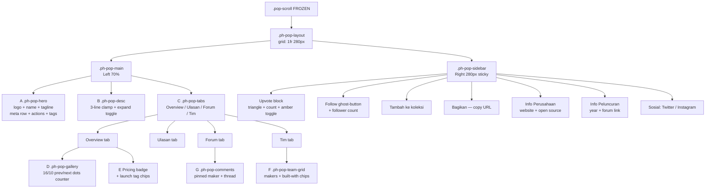

# Phase 3 — Product Hunt-Style Popover: Apphunt

> **Project:** Apphunt — Platform penemuan aplikasi buatan developer Indonesia  
> **File target:** `src/RetroPopover.jsx` (inner scroll content replaced — outer wrapper frozen)  
> **CSS target:** Append new `.ph-pop-*` classes to `src/App.css`  
> **New hook:** `src/hooks/useUpvote.js`  
> **Depends on:** Phase 1 (003_apps.sql), Phase 2 (submit form)  
> **Status:** Ready for implementation  
> **Last updated:** 2026-06-28  

---

## Table of Contents

1. [Overview and Goals](#1-overview-and-goals)
2. [Layout Architecture](#2-layout-architecture)
3. [Left Column — Section-by-Section Spec](#3-left-column--section-by-section-spec)
4. [Right Column — Section-by-Section Spec](#4-right-column--section-by-section-spec)
5. [Complete Replacement — RetroPopover.jsx](#5-complete-replacement--retropopoverjsx)
6. [CSS Additions — App.css](#6-css-additions--appcss)
7. [Hook — useUpvote.js](#7-hook--useupvotejs)
8. [normalizeApp Compatibility Layer](#8-normalizeapp-compatibility-layer)
9. [Animation Spec](#9-animation-spec)
10. [Accessibility Checklist](#10-accessibility-checklist)
11. [Definition of Done](#11-definition-of-done)

---

## 1. Overview and Goals

### What Changes vs What Stays Frozen

Phase 3 replaces every child element inside the existing `.pop-scroll` div with a
Product Hunt-style app detail layout. The outer chrome is **pixel-frozen**.

| Layer | Status | Rule |
|---|---|---|
| `.retro-backdrop` | FROZEN | Do not modify |
| `.retro-window.pop-window` | FROZEN | Do not modify |
| `.retro-titlebar` (dots, brand, close X) | FROZEN | Do not modify |
| `.pop-scroll` div element | FROZEN (element stays) | Inner children replaced |
| Everything **inside** `.pop-scroll` | **REPLACED** | New PH layout goes here |

### Before / After Comparison

| # | Old Section | Old Class | New Section | New Class |
|---|---|---|---|---|
| 1 | Full-width gallery hero | `.pop-gallery` | In-column gallery (Overview tab, 16/10) | `.ph-pop-gallery` |
| 2 | Label pill role chip | `.pop-label-pill` / `app.role` | Pricing badge + launch tag chips | `.ph-pop-pricing-badge`, `.ph-pop-tag-chip` |
| 3 | Project header (logo + name) | `.pop-project-header` | Hero header (64px logo, name, tagline, meta row) | `.ph-pop-hero` |
| 4 | Stats grid (`app.stats[]`) | `.pop-stats-row` | Star rating + review count + follower count | `.ph-pop-meta-row` |
| 5 | Overview paragraph | `.pop-section` | Collapsible description (3-line clamp) | `.ph-pop-desc` |
| 6 | Highlights grid (`app.highlights[]`) | `.pop-highlights-grid` | Inside Overview tab panel | `.ph-pop-tab-panel` |
| 7 | Methodology carousel (`app.strategy[]`) | `.pop-carousel-hd` | Navigation tabs (Overview/Ulasan/Tim/Forum) | `.ph-pop-tabs` |
| 8 | Phase detail card | `.pop-phase-card` | Team grid + built-with chips | `.ph-pop-team-grid` |
| 9 | User journey steps | `.pop-journey` | Comments / Diskusi section | `.ph-pop-comments` |
| 10 | Rich content blocks | `.pop-rich-body` | Sidebar: company info + social | `.ph-pop-sidebar-section` |
| 11 | CTA footer (2 buttons) | `.pop-cta-footer` | Sidebar: upvote + follow + share | `.ph-pop-upvote-btn`, `.ph-pop-sidebar` |

### Goals

- **Zero regressions** on old `libraryCards` data — `normalizeApp()` maps every old field safely
- **All UI text in Indonesian** (Bahasa Indonesia)
- **No external icon libraries** — all icons are inline SVG
- **No new color values** — only tokens defined in `STYLING_GUIDE.md`
- **Production-ready** — error states, empty states, loading guards, interval cleanup on unmount
- **Supabase-native** — upvote hook reads/writes `app_upvotes` table with optimistic updates

---

## 2. Layout Architecture

The new content lives entirely inside the existing `.pop-scroll` div. Nothing outside that boundary changes.

### Structural Tree

```
.pop-scroll                            <- FROZEN outer container (flex-col, overflow-y auto)
  .ph-pop-layout                       <- CSS Grid: 1fr 280px, gap 32px, padding 28px 28px 40px
    .ph-pop-main                       <- Left column (70%)
      .ph-pop-hero                     <- A: 64px logo + name row + tagline + meta + actions + tags
      .ph-pop-desc                     <- B: Collapsible description, 3-line clamp
      .ph-pop-tabs                     <- C: Tab bar — Overview | Ulasan(N) | Forum | Tim | Lainnya
      .ph-pop-tab-panel[overview]
        .ph-pop-gallery                <- D: 16/10 image carousel, prev/next, dots, counter
        .ph-pop-pricing-row            <- E: Pricing badge + launch tag chips
      .ph-pop-tab-panel[ulasan]        <- Star reviews list
      .ph-pop-tab-panel[forum]
        .ph-pop-comments               <- G: Pinned maker comment + thread
      .ph-pop-tab-panel[tim]
        .ph-pop-team-grid              <- F: Maker cards + built-with chips
      .ph-pop-tab-panel[lainnya]       <- Open source, pricing detail, misc stats
    .ph-pop-sidebar                    <- Right column (280px, sticky top 28px)
      .ph-pop-upvote-block             <- Large upvote button, triangle + count
      .ph-pop-follow-block             <- Follow ghost-button + follower count
      .ph-pop-sidebar-divider
      .ph-pop-sidebar-section          <- Tambah ke koleksi
      .ph-pop-sidebar-section          <- Bagikan — copies URL, 'Tersalin!' feedback
      .ph-pop-sidebar-divider
      .ph-pop-sidebar-section          <- Info Perusahaan: website + open source badge
      .ph-pop-sidebar-section          <- Info Peluncuran: year + forum link
      .ph-pop-sidebar-section          <- Sosial: Twitter/X + Instagram
```

### Mermaid Diagram



### Grid CSS Rule

```css
.ph-pop-layout {
    display: grid;
    grid-template-columns: 1fr 280px;
    gap: 32px;
    padding: 28px 28px 40px;
    align-items: start;
}
```

---

## 3. Left Column — Section-by-Section Spec

### Section A — Hero Header (`.ph-pop-hero`)

**Visual anatomy (top to bottom):**

```
[ 64x64 logo ] [ App Name 24px/800/#0d1d38 ] [ 'Launching today' amber chip — only if today ]
               [ tagline 16px/#29405f ]
[ ★★★★☆ 4.5 ]  [ 9 ulasan ]  [ • ]  [ 65 pengikut ]
[ Kunjungi website (cta-button, _blank) ]  [ Ikuti (ghost-button, toggles) ]
[ Produktivitas ]  [ AI ]  [ Developer Tools ]   <- .ph-pop-tag-chip chips
```

| Element | Spec |
|---|---|
| Logo `` | 64×64px, `border-radius: 12px`, `border: 1px solid #d9d1c2`, `object-fit: cover` |
| Name | `font-size: 24px`, `font-weight: 800`, `color: #0d1d38`, `letter-spacing: -0.03em` |
| 'Launching today' chip | Only render when `launch_date` ISO slice matches today. bg `#fff7e6`, border `1px solid #f6a61e`, color `#c7820e`, `font-size: 11px`, `font-weight: 700`, `letter-spacing: 0.07em` |
| Tagline | `font-size: 16px`, `color: #29405f`, `line-height: 1.45` |
| Star rating | Inline SVG filled/half/empty stars, computed from avg review score |
| Meta separator | `•` bullet, `color: #d9d1c2` |
| 'Kunjungi website' | `.cta-button`, opens `app.website_url` `target='_blank' rel='noopener noreferrer'` |
| 'Ikuti' | `.ghost-button`, toggles `followed` state; label changes to 'Mengikuti ✓' when active |
| Tag chips | `.ph-pop-tag-chip` from `app.launch_tags[]` — clickable, `cursor: pointer` |

**Backward compat:** old `app.role` maps to first launch tag via `normalizeApp()`. Old `app.category` appended to tag list when `launch_tags` is empty.

---

### Section B — Description (`.ph-pop-desc`)

- Renders `app.description` (long-form), falls back to `app.tagline`
- **Collapsed state:** 3-line clamp via `WebkitLineClamp: 3`, `WebkitBoxOrient: 'vertical'`, `overflow: hidden`
- **Toggle button:** 'lihat selengkapnya ↓' (collapsed) / 'tutup ↑' (expanded)
- State: `showFullDesc` boolean, default `false`
- Transition: `max-height` from `4.5em` → `2000px`, `300ms ease`
- Toggle button: `font-size: 13px`, `color: #f6a61e`, `font-weight: 700`, `background: none`, `border: none`, `cursor: pointer`, `padding: 4px 0`
- Only render toggle when description length > 200 chars

---

### Section C — Navigation Tabs (`.ph-pop-tabs`)

| Tab label | `activeTab` value | Panel content |
|---|---|---|
| Overview | `'overview'` | Gallery + pricing badge + launch tags |
| Ulasan (N) | `'ulasan'` | Reviews list — N = `app.reviews_count` |
| Forum | `'forum'` | Comments / diskusi thread |
| Tim | `'tim'` | Team maker grid + built-with chips |
| Lainnya | `'lainnya'` | Open source badge, pricing detail, misc |

**Tab bar rules:**

- `role='tablist'` on `.ph-pop-tabs` container
- Each tab: `role='tab'`, `aria-selected={activeTab === value}`, `tabIndex={activeTab === value ? 0 : -1}`
- Active state: `border-bottom: 2px solid #f6a61e`, `color: #0d1d38`, `font-weight: 700`
- Inactive: `border-bottom: 2px solid transparent`, `color: #55606d`, `font-weight: 600`
- Tab panel switch animation: `opacity` 0 → 1, `150ms ease`
- Sticky on scroll: `position: sticky; top: 0; background: #fffdf8; z-index: 2; border-bottom: 1px solid #d9d1c2`

---

### Section D — Gallery (inside Overview tab, `.ph-pop-gallery`)

**Data source priority:** `app.gallery_images[]` → `[app.logo_url]` → `[app.image]`

| Element | Spec |
|---|---|
| Main image wrapper | `aspect-ratio: 16 / 10`, `border-radius: 10px`, `overflow: hidden`, `background: #ece8e0` |
| Image | `width: 100%`, `height: 100%`, `object-fit: cover`, `display: block` |
| Prev arrow | `.ph-pop-gallery-arrow` absolute left 18px, 40×40px circle, `backdrop-filter: blur(8px)` |
| Next arrow | `.ph-pop-gallery-arrow` absolute right 18px |
| Counter overlay | top-right corner, `'3 / 7'`, `background: rgba(13,29,56,0.55)`, `color: #fff`, `font-size: 12px`, `border-radius: 6px`, `padding: 3px 8px` |
| Thumbnail dots | `.ph-pop-gallery-dot` 6px circles, active dot expands to 22px amber pill |
| Auto-advance | `setInterval` 3500ms, clears on unmount and manual nav |
| Pause on hover | `onMouseEnter` clears interval; `onMouseLeave` restarts it |
| Single image | Arrows and dots hidden, counter hidden |

---

### Section E — Pricing Badge + Launch Tags (`.ph-pop-pricing-row`)

**Pricing badge color variants:**

| `pricing_type` value | Label (ID) | Background | Text color | Border |
|---|---|---|---|---|
| `'free'` | Gratis | `#e8f5e9` | `#2e7d32` | `#a5d6a7` |
| `'paid'` | Berbayar | `#e3f2fd` | `#1565c0` | `#90caf9` |
| `'freemium'` | Freemium | `#f3e5f5` | `#6a1b9a` | `#ce93d8` |
| `'free_options'` | Ada versi gratis | `#e0f2f1` | `#00695c` | `#80cbc4` |
| `undefined` / null | — | hidden | — | — |

**Launch tags:** `app.launch_tags[]` rendered as `.ph-pop-tag-chip` chips, same style as hero section.

---

### Section F — Tim dan Built With (inside Tim tab, `.ph-pop-team-grid`)

**Maker grid:**

- Heading: 'Tim Pengembang' — eyebrow style, `font-size: 11px`, `letter-spacing: 0.07em`, `color: #7b8594`
- Data source: `app.app_makers[]` — each entry: `{ name, avatar_url, role, website_url, twitter_handle }`
- Each card: 32px circle avatar + name (`14px/600/#0d1d38`) + role (`12px/#55606d`)
- Fallback avatar: initials circle, `background: #f0ede6`, `color: #55606d`
- Maker name links to `website_url` when present
- Show max 4 makers; 'Tampilkan lebih banyak' ghost link if `app_makers.length > 4`
- Backward compat: old `app.team[]` accepted via `normalizeApp()`

**Built With chips:**

- Heading: 'Dibuat Dengan' — same eyebrow style
- Data: `app.built_with[]` string array, e.g. `['React', 'Supabase', 'Tailwind CSS']`
- Rendered as `.ph-pop-tag-chip` chips
- Section hidden entirely when array is empty or undefined

---

### Section G — Comments / Diskusi (inside Forum tab, `.ph-pop-comments`)

**Rendering order:**

1. Pinned maker comment first — `comment.is_pinned === true`
2. All other comments sorted by `created_at` descending

**Pinned comment appearance:**

- `border-left: 3px solid #f6a61e`, `background: #fffbf0`, `padding: 12px 16px`, `border-radius: 0 8px 8px 0`
- 📌 pin emoji + 'Maker' amber badge next to commenter name
- Badge: `background: #fff7e6`, `border: 1px solid #f6a61e`, `color: #c7820e`, `font-size: 11px`, `border-radius: 4px`, `padding: 1px 6px`

**Regular comment:**

- 32px circle avatar + name (`14px/700/#0d1d38`) + time-ago string (`12px/#7b8594`)
- Comment body: `14px/#29405f`, `line-height: 1.55`
- Footer: upvote count (▲ N) + 'Balas' link

**Empty states:**

- No comments: `'Belum ada diskusi. Jadilah yang pertama!'` — `color: #7b8594`, centered
- Not logged in: `'Login untuk berkomentar'` amber text button
- `first_comment` shortcut: if `app.first_comment` string set and `app_comments` empty, render it as a synthetic pinned maker comment

---

## 4. Right Column — Section-by-Section Spec

The sidebar uses `position: sticky; top: 28px` so it stays visible as the left column scrolls.
On mobile (< 768px) the grid collapses to a single column and the sidebar moves below `.ph-pop-main`.

### Upvote Block (`.ph-pop-upvote-block`)

```
┌──────────────────────────┐
│        ▲  124            │  <- IcoTriangle SVG + upvote count
│  [ Dukung Aplikasi  ]    │  <- full-width button
└──────────────────────────┘
```

| State | Appearance |
|---|---|
| Default | `background: #fffdf8`, `border: 1px solid #d9d1c2`, `color: #0d1d38` |
| Upvoted | `background: #fff7e6`, `border: 1px solid #f6a61e`, `color: #c7820e`, triangle filled amber |
| Hover | `box-shadow: 0 2px 8px rgba(246,166,30,0.18)` |
| Active press | `transform: scale(0.97)` |

- `width: 100%`, `height: 56px`, `border-radius: 10px`, `min-width: 80px`
- Click: calls `useUpvote().toggle()` — optimistic UI update
- Bounce on upvote: `scale(1.12)` → `scale(1)` over `200ms cubic-bezier(0.22,1,0.36,1)`
- Count: displays `upvoteCount` from hook (starts at `app.upvotes_count`)

### Follow Block (`.ph-pop-follow-block`)

- `.ghost-button` full-width
- Label: `'Ikuti'` (not following) → `'Mengikuti ✓'` (following)
- Below button: `'{N} pengikut'`, `font-size: 12px`, `color: #7b8594`, `text-align: center`, `margin-top: 6px`
- `followed` state is local only in Phase 3 — no Supabase write (TODO: followers table Phase 5)

### Divider

```css
.ph-pop-sidebar-divider { height: 1px; background: #d9d1c2; margin: 12px 0; }
```

### Tambah ke Koleksi

- IcoBookmark SVG (13px) + label `'Tambah ke koleksi'`
- `display: flex`, `align-items: center`, `gap: 8px`, `color: #29405f`, `font-size: 13px`, `font-weight: 600`, `cursor: pointer`, `padding: 6px 0`, `background: none`, `border: none`, `width: 100%`
- Hover: `color: #0d1d38`
- No Supabase action in Phase 3 (TODO: collections feature Phase 5)

### Bagikan

- IcoShare SVG (15px) + label `'Bagikan'` / `'Tersalin! ✓'` when copied
- Same style as Tambah ke koleksi
- Click: `navigator.clipboard.writeText(window.location.href)` → sets `copied = true` → label changes → `setTimeout(2000)` resets
- Copied state color: `color: #2e7d32`

### Info Perusahaan (`.ph-pop-sidebar-section`)

- Eyebrow heading: `'INFO PERUSAHAAN'`, `font-size: 11px`, `letter-spacing: 0.07em`, `color: #7b8594`
- Website row: IcoExternal SVG + truncated domain text, links to `app.website_url`, `target='_blank'`
- Open source badge: if `app.is_open_source === true` — `'Open Source'` chip, `background: #e8f5e9`, `color: #2e7d32`, `border: 1px solid #a5d6a7`
- Twitter/X: if `app.twitter_handle` — IcoX SVG + `'@{handle}'`

### Info Peluncuran

- Eyebrow heading: `'INFO PELUNCURAN'`
- `'Diluncurkan tahun {YYYY}'` — year extracted from `app.launch_date` or `app.created_at`
- Forum link: `'Lihat di forum →'` — `href='/forum?app={app.slug}'` (future route)

### Sosial

- Eyebrow heading: `'SOSIAL'`
- Twitter/X: IcoX SVG + `'@{twitter_handle}'`, links to `https://twitter.com/{handle}`
- Instagram: if `app.instagram_handle` — Instagram icon SVG + handle (normalizeApp adds this field)
- Each row: `display: flex`, `align-items: center`, `gap: 7px`, `font-size: 13px`, `color: #29405f`

---

## 5. Complete Replacement — `src/RetroPopover.jsx`

> The outer wrapper (`retro-backdrop` → `retro-window` → `retro-titlebar` → `pop-scroll`)
> is reproduced **exactly** as it exists today. Only the children of `.pop-scroll` change.

```jsx
import React, { useEffect, useState, useRef, useCallback } from 'react';
import { useAuth } from './hooks/useAuth';
import { useUpvote } from './hooks/useUpvote';

// ─── Inline SVG icons ────────────────────────────────────────────────────────
function IcoChevLeft() {
  return (
    <svg viewBox="0 0 16 16" fill="none" stroke="currentColor"
      strokeWidth="1.8" strokeLinecap="round" strokeLinejoin="round"
      style={{ width: 16, height: 16, flexShrink: 0 }}>
      <path d="M10 3L5 8l5 5" />
    </svg>
  );
}
function IcoChevRight() {
  return (
    <svg viewBox="0 0 16 16" fill="none" stroke="currentColor"
      strokeWidth="1.8" strokeLinecap="round" strokeLinejoin="round"
      style={{ width: 16, height: 16, flexShrink: 0 }}>
      <path d="M6 3l5 5-5 5" />
    </svg>
  );
}
function IcoTriangle({ filled = false }) {
  return (
    <svg viewBox="0 0 12 12" width="12" height="12" aria-hidden="true"
      style={{ flexShrink: 0, display: 'block' }}>
      <path d="M6 1l5 9H1z"
        fill={filled ? '#f6a61e' : 'none'}
        stroke={filled ? '#c7820e' : 'currentColor'}
        strokeWidth="1.4" strokeLinejoin="round" />
    </svg>
  );
}
function IcoExternal() {
  return (
    <svg viewBox="0 0 14 14" fill="none" stroke="currentColor"
      strokeWidth="1.6" strokeLinecap="round" strokeLinejoin="round"
      width="13" height="13" style={{ flexShrink: 0 }}>
      <path d="M5 2H2v10h10V9M8 2h4v4M12 2L6 8" />
    </svg>
  );
}
function IcoShare() {
  return (
    <svg viewBox="0 0 16 16" fill="none" stroke="currentColor"
      strokeWidth="1.6" strokeLinecap="round" strokeLinejoin="round"
      width="15" height="15" style={{ flexShrink: 0 }}>
      <circle cx="12" cy="3" r="1.5" />
      <circle cx="12" cy="13" r="1.5" />
      <circle cx="4" cy="8" r="1.5" />
      <path d="M10.5 3.9L5.5 7.1M10.5 12.1L5.5 8.9" />
    </svg>
  );
}
function IcoBookmark() {
  return (
    <svg viewBox="0 0 14 16" fill="none" stroke="currentColor"
      strokeWidth="1.6" strokeLinecap="round" strokeLinejoin="round"
      width="13" height="15" style={{ flexShrink: 0 }}>
      <path d="M2 2h10v13l-5-3.5L2 15z" />
    </svg>
  );
}
function IcoX() {
  return (
    <svg viewBox="0 0 16 16" fill="none" stroke="currentColor"
      strokeWidth="1.6" strokeLinecap="round"
      width="14" height="14" style={{ flexShrink: 0 }}>
      <path d="M2 2l12 12M14 2L2 14" />
    </svg>
  );
}

// ─── Utilities ────────────────────────────────────────────────────────────────
function timeAgo(dateString) {
  if (!dateString) return '';
  const diff = Date.now() - new Date(dateString).getTime();
  const sec = Math.floor(diff / 1000);
  const min = Math.floor(sec / 60);
  const hr  = Math.floor(min / 60);
  const day = Math.floor(hr  / 24);
  const mon = Math.floor(day / 30);
  const yr  = Math.floor(mon / 12);
  if (sec < 60)  return 'baru saja';
  if (min < 60)  return min  + ' menit lalu';
  if (hr  < 24)  return hr   + ' jam lalu';
  if (day < 30)  return day  + ' hari lalu';
  if (mon < 12)  return mon  + ' bulan lalu';
  return yr + ' tahun lalu';
}

function isToday(dateString) {
  if (!dateString) return false;
  return String(dateString).slice(0, 10) === new Date().toISOString().slice(0, 10);
}

function getYear(dateString) {
  if (!dateString) return null;
  return new Date(dateString).getFullYear();
}

function StarRating({ rating = 0, count = 0 }) {
  return (
    <span className="ph-pop-stars" aria-label={rating + ' dari 5 bintang'}>
      {[1,2,3,4,5].map((s) => {
        const filled = rating >= s;
        const half   = !filled && rating >= s - 0.5;
        return (
          <svg key={s} viewBox="0 0 16 16" width="13" height="13"
            className={'ph-star' + (filled ? ' filled' : half ? ' half' : '')}>
            <polygon
              points="8,1.5 10,6 15,6.5 11.5,10 12.5,15 8,12.5 3.5,15 4.5,10 1,6.5 6,6"
              fill={filled ? '#f6a61e' : 'none'}
              stroke="#f6a61e" strokeWidth="1" strokeLinejoin="round" />
          </svg>
        );
      })}
      {count > 0 && <span className="ph-star-count">{count} ulasan</span>}
    </span>
  );
}

function Avatar({ src, name, size = 32 }) {
  const [err, setErr] = useState(false);
  const initials = (name || '?').split(' ').map(w => w[0]).join('').slice(0, 2).toUpperCase();
  if (!src || err) {
    return (
      <div className="ph-pop-avatar-fallback" style={{ width: size, height: size, fontSize: size * 0.38 }}>
        {initials}
      </div>
    );
  }
  return (
     setErr(true)} />
  );
}
```

```jsx
// ─── normalizeApp — backward-compat mapper ───────────────────────────────────
// Maps old libraryCards fields to new PH Supabase shape.
// Safe to call with either data shape; new fields always win.
function normalizeApp(raw) {
  if (!raw) return null;
  return {
    // identity
    id:             raw.id            ?? raw.slug ?? null,
    slug:           raw.slug          ?? null,
    name:           raw.name          ?? 'Tanpa Nama',
    tagline:        raw.tagline       ?? raw.desc ?? '',
    description:    raw.description   ?? raw.desc ?? raw.tagline ?? '',
    website_url:    raw.website_url   ?? raw.url  ?? null,
    // media
    logo_url:       raw.logo_url      ?? raw.image ?? null,
    gallery_images: Array.isArray(raw.gallery_images) && raw.gallery_images.length
                      ? raw.gallery_images
                      : Array.isArray(raw.gallery) && raw.gallery.length
                        ? raw.gallery
                        : raw.image ? [raw.image] : [],
    // taxonomy
    launch_tags:    Array.isArray(raw.launch_tags) && raw.launch_tags.length
                      ? raw.launch_tags
                      : [raw.role, raw.category].filter(Boolean),
    // flags
    is_open_source: raw.is_open_source ?? false,
    pricing_type:   raw.pricing_type  ?? null,
    // social
    twitter_handle:   raw.twitter_handle   ?? null,
    instagram_handle: raw.instagram_handle ?? null,
    // counters
    upvotes_count:  raw.upvotes_count  ?? raw.upvotes ?? 0,
    reviews_count:  raw.reviews_count  ?? 0,
    // dates
    launch_date:    raw.launch_date    ?? raw.created_at ?? null,
    created_at:     raw.created_at     ?? null,
    // relational arrays
    app_makers: Array.isArray(raw.app_makers) ? raw.app_makers
      : Array.isArray(raw.team) ? raw.team.map(m => ({
          name:             m.name       ?? 'Anggota Tim',
          avatar_url:       m.avatar     ?? m.avatar_url ?? null,
          role:             m.role       ?? '',
          website_url:      m.website_url    ?? null,
          twitter_handle:   m.twitter_handle ?? null,
        }))
      : [],
    app_comments:   Array.isArray(raw.app_comments) ? raw.app_comments : [],
    built_with:     Array.isArray(raw.built_with)   ? raw.built_with   : [],
    // synthetic first comment
    first_comment:  raw.first_comment  ?? null,
    // status
    status:         raw.status         ?? 'live',
  };
}
```

## 5. Complete Replacement — `src/RetroPopover.jsx`

> Outer wrapper (`retro-backdrop` → `retro-window` → `retro-titlebar` → `pop-scroll`) is
> reproduced **exactly** as today. Only the children of `.pop-scroll` change.

```jsx
import React, { useEffect, useState, useRef, useCallback } from 'react';
import { useAuth } from './hooks/useAuth';
import { useUpvote } from './hooks/useUpvote';

// ─── Inline SVG icons ────────────────────────────────────────────────────────
function IcoChevLeft() {
  return (
    <svg viewBox="0 0 16 16" fill="none" stroke="currentColor"
      strokeWidth="1.8" strokeLinecap="round" strokeLinejoin="round"
      style={{ width:16, height:16, flexShrink:0 }}>
      <path d="M10 3L5 8l5 5" />
    </svg>
  );
}
function IcoChevRight() {
  return (
    <svg viewBox="0 0 16 16" fill="none" stroke="currentColor"
      strokeWidth="1.8" strokeLinecap="round" strokeLinejoin="round"
      style={{ width:16, height:16, flexShrink:0 }}>
      <path d="M6 3l5 5-5 5" />
    </svg>
  );
}
function IcoTriangle({ filled = false }) {
  return (
    <svg viewBox="0 0 12 12" width="12" height="12" aria-hidden="true"
      style={{ flexShrink:0, display:'block' }}>
      <path d="M6 1l5 9H1z"
        fill={filled ? '#f6a61e' : 'none'}
        stroke={filled ? '#c7820e' : 'currentColor'}
        strokeWidth="1.4" strokeLinejoin="round" />
    </svg>
  );
}
function IcoExternal() {
  return (
    <svg viewBox="0 0 14 14" fill="none" stroke="currentColor"
      strokeWidth="1.6" strokeLinecap="round" strokeLinejoin="round"
      width="13" height="13" style={{ flexShrink:0 }}>
      <path d="M5 2H2v10h10V9M8 2h4v4M12 2L6 8" />
    </svg>
  );
}
function IcoShare() {
  return (
    <svg viewBox="0 0 16 16" fill="none" stroke="currentColor"
      strokeWidth="1.6" strokeLinecap="round" strokeLinejoin="round"
      width="15" height="15" style={{ flexShrink:0 }}>
      <circle cx="12" cy="3" r="1.5" />
      <circle cx="12" cy="13" r="1.5" />
      <circle cx="4" cy="8" r="1.5" />
      <path d="M10.5 3.8L5.5 7.2M5.5 8.8l5 3.4" />
    </svg>
  );
}
function IcoBookmark() {
  return (
    <svg viewBox="0 0 14 16" fill="none" stroke="currentColor"
      strokeWidth="1.6" strokeLinecap="round" strokeLinejoin="round"
      width="13" height="13" style={{ flexShrink:0 }}>
      <path d="M2 2h10v13L7 11l-5 4V2z" />
    </svg>
  );
}
function IcoX() {
  return (
    <svg viewBox="0 0 16 16" fill="currentColor" width="13" height="13"
      style={{ flexShrink:0 }}>
      <path d="M12.6 0h2.4L9.6 6.7 16 16h-4.8l-3.7-5-4.2 5H.9l5.7-6.7L0 0h5l3.4 4.6L12.6 0z" />
    </svg>
  );
}
function IcoInstagram() {
  return (
    <svg viewBox="0 0 16 16" fill="none" stroke="currentColor"
      strokeWidth="1.5" strokeLinecap="round" strokeLinejoin="round"
      width="13" height="13" style={{ flexShrink:0 }}>
      <rect x="2" y="2" width="12" height="12" rx="3" />
      <circle cx="8" cy="8" r="2.8" />
      <circle cx="11.5" cy="4.5" r="0.5" fill="currentColor" stroke="none" />
    </svg>
  );
}

// ─── Utilities ────────────────────────────────────────────────────────────────
function timeAgo(dateString) {
  if (!dateString) return '';
  const diff = Date.now() - new Date(dateString).getTime();
  const s = Math.floor(diff / 1000);
  if (s < 60)  return 'baru saja';
  const m = Math.floor(s / 60);
  if (m < 60)  return m + ' menit lalu';
  const h = Math.floor(m / 60);
  if (h < 24)  return h + ' jam lalu';
  const d = Math.floor(h / 24);
  if (d < 30)  return d + ' hari lalu';
  const mo = Math.floor(d / 30);
  if (mo < 12) return mo + ' bulan lalu';
  return Math.floor(mo / 12) + ' tahun lalu';
}

function isLaunchingToday(launch_date) {
  if (!launch_date) return false;
  // Compare in WIB (UTC+7)
  const wib = new Date(new Date().toLocaleString('en-US', { timeZone: 'Asia/Jakarta' }));
  const today = wib.toISOString().slice(0, 10);
  return String(launch_date).slice(0, 10) === today;
}

function StarRating({ rating = 0, count = 0 }) {
  return (
    <span className="ph-star-row" aria-label={`Rating ${rating} dari 5`}>
      {[1, 2, 3, 4, 5].map(n => {
        const filled = rating >= n;
        const half   = !filled && rating >= n - 0.5;
        return (
          <svg key={n} className={'ph-star' + (filled ? ' filled' : half ? ' half' : '')}
            viewBox="0 0 16 16" width="14" height="14" aria-hidden="true">
            {half
              ? <>
                  <defs>
                    <linearGradient id={'hg'+n}>
                      <stop offset="50%" stopColor="#f6a61e" />
                      <stop offset="50%" stopColor="#d9d1c2" />
                    </linearGradient>
                  </defs>
                  <path d="M8 1l2 4.5H15l-4 3.2 1.5 5L8 11l-4.5 2.7L5 8.7 1 5.5h5z"
                    fill={`url(#hg${n})`} stroke="none" />
                </>
              : <path d="M8 1l2 4.5H15l-4 3.2 1.5 5L8 11l-4.5 2.7L5 8.7 1 5.5h5z"
                  fill={filled ? '#f6a61e' : 'none'}
                  stroke={filled ? '#c7820e' : '#d9d1c2'} strokeWidth="1" />
            }
          </svg>
        );
      })}
      {count > 0 && <span className="ph-star-count">{count} ulasan</span>}
    </span>
  );
}

function Avatar({ src, name, size = 32 }) {
  const [err, setErr] = useState(false);
  const initials = (name || '?').split(' ').map(w => w[0]).join('').slice(0, 2).toUpperCase();
  if (!src || err) {
    return (
      <div className="ph-pop-avatar-fallback"
        style={{ width:size, height:size, fontSize:Math.round(size*0.38) }}>
        {initials}
      </div>
    );
  }
  return (
     setErr(true)} />
  );
}

