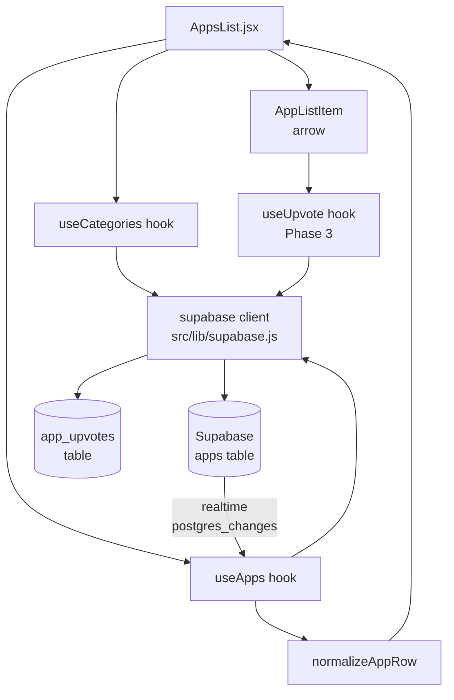

# Phase 4 — Data Layer: AppsList Pulls Real Supabase Data

> **Project:** Apphunt (Indonesian Product Hunt clone) — React + Vite + Supabase
> **Phase:** 4 of N
> **Status:** Planning
> **Last updated:** 2026-06-28
> **Scope:** Wire `AppsList` to the live `apps` Supabase table. Zero UI changes.

---

## Table of Contents

1. [Overview & Goals](#1-overview--goals)
2. [Architecture Diagram](#2-architecture-diagram)
3. [Hook: `useApps`](#3-hook-useappsjs)
4. [Hook: `useCategories`](#4-hook-usecategoriesjs)
5. [Updated `AppsList.jsx`](#5-updated-appslistjsx)
6. [Loading Skeleton](#6-loading-skeleton)
7. [Optimistic Upvote](#7-optimistic-upvote)
8. [Sort Controls UI](#8-sort-controls-ui)
9. [Real-time Updates](#9-real-time-updates)
10. [Data Normalization](#10-data-normalization-normalizeapprow)
11. [Definition of Done](#11-definition-of-done)
12. [Testing Scenarios](#12-testing-scenarios)

---

## 1. Overview & Goals

### What changes in this phase

| Area | Before (Phase 3) | After (Phase 4) |
|---|---|---|
| Data source | `libraryCards` from `App.jsx` (hardcoded JS array) | `apps` table in Supabase via `useApps` hook |
| Categories | `new Set(["All", "Live", "On Development", ...card.team])` | `useCategories` hook — distinct `launch_tags` from live rows |
| Search | Client-side `.filter()` on in-memory array | Server-side `.ilike` via Supabase PostgREST |
| Pagination | None — all cards rendered at once | `range()`-based cursor with "Muat lebih banyak" button |
| Sort | None | 3 options: Terpopuler / Terbaru / Hari ini |
| Upvote count | Static `150 + i * 23` | Live `upvotes_count` from DB, real-time subscribed |
| Outer layout | Frozen | Frozen — zero changes to HTML structure or CSS classes |

### What does NOT change

- `AppsList` JSX structure, CSS class names, sidebar widgets
- `RetroPopover` — receives the same normalized `app` shape it already expects
- `App.jsx` — `libraryCards` export stays in place for other pages that use it
- Routing — no new routes in this phase

### Fallback strategy

`src/lib/supabase.js` already exports `supabase` as `null` when env vars are missing. Every hook in this phase checks `if (!supabase)` as its first line and returns a safe empty state — no crash, no spinner stuck forever, no unhandled promise rejection.

```
supabase === null  →  { apps: [], loading: false, error: null, total: 0, hasMore: false }
```

This means the dev can open the app locally without a `.env` file and see the empty state, not a white screen.

---

## 2. Architecture Diagram



**Data flow summary:**

1. `AppsList` mounts → calls `useCategories()` and `useApps({ category, search, sort, page })`
2. Both hooks call `supabase.from(...)` — return empty state if client is null
3. `useApps` normalizes each row via `normalizeAppRow()` before storing in state
4. A Supabase Realtime subscription watches `postgres_changes` on the `apps` table for `upvotes_count` updates — patches local state in place without a full refetch
5. On upvote click, `useUpvote` (Phase 3) does the optimistic update; the realtime channel confirms or reverts

---

## 3. Hook: `useApps.js`

**Path:** `src/hooks/useApps.js`

```js
/**
 * useApps({ category, search, sort, page, pageSize })
 *
 * Returns live app rows from the Supabase `apps` table.
 * Falls back to empty state if supabase client is null (no env vars).
 *
 * @param {object}  opts
 * @param {string}  [opts.category]  - launch_tag to filter by, e.g. "SaaS". Omit or "Semua" = no filter.
 * @param {string}  [opts.search]    - free-text search against name + tagline
 * @param {string}  [opts.sort]      - "upvotes" | "newest" | "today". Default: "upvotes"
 * @param {number}  [opts.page]      - current page index, 0-based. Default: 0
 * @param {number}  [opts.pageSize]  - rows per page. Default: 20
 *
 * @returns {{ apps: NormalizedApp[], loading: boolean, error: string|null,
 *             total: number, hasMore: boolean, loadMore: () => void }}
 */

import { useState, useEffect, useCallback, useRef } from "react";
import { supabase } from "../lib/supabase";
import { normalizeAppRow } from "../lib/normalizeAppRow";

const DEFAULT_PAGE_SIZE = 20;

export function useApps({
  category = "Semua",
  search = "",
  sort = "upvotes",
  pageSize = DEFAULT_PAGE_SIZE,
} = {}) {
  // --- Null guard: supabase client unavailable (no env vars) ---
  const clientMissing = supabase === null;

  const [apps, setApps] = useState([]);
  const [loading, setLoading] = useState(!clientMissing);
  const [error, setError] = useState(null);
  const [total, setTotal] = useState(0);
  const [page, setPage] = useState(0);

  // Abort controller ref — cancel in-flight fetch when deps change
  const abortRef = useRef(null);

  // Reset to page 0 whenever filters change
  useEffect(() => {
    setPage(0);
    setApps([]);
  }, [category, search, sort]);

  // ---------------------------------------------------------------
  // Core fetch effect
  // ---------------------------------------------------------------
  useEffect(() => {
    if (clientMissing) return;

    let cancelled = false;

    async function fetchApps() {
      setLoading(true);
      setError(null);

      try {
        // --- Build query ---
        let query = supabase
          .from("apps")
          .select("*, app_makers(*)", { count: "exact" })
          .eq("status", "live");

        // Category filter — launch_tags is a text[] column, use contains()
        if (category && category !== "Semua") {
          query = query.contains("launch_tags", [category]);
        }

        // Full-text search against name + tagline (case-insensitive)
        if (search && search.trim() !== "") {
          const q = search.trim().replace(/'/g, "''"); // escape single quotes
          query = query.or(`name.ilike.%${q}%,tagline.ilike.%${q}%`);
        }

        // Sort
        if (sort === "upvotes") {
          query = query.order("upvotes_count", { ascending: false });
        } else if (sort === "newest") {
          query = query.order("created_at", { ascending: false });
        } else if (sort === "today") {
          const today = new Date().toISOString().slice(0, 10); // "YYYY-MM-DD"
          query = query.eq("launch_date", today).order("upvotes_count", { ascending: false });
        }

        // Pagination — page is reset to 0 on filter change (see effect above)
        const from = page * pageSize;
        const to = from + pageSize - 1;
        query = query.range(from, to);

        const { data, error: sbError, count } = await query;

        if (cancelled) return;

        if (sbError) {
          setError(sbError.message ?? "Gagal memuat apps");
          setLoading(false);
          return;
        }

        const normalized = (data ?? []).map(normalizeAppRow);

        setApps((prev) =>
          page === 0 ? normalized : [...prev, ...normalized]
        );
        setTotal(count ?? 0);
      } catch (err) {
        if (!cancelled) {
          setError(err?.message ?? "Terjadi kesalahan");
        }
      } finally {
        if (!cancelled) setLoading(false);
      }
    }

    fetchApps();

    return () => {
      cancelled = true;
    };
  }, [clientMissing, category, search, sort, page, pageSize]);

  // ---------------------------------------------------------------
  // Realtime subscription — upvotes_count changes on `apps` table
  // ---------------------------------------------------------------
  useEffect(() => {
    if (clientMissing) return;

    const channel = supabase
      .channel("apps-upvotes-realtime")
      .on(
        "postgres_changes",
        {
          event: "UPDATE",
          schema: "public",
          table: "apps",
          // Only react to upvotes_count column changes (filter on server side)
        },
        (payload) => {
          const updated = payload.new;
          if (!updated?.id) return;

          setApps((prev) =>
            prev.map((app) =>
              app.id === updated.id
                ? { ...app, upvotes_count: updated.upvotes_count }
                : app
            )
          );
        }
      )
      .subscribe();

    return () => {
      supabase.removeChannel(channel);
    };
  }, [clientMissing]);

  // ---------------------------------------------------------------
  // loadMore — increments page; the fetch effect appends results
  // ---------------------------------------------------------------
  const loadMore = useCallback(() => {
    setPage((p) => p + 1);
  }, []);

  const hasMore = apps.length < total;

  // --- Null guard return ---
  if (clientMissing) {
    return { apps: [], loading: false, error: null, total: 0, hasMore: false, loadMore: () => {} };
  }

  return { apps, loading, error, total, hasMore, loadMore };
}
```

### Key design decisions

- **`cancelled` flag** — prevents stale state updates when the user types quickly (category/search changes abort the previous fetch before it can call `setApps`).
- **Page reset** — the `useEffect` that watches `[category, search, sort]` resets `page` to `0` and clears `apps`. The fetch effect then runs fresh.
- **`page === 0` check** — on first load or filter change, replace the list. On `loadMore`, append.
- **Realtime patches in place** — instead of re-fetching the whole list on every upvote, the subscription patches only the changed row. This is safe because `upvotes_count` is a DB-managed counter (Phase 3).
- **Single quote escaping** — user search input has `'` replaced with `''` before being interpolated into the `.or()` filter to prevent PostgREST query breakage. Input is never executed as SQL directly.

---

## 4. Hook: `useCategories.js`

**Path:** `src/hooks/useCategories.js`

```js
/**
 * useCategories()
 *
 * Fetches all distinct launch_tags from live apps.
 * Returns ["Semua", ...uniqueTags] sorted alphabetically.
 * Results are cached for 5 minutes — avoids re-fetching on every render.
 *
 * Falls back to ["Semua"] if supabase is null or query fails.
 *
 * @returns {{ categories: string[], loading: boolean }}
 */

import { useState, useEffect, useMemo, useRef } from "react";
import { supabase } from "../lib/supabase";

const CACHE_TTL_MS = 5 * 60 * 1000; // 5 minutes

// Module-level cache — persists across component remounts within the same session
const cache = {
  tags: /** @type {string[]|null} */ (null),
  fetchedAt: 0,
};

export function useCategories() {
  const [rawTags, setRawTags] = useState(cache.tags ?? []);
  const [loading, setLoading] = useState(supabase !== null && cache.tags === null);

  useEffect(() => {
    if (supabase === null) return;

    // Cache hit — still fresh
    const now = Date.now();
    if (cache.tags !== null && now - cache.fetchedAt < CACHE_TTL_MS) {
      setRawTags(cache.tags);
      setLoading(false);
      return;
    }

    let cancelled = false;

    async function fetchTags() {
      setLoading(true);
      try {
        // launch_tags is text[] — we need all distinct values across all rows.
        // PostgREST doesn't support unnest directly, so we select the column
        // and flatten client-side. For large tables, a Supabase RPC/view is preferred.
        const { data, error } = await supabase
          .from("apps")
          .select("launch_tags")
          .eq("status", "live");

        if (cancelled) return;
        if (error) throw error;

        const tagSet = new Set();
        (data ?? []).forEach((row) => {
          (row.launch_tags ?? []).forEach((tag) => {
            if (tag && typeof tag === "string") tagSet.add(tag.trim());
          });
        });

        const sorted = Array.from(tagSet).sort((a, b) =>
          a.localeCompare(b, "id")
        );

        cache.tags = sorted;
        cache.fetchedAt = Date.now();

        setRawTags(sorted);
      } catch (err) {
        // Non-fatal — fall back silently, categories will just show "Semua"
        console.warn("[useCategories] Failed to fetch tags:", err?.message);
        setRawTags([]);
      } finally {
        if (!cancelled) setLoading(false);
      }
    }

    fetchTags();

    // Schedule cache invalidation so the next mount after TTL refetches
    const ttlTimer = setTimeout(() => {
      cache.tags = null;
    }, CACHE_TTL_MS);

    return () => {
      cancelled = true;
      clearTimeout(ttlTimer);
    };
  }, []); // runs once per mount; cache guards against redundant network hits

  // Prepend "Semua" as the catch-all tab
  const categories = useMemo(() => ["Semua", ...rawTags], [rawTags]);

  return { categories, loading };
}
```

### Key design decisions

- **Module-level cache** — survives React StrictMode double-invoke and quick navigation back to the page without hitting the network twice.
- **Client-side unnest** — `launch_tags` is `text[]`. PostgREST has no built-in `unnest` + `distinct` query. For < 10k rows this is fine. If the `apps` table grows large, replace with a Supabase RPC: `select distinct_launch_tags()`.
- **Indonesian locale sort** — `localeCompare(b, "id")` sorts correctly for Indonesian tag names (e.g. "Keuangan" before "Teknologi").
- **Silent failure** — if the fetch fails, the hook returns `["Semua"]`. The app still works; users just see no sub-category tabs.

---

## 5. Updated `AppsList.jsx`

**Path:** `src/AppsList.jsx`

This is the minimal diff version. The outer `<section className="apps-page-layout">` structure, all sidebar widgets, CSS classes, and `RetroPopover` integration are **untouched**. Only the data source, category source, and the main list body change.

```jsx
import React, { useState, useMemo } from "react";
import RetroPopover from "./RetroPopover";
import { useApps } from "./hooks/useApps";
import { useCategories } from "./hooks/useCategories";
import { useUpvote } from "./hooks/useUpvote";
import { libraryCards } from "./App"; // still used by sidebar widgets (featured project, tech stacks)

// ─── Icons (unchanged) ───────────────────────────────────────────────────────

function SearchIcon() {
  return (
    <svg viewBox="0 0 24 24" aria-hidden="true" className="icon-inline">
      <circle cx="10.5" cy="10.5" r="5.5" />
      <path d="m15 15 4 4" />
    </svg>
  );
}

function CaretUpIcon() {
  return (
    <svg viewBox="0 0 10 10" aria-hidden="true" className="icon-inline upvote-icon">
      <path d="M2 6.5 5 3.5l3 3" />
    </svg>
  );
}

// ─── Skeleton (see Section 6 for full detail) ─────────────────────────────────

function AppListSkeleton() {
  return (
    <div className="app-list-skeleton" aria-hidden="true">
      {[0, 1, 2].map((i) => (
        <div key={i} className="app-list-item skeleton-item">
          <div className="skeleton-logo" />
          <div className="skeleton-body">
            <div className="skeleton-line skeleton-name" />
            <div className="skeleton-line skeleton-tagline" />
          </div>
          <div className="skeleton-upvote" />
        </div>
      ))}
    </div>
  );
}

// ─── Sort Controls ────────────────────────────────────────────────────────────

const SORT_OPTIONS = [
  { value: "upvotes", label: "Terpopuler" },
  { value: "newest",  label: "Terbaru"    },
  { value: "today",   label: "Hari ini"   },
];

function SortControls({ activeSort, onSort }) {
  return (
    <div className="sort-controls" role="group" aria-label="Urutkan apps">
      {SORT_OPTIONS.map((opt) => (
        <button
          key={opt.value}
          className={`mini-tag-btn${activeSort === opt.value ? " active" : ""}`}
          onClick={() => onSort(opt.value)}
          aria-pressed={activeSort === opt.value}
        >
          {opt.label}
        </button>
      ))}
    </div>
  );
}

// ─── Single app row with optimistic upvote ────────────────────────────────────

function AppListItem({ app, onSelect }) {
  const { upvotes, upvoted, toggle, pending } = useUpvote(app.id, app.upvotes_count);

  return (
    <article
      className="app-list-item"
      onClick={() => onSelect(app)}
      role="button"
      tabIndex={0}
      onKeyDown={(e) => e.key === "Enter" && onSelect(app)}
      aria-label={`Buka detail ${app.name}`}
    >
       { e.currentTarget.src = "/placeholder-logo.png"; }}
      />
      <div className="app-list-body">
        <strong className="app-list-name">{app.name}</strong>
        <p className="app-list-tagline">{app.tagline}</p>
        {app.launch_tags?.length > 0 && (
          <div className="app-list-tags">
            {app.launch_tags.slice(0, 3).map((tag) => (
              <span key={tag} className="mini-tag-btn">{tag}</span>
            ))}
          </div>
        )}
      </div>
      <button
        className={`upvote-button${upvoted ? " upvoted" : ""}`}
        onClick={(e) => { e.stopPropagation(); toggle(); }}
        aria-label={`${upvoted ? "Batalkan upvote" : "Upvote"} ${app.name}`}
        aria-pressed={upvoted}
        disabled={pending}
      >
        <CaretUpIcon />
        <span className="upvote-count">{upvotes}</span>
      </button>
    </article>
  );
}

// ─── Main component ───────────────────────────────────────────────────────────

export default function AppsList() {
  const [searchQuery, setSearchQuery]     = useState("");
  const [activeCategory, setActiveCategory] = useState("Semua");
  const [activeSort, setActiveSort]       = useState("upvotes");
  const [selectedApp, setSelectedApp]     = useState(null);

  // --- Data hooks (Phase 4) ---
  const { categories } = useCategories();
  const { apps, loading, error, hasMore, loadMore } = useApps({
    category: activeCategory,
    search:   searchQuery,
    sort:     activeSort,
  });

  // --- Sidebar data still sourced from libraryCards (unchanged) ---
  const techStacks = useMemo(() => {
    const stacks = new Set();
    libraryCards.forEach((card) => {
      const kvBlock = card.richContent?.blocks?.find((b) => b.type === "kv");
      if (kvBlock) {
        kvBlock.rows.forEach((row) => {
          if (row.label === "Tech Stack" && row.value) {
            row.value.split(/[+&,]/).forEach((tech) => {
              const trimmed = tech.trim();
              if (trimmed) stacks.add(trimmed);
            });
          }
        });
      }
    });
    return Array.from(stacks).slice(0, 5);
  }, []);

  const clientIndustries = useMemo(() => {
    const industries = new Set();
    libraryCards.forEach((card) => {
      if (card.place) {
        if (card.place.includes("EdTech") || card.place.includes("Learning")) industries.add("Education");
        if (card.place.includes("HR") || card.place.includes("Talent")) industries.add("HR Tech");
        if (card.place.includes("Healthcare") || card.place.includes("Medical")) industries.add("Healthcare");
        if (card.place.includes("SaaS") || card.place.includes("B2B")) industries.add("SaaS");
      }
    });
    return Array.from(industries).slice(0, 4);
  }, []);

  const featuredProject = useMemo(
    () => libraryCards.find((card) => card.status?.includes("Live")) || libraryCards[0],
    []
  );

  // ─── Render ───────────────────────────────────────────────────────────────

  return (
    <section className="apps-page-layout">

      {/* ── Left Sidebar: Categories (now from useCategories) ── */}
      <aside className="apps-left-sidebar">
        <nav className="category-nav" aria-label="Kategori apps">
          {categories.map((cat) => (
            <button
              key={cat}
              className={`category-tab${activeCategory === cat ? " active" : ""}`}
              onClick={() => setActiveCategory(cat)}
              aria-pressed={activeCategory === cat}
            >
              {cat}
            </button>
          ))}
        </nav>
      </aside>

      {/* ── Main content ── */}
      <div className="apps-main">

        {/* Search bar — structure unchanged */}
        <div className="apps-search-bar">
          <SearchIcon />
          <input
            type="search"
            className="apps-search-input"
            placeholder="Cari apps..."
            value={searchQuery}
            onChange={(e) => setSearchQuery(e.target.value)}
            aria-label="Cari apps"
          />
        </div>

        {/* Sort controls — NEW in Phase 4, placed below search */}
        <SortControls activeSort={activeSort} onSort={setActiveSort} />

        {/* App list — only this block changes from Phase 3 */}
        <div className="app-list" role="list">
          {loading && apps.length === 0 && <AppListSkeleton />}

          {error && (
            <div className="app-list-error" role="alert">
              <p>Gagal memuat apps: {error}</p>
              <button
                className="mini-tag-btn"
                onClick={() => window.location.reload()}
              >
                Coba lagi
              </button>
            </div>
          )}

          {!loading && !error && apps.length === 0 && (
            <div className="app-list-empty">
              <p>Belum ada apps di kategori ini.</p>
            </div>
          )}

          {apps.map((app) => (
            <AppListItem
              key={app.id}
              app={app}
              onSelect={setSelectedApp}
            />
          ))}

          {/* Load more — shown only when there are more pages */}
          {hasMore && !loading && (
            <div className="app-list-loadmore">
              <button className="mini-tag-btn" onClick={loadMore}>
                Muat lebih banyak
              </button>
            </div>
          )}

          {/* Inline loading indicator during pagination (not first load) */}
          {loading && apps.length > 0 && (
            <div className="app-list-loading-more" aria-live="polite">
              Memuat...
            </div>
          )}
        </div>
      </div>

      {/* ── Right Sidebar: unchanged from Phase 3 ── */}
      <aside className="apps-sidebar">
        <div className="sidebar-widget">
          <span className="sidebar-eyebrow">Featured Project</span>
          <article className="library-card featured-card">
            <div className="library-card-hero">
              <div className="library-card-screenshot-wrap">
                
              </div>
            </div>
            <div className="library-card-ribbon">
              <strong>{featuredProject.name}</strong>
              <span>{featuredProject.status}</span>
            </div>
            <div className="library-card-meta">
              <p>{featuredProject.role}</p>
            </div>
          </article>
        </div>

        <div className="sidebar-widget">
          <span className="sidebar-eyebrow">Tech Stack</span>
          <div className="panel-chips">
            {techStacks.map((chip) => (
              <span key={chip} className="panel-chip">{chip}</span>
            ))}
          </div>
        </div>

        <div className="sidebar-widget">
          <span className="sidebar-eyebrow">Client Industries</span>
          <div className="trust-logos">
            {clientIndustries.map((industry) => (
              <span key={industry}>{industry}</span>
            ))}
          </div>
        </div>
      </aside>

      <RetroPopover app={selectedApp} onClose={() => setSelectedApp(null)} />
    </section>
  );
}
```

---

## 6. Loading Skeleton

The skeleton renders inline inside `AppsList` — no separate file needed. The CSS is injected as a `<style>` tag in `App.css` (or `index.css`). Shape exactly mirrors `.app-list-item` so there is no layout shift when real data arrives.

### JSX (already embedded in `AppsList.jsx` above as `<AppListSkeleton />`)

```jsx
function AppListSkeleton() {
  return (
    <div className="app-list-skeleton" aria-hidden="true" aria-label="Memuat apps...">
      {[0, 1, 2].map((i) => (
        <div key={i} className="app-list-item skeleton-item">
          {/* Logo placeholder: 48x48 */}
          <div className="skeleton-logo" />

          {/* Text block */}
          <div className="skeleton-body">
            {/* Name: ~140px */}
            <div className="skeleton-line skeleton-name" />
            {/* Tagline: ~220px */}
            <div className="skeleton-line skeleton-tagline" />
          </div>

          {/* Upvote button placeholder: 40x40 */}
          <div className="skeleton-upvote" />
        </div>
      ))}
    </div>
  );
}
```

### CSS (add to `src/App.css` or `src/index.css`)

```css
/* ── Skeleton pulse animation ─────────────────────────────────── */
@keyframes skeleton-pulse {
  0%   { opacity: 1; }
  50%  { opacity: 0.4; }
  100% { opacity: 1; }
}

.skeleton-item {
  pointer-events: none;
  cursor: default;
}

.skeleton-logo {
  width: 48px;
  height: 48px;
  border-radius: 10px;
  background: var(--color-surface-2, #e2e8f0);
  flex-shrink: 0;
  animation: skeleton-pulse 1.4s ease-in-out infinite;
}

.skeleton-body {
  flex: 1;
  display: flex;
  flex-direction: column;
  gap: 8px;
  justify-content: center;
}

.skeleton-line {
  height: 12px;
  border-radius: 6px;
  background: var(--color-surface-2, #e2e8f0);
  animation: skeleton-pulse 1.4s ease-in-out infinite;
}

.skeleton-name {
  width: 140px;
  animation-delay: 0s;
}

.skeleton-tagline {
  width: 220px;
  animation-delay: 0.15s;
}

.skeleton-upvote {
  width: 40px;
  height: 40px;
  border-radius: 8px;
  background: var(--color-surface-2, #e2e8f0);
  flex-shrink: 0;
  animation: skeleton-pulse 1.4s ease-in-out infinite;
  animation-delay: 0.3s;
}

/* Sort controls */
.sort-controls {
  display: flex;
  gap: 6px;
  margin-bottom: 12px;
  flex-wrap: wrap;
}

/* Load more / error / empty states */
.app-list-loadmore,
.app-list-error,
.app-list-empty {
  padding: 16px 0;
  text-align: center;
}

.app-list-loading-more {
  padding: 8px 0;
  text-align: center;
  font-size: 0.85rem;
  opacity: 0.6;
}
```

### Accessibility notes

- `aria-hidden="true"` on the skeleton wrapper — screen readers skip it
- A visually hidden `aria-live="polite"` region (the `app-list-loading-more` div) announces when pagination loads so keyboard-only users know new content arrived
- `aria-label="Memuat apps..."` on the skeleton container gives assistive tech context if `aria-hidden` is removed

---

## 7. Optimistic Upvote

**Path:** `src/hooks/useUpvote.js`

This hook was scaffolded in Phase 3. The interface `useUpvote(appId, initialCount)` is already consumed by `AppListItem` in section 5. Here is the complete implementation for reference, including the revert-on-error path.

```js
/**
 * useUpvote(appId, initialCount)
 *
 * Manages optimistic upvote state for a single app.
 * - Immediately updates local count on toggle
 * - Writes to `app_upvotes` table in Supabase
 * - Reverts local state if the DB write fails
 *
 * @param {string|number} appId
 * @param {number}        initialCount  - upvotes_count from the DB row
 * @returns {{ upvotes: number, upvoted: boolean, toggle: () => void, pending: boolean }}
 */

import { useState, useCallback, useRef } from "react";
import { supabase } from "../lib/supabase";

export function useUpvote(appId, initialCount = 0) {
  const [upvotes, setUpvotes] = useState(initialCount);
  const [upvoted, setUpvoted] = useState(false);
  const [pending, setPending] = useState(false);

  // Keep upvotes in sync when the parent re-renders with a new realtime count
  // (only if the user has not locally modified it yet)
  const locallyModified = useRef(false);
  if (!locallyModified.current && upvotes !== initialCount) {
    setUpvotes(initialCount);
  }

  const toggle = useCallback(async () => {
    if (!supabase || pending) return;

    // --- Optimistic update ---
    const wasUpvoted = upvoted;
    const prevCount  = upvotes;
    const nextCount  = wasUpvoted ? prevCount - 1 : prevCount + 1;

    setUpvoted(!wasUpvoted);
    setUpvotes(nextCount);
    locallyModified.current = true;
    setPending(true);

    try {
      if (wasUpvoted) {
        // Remove upvote — auth.uid() must match the row's user_id
        const { error } = await supabase
          .from("app_upvotes")
          .delete()
          .eq("app_id", appId);
        if (error) throw error;
      } else {
        // Insert upvote — `app_upvotes(app_id, user_id)` has a unique constraint
        const { error } = await supabase
          .from("app_upvotes")
          .insert({ app_id: appId });
        if (error) throw error;
      }
    } catch (err) {
      // --- Revert on error ---
      console.warn("[useUpvote] Toggle failed, reverting:", err?.message);
      setUpvoted(wasUpvoted);
      setUpvotes(prevCount);
    } finally {
      setPending(false);
    }
  }, [appId, upvoted, upvotes, pending]);

  return { upvotes, upvoted, toggle, pending };
}
```

### How optimistic upvote interacts with realtime

```
User clicks upvote
  ↓
useUpvote: setUpvotes(n+1) immediately  ← user sees instant feedback
  ↓
DB INSERT into app_upvotes
  ↓
Supabase trigger: UPDATE apps SET upvotes_count = upvotes_count + 1
  ↓
useApps realtime channel receives UPDATE payload
  ↓
setApps patches upvotes_count in local state
  ↓
AppListItem re-renders — upvotes_count now matches DB truth
```

If the DB write fails, `useUpvote` reverts before the realtime event ever fires — no double-revert risk.

---

## 8. Sort Controls UI

The `SortControls` component is already embedded in the updated `AppsList.jsx` above. Extracted here for clarity:

```jsx
/**
 * SortControls
 * Renders 3 toggle buttons using the existing `.mini-tag-btn` CSS class.
 * Placed between the search bar and the app list.
 */

const SORT_OPTIONS = [
  { value: "upvotes", label: "Terpopuler" },
  { value: "newest",  label: "Terbaru"    },
  { value: "today",   label: "Hari ini"   },
];

function SortControls({ activeSort, onSort }) {
  return (
    <div className="sort-controls" role="group" aria-label="Urutkan apps">
      {SORT_OPTIONS.map((opt) => (
        <button
          key={opt.value}
          className={`mini-tag-btn${activeSort === opt.value ? " active" : ""}`}
          onClick={() => onSort(opt.value)}
          aria-pressed={activeSort === opt.value}
        >
          {opt.label}
        </button>
      ))}
    </div>
  );
}
```

### CSS for `.mini-tag-btn.active` (add to existing ruleset)

```css
.mini-tag-btn.active {
  background: var(--color-accent, #f36f27);
  color: #fff;
  border-color: var(--color-accent, #f36f27);
}
```

### Sort → query mapping

| Button | `sort` value | Supabase query |  
|---|---|---|
| Terpopuler | `"upvotes"` | `.order("upvotes_count", { ascending: false })` |
| Terbaru | `"newest"` | `.order("created_at", { ascending: false })` |
| Hari ini | `"today"` | `.eq("launch_date", today).order("upvotes_count", { ascending: false })` |

Note: **"Hari ini"** uses `launch_date` (a `date` column), not `created_at`. If no apps launched today, the empty state is shown.

---

## 9. Real-time Updates

The realtime subscription lives inside `useApps` — no separate effect needed in `AppsList`. Here is the full subscription block isolated for documentation clarity:

```js
// Inside useApps, after the fetch effect:

useEffect(() => {
  if (clientMissing) return;

  // Subscribe to all UPDATE events on the `apps` table.
  // The payload.new object contains the full updated row.
  const channel = supabase
    .channel("apps-upvotes-realtime")
    .on(
      "postgres_changes",
      {
        event: "UPDATE",    // only updates — INSERT/DELETE handled by upvote hook
        schema: "public",
        table: "apps",
      },
      (payload) => {
        const updated = payload.new;
        if (!updated?.id) return;

        // Patch only the affected row in local state — no full refetch
        setApps((prev) =>
          prev.map((app) =>
            app.id === updated.id
              ? { ...app, upvotes_count: updated.upvotes_count }
              : app
          )
        );
      }
    )
    .subscribe((status) => {
      if (status === "CHANNEL_ERROR") {
        console.warn("[useApps] Realtime channel error — upvote counts may be stale");
      }
    });

  // Unsubscribe when the component unmounts or supabase client changes
  return () => {
    supabase.removeChannel(channel);
  };
}, [clientMissing]);
```

### Requirements on the Supabase side

For `postgres_changes` to fire, Realtime must be enabled on the `apps` table in the Supabase dashboard:

```sql
-- Run in Supabase SQL editor if not already done in Phase 1 migration
alter publication supabase_realtime add table apps;
```

### What is NOT subscribed via realtime

| Event | Handling |
|---|---|
| New app INSERT | User must pull-to-refresh or navigate away and back. Realtime inserts would shift the paginated list in confusing ways. |
| App DELETE / status change | Not subscribed. Stale rows in local state are harmless (they show as live until next full fetch). |
| `app_upvotes` INSERT/DELETE | Handled by the DB trigger that updates `apps.upvotes_count`, which then fires the UPDATE event above. |

---

## 10. Data Normalization: `normalizeAppRow`

**Path:** `src/lib/normalizeAppRow.js`

This pure function maps a raw Supabase row to the shape that `AppListItem` and `RetroPopover` expect. It is the single translation boundary between DB schema and UI components.

```js
/**
 * normalizeAppRow(row)
 *
 * Maps a raw Supabase `apps` row (with optional joined `app_makers`)
 * to the shape consumed by AppListItem and RetroPopover.
 *
 * All fields are optional-safe: missing DB fields get sensible defaults
 * rather than undefined/null bleeding into the UI.
 *
 * @param   {object} row  - Raw row from supabase.from('apps').select('*, app_makers(*)')
 * @returns {NormalizedApp}
 */
export function normalizeAppRow(row) {
  if (!row || typeof row !== "object") return null;

  return {
    // ── Identity ──────────────────────────────────────────────────
    id:           row.id,
    slug:         row.slug ?? slugify(row.name ?? ""),
    name:         row.name ?? "Unnamed App",

    // ── Display fields ────────────────────────────────────────────
    tagline:      row.tagline ?? row.role ?? "",
    logo_url:     row.logo_url ?? row.image ?? null,
    // gallery_images[] → array used by RetroPopover gallery slider
    gallery:      Array.isArray(row.gallery_images)
                    ? row.gallery_images.filter(Boolean)
                    : (row.image ? [row.image] : []),

    // ── Categorisation ────────────────────────────────────────────
    launch_tags:  Array.isArray(row.launch_tags) ? row.launch_tags : [],
    // Backwards-compat alias: RetroPopover reads app.category
    category:     Array.isArray(row.launch_tags) && row.launch_tags[0]
                    ? row.launch_tags[0]
                    : (row.category ?? ""),

    // ── Metrics ───────────────────────────────────────────────────
    upvotes_count: typeof row.upvotes_count === "number" ? row.upvotes_count : 0,
    // Legacy alias — some UI reads app.upvotes
    upvotes:       typeof row.upvotes_count === "number" ? row.upvotes_count : 0,
    reviews_count: typeof row.reviews_count === "number" ? row.reviews_count : 0,

    // ── Dates & status ────────────────────────────────────────────
    launch_date:   row.launch_date ?? null,
    status:        row.status ?? "live",
    pricing_type:  row.pricing_type ?? "free",
    created_at:    row.created_at ?? null,

    // ── Makers ────────────────────────────────────────────────────
    // app_makers is the joined array from select('*, app_makers(*)')
    app_makers: Array.isArray(row.app_makers)
      ? row.app_makers.map((m) => ({
          id:         m.id,
          name:       m.name ?? m.full_name ?? "Maker",
          avatar_url: m.avatar_url ?? null,
          role:       m.role ?? null,
          twitter:    m.twitter ?? null,
        }))
      : [],

    // ── RetroPopover compat fields ────────────────────────────────
    // RetroPopover reads: app.stats, app.highlights, app.userJourney,
    // app.richContent, app.strategy — these are not in the `apps` table.
    // They come from a separate `app_details` table (Phase 5).
    // For now, fall back to empty/null so RetroPopover degrades gracefully.
    stats:       row.stats        ?? [],
    highlights:  row.highlights   ?? [],
    userJourney: row.userJourney  ?? [],
    richContent: row.richContent  ?? null,
    strategy:    row.strategy     ?? [],

    // Keep the raw row available for debugging — stripped in production builds
    // via tree-shaking since it's only accessed in dev tools
    _raw: import.meta.env.DEV ? row : undefined,
  };
}

/**
 * Simple URL-safe slug from a display name.
 * Mirrors the toSlug() used in App.jsx routing.
 */
function slugify(name) {
  return name
    .toLowerCase()
    .replace(/[^a-z0-9]+/g, "-")
    .replace(/^-|-$/g, "");
}
```

### Shape contract

```ts
// TypeScript-style interface for documentation (not enforced at runtime)
interface NormalizedApp {
  // Identity
  id:            string | number;
  slug:          string;
  name:          string;

  // Display
  tagline:       string;
  logo_url:      string | null;
  gallery:       string[];           // used by RetroPopover gallery slider

  // Categorisation
  launch_tags:   string[];
  category:      string;             // alias: launch_tags[0]

  // Metrics
  upvotes_count: number;
  upvotes:       number;             // alias for legacy reads
  reviews_count: number;

  // Dates & status
  launch_date:   string | null;      // "YYYY-MM-DD"
  status:        string;             // "live" | "coming_soon" | etc.
  pricing_type:  string;             // "free" | "freemium" | "paid"
  created_at:    string | null;

  // Makers
  app_makers: {
    id:         string;
    name:       string;
    avatar_url: string | null;
    role:       string | null;
    twitter:    string | null;
  }[];

  // RetroPopover compat (Phase 5 will populate these from app_details)
  stats:        { label: string; value: string }[];
  highlights:   string[];
  userJourney:  { step: string; tag: string; desc: string; callout: string }[];
  richContent:  object | null;
  strategy:     { phase: string; desc: string; image: string }[];
}
```

---

## 11. Definition of Done

All items must be checked before Phase 4 is considered complete.

### Data & Hooks

- [ ] `src/hooks/useApps.js` created and returns `{ apps, loading, error, total, hasMore, loadMore }`
- [ ] `src/hooks/useCategories.js` created and returns `{ categories, loading }`
- [ ] `src/lib/normalizeAppRow.js` created; all fields have safe defaults
- [ ] `useApps` returns empty state (not crash) when `supabase === null`
- [ ] `useCategories` returns `["Semua"]` (not crash) when `supabase === null`
- [ ] `useApps` correctly resets to page 0 when `category`, `search`, or `sort` changes
- [ ] `loadMore` correctly appends the next page without duplicating results
- [ ] Realtime channel subscribes on mount and unsubscribes on unmount
- [ ] Realtime `UPDATE` event patches only the changed row's `upvotes_count`
- [ ] `useCategories` result is cached for 5 minutes and not refetched on re-render

### Query correctness

- [ ] Category filter uses `.contains("launch_tags", [category])` (array contains, not equals)
- [ ] Search filter uses `.or("name.ilike.%q%,tagline.ilike.%q%")` with single-quote escaping
- [ ] "Hari ini" sort filters by `launch_date` equal to today's date in `YYYY-MM-DD` format
- [ ] Pagination uses `.range(from, to)` — `from = page * pageSize`, `to = from + pageSize - 1`
- [ ] `select('*, app_makers(*)')` is used (joined query, not two separate calls)

### UI — AppsList

- [ ] `AppsList` imports `useApps` and `useCategories` instead of `libraryCards` for list + categories
- [ ] Skeleton renders exactly 3 rows matching `.app-list-item` shape on first load
- [ ] Skeleton disappears when `loading === false`
- [ ] Error state shows "Gagal memuat apps" with a retry button when `error !== null`
- [ ] Empty state shows "Belum ada apps di kategori ini" when `apps.length === 0 && !loading && !error`
- [ ] "Muat lebih banyak" button appears only when `hasMore === true`
- [ ] "Muat lebih banyak" disappears while the next page is loading
- [ ] Sort controls render above the app list, below the search bar
- [ ] Active sort button has `.active` class and correct `aria-pressed` attribute
- [ ] Outer `<section className="apps-page-layout">`, sidebar widgets, and `RetroPopover` are **unchanged**

### Optimistic upvote

- [ ] `useUpvote` hook exists at `src/hooks/useUpvote.js`
- [ ] Clicking upvote immediately increments local count (no waiting for DB)
- [ ] On DB error, count reverts to the pre-click value
- [ ] Upvote button is `disabled` while `pending === true`

### Infrastructure

- [ ] `alter publication supabase_realtime add table apps` migration is applied
- [ ] `apps` table has RLS policy allowing `anon` role to `SELECT` rows with `status = 'live'`
- [ ] `app_upvotes` table has RLS allowing authenticated users to INSERT and DELETE their own rows

---

## 12. Testing Scenarios

Manual QA checklist. Run these in order before marking the phase complete.

### Scenario 1 — Supabase offline (no env vars)

**Setup:** Remove or rename `.env` so `VITE_SUPABASE_URL` is undefined. Restart `vite dev`.

| Step | Expected result |
|---|---|
| Navigate to `/apps` | Page loads without error or white screen |
| App list area | Shows empty state: "Belum ada apps di kategori ini" |
| Category tabs | Shows only "Semua" |
| Browser console | No uncaught errors, no unhandled promise rejections |
| Sort controls | Render correctly; clicking them does nothing visually |

### Scenario 2 — Search returns zero results

**Setup:** Supabase connected. Type a nonsense string like `"xyzxyzxyz123"` in the search box.

| Step | Expected result |
|---|---|
| While typing | Loading skeleton appears briefly |
| After debounce / fetch | App list shows empty state message |
| Clear search | Full app list re-appears |
| Console | No errors |

### Scenario 3 — Category filter

**Setup:** At least two distinct `launch_tags` exist in the `apps` table.

| Step | Expected result |
|---|---|
| Load page | "Semua" tab is active; all live apps shown |
| Click a specific tag (e.g. "SaaS") | List re-fetches; only apps with "SaaS" in `launch_tags` shown |
| Click "Semua" again | Full list returns |
| Category + search combined | Both filters applied simultaneously |

### Scenario 4 — Pagination

**Setup:** At least 21 live apps in the `apps` table (to exceed default page size of 20).

| Step | Expected result |
|---|---|
| Initial load | 20 apps visible; "Muat lebih banyak" button visible |
| Click "Muat lebih banyak" | Button disappears, spinner/text "Memuat..." appears |
| After load | Next batch appended below existing items; no duplicates |
| All apps loaded | "Muat lebih banyak" button no longer shown |
| Change category mid-pagination | List resets to page 0 of new category |

### Scenario 5 — Realtime upvote count update

**Setup:** Two browser windows open on `/apps`.

| Step | Expected result |
|---|---|
| Window A: click upvote on app X | Window A: count increments immediately |
| Window B: observe within ~2 seconds | Window B: count for app X updates to match without page reload |
| Simulate DB error (temporarily break RLS) | Window A: count reverts to pre-click value |

### Scenario 6 — Sort controls

| Step | Expected result |
|---|---|
| Click "Terbaru" | List reloads sorted by `created_at DESC`; button shows `.active` |
| Click "Hari ini" | List shows only apps with today's `launch_date`; or empty state if none |
| Click "Terpopuler" | List reloads sorted by `upvotes_count DESC`; default state restored |
| Combine sort + search | Both applied simultaneously |

### Scenario 7 — Skeleton accessibility

| Step | Expected result |
|---|---|
| Tab to skeleton area with keyboard | Focus skips the skeleton (it has `aria-hidden`) |
| Screen reader (NVDA/JAWS) on load | Announces app list items when loaded, not skeleton noise |
| `aria-live` region | Announces "Memuat..." only during pagination (not first load) |

---

## Appendix: File Inventory

All new and modified files for Phase 4:

| File | Change type | Notes |
|---|---|---|
| `src/hooks/useApps.js` | **NEW** | Core data hook |
| `src/hooks/useCategories.js` | **NEW** | Category list hook |
| `src/hooks/useUpvote.js` | **NEW** (or Phase 3 carry-over) | Optimistic upvote |
| `src/lib/normalizeAppRow.js` | **NEW** | DB row → UI shape |
| `src/AppsList.jsx` | **MODIFIED** | Data source swap + states |
| `src/App.css` (or `index.css`) | **MODIFIED** | Skeleton + sort CSS |
| `supabase/migrations/003_apps_realtime.sql` | **NEW** | Enable realtime on `apps` table |

### Migration: `003_apps_realtime.sql`

```sql
-- Phase 4: Enable Supabase Realtime on the apps table
-- Required for upvotes_count live updates in AppsList

alter publication supabase_realtime add table apps;

-- RLS: allow anonymous reads of live apps (if not already set in Phase 1)
create policy "Public can read live apps"
  on apps
  for select
  to anon
  using (status = 'live');

-- RLS: authenticated users can read all their own apps regardless of status
create policy "Makers can read their own apps"
  on apps
  for select
  to authenticated
  using (
    id in (
      select app_id from app_makers where user_id = auth.uid()
    )
  );
```
