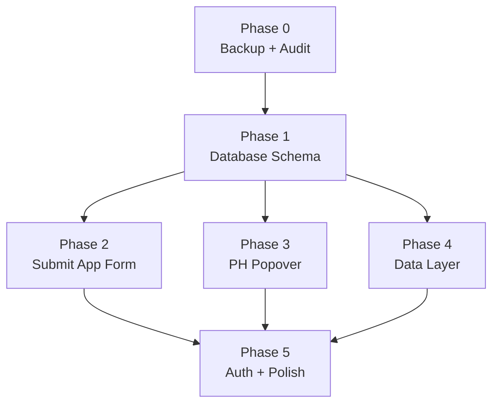
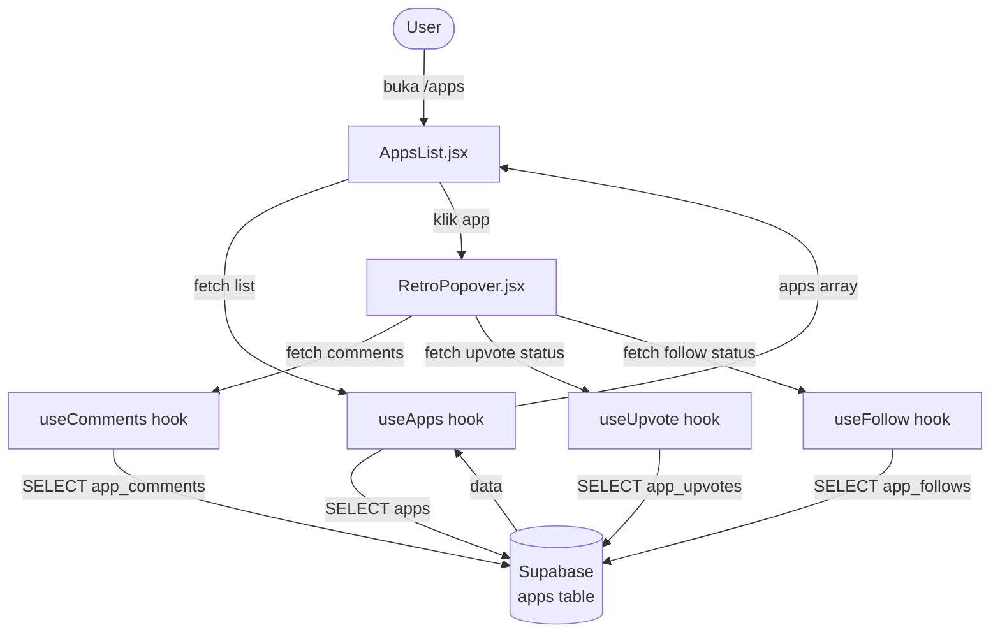
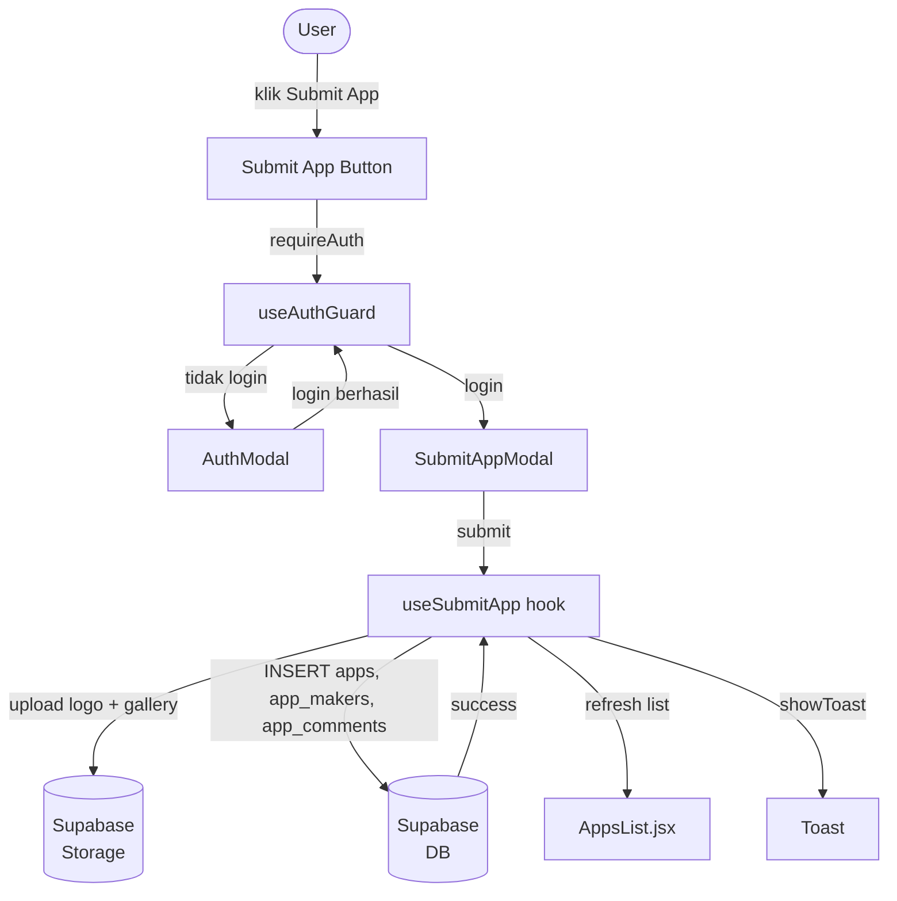
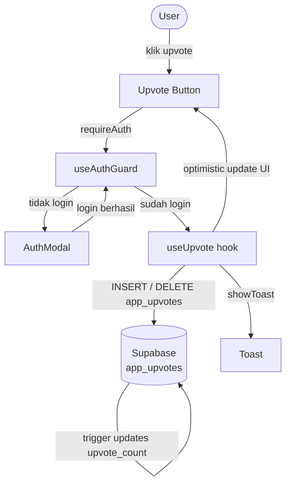

# Apphunt — Master Phase Index

> **Project:** Apphunt — Indonesian Product Hunt Clone
> **Stack:** React + Vite + Supabase
> **Prinsip Besi:** Outer `AppsList` UI frozen. Hanya popover content + data layer yang berubah.

---

## Table of Contents

1. [Project Summary](#1-project-summary)
2. [Phase Overview](#2-phase-overview)
3. [File Inventory](#3-file-inventory)
4. [Dependency Map](#4-dependency-map)
5. [Frozen Files List](#5-frozen-files-list)
6. [Data Flow Diagram](#6-data-flow-diagram)
7. [Environment Variables](#7-environment-variables)
8. [Styling Guide Quick Reference](#8-styling-guide-quick-reference)
9. [Risk Register](#9-risk-register)
10. [Execution Checklist](#10-execution-checklist)

---

## 1. Project Summary

### Apa yang Kita Bangun

Apphunt adalah klon Product Hunt berbahasa Indonesia yang dibangun di atas platform Appverse ID yang sudah ada. User bisa:

- **Browse** daftar aplikasi Indonesia yang sudah disubmit
- **Submit** aplikasi baru lewat wizard 4-step dengan upload logo + gallery
- **Upvote** aplikasi favorit (auth required)
- **Follow** aplikasi untuk mendapat update (auth required)
- **Comment** di halaman detail setiap aplikasi (auth required)
- **Filter** berdasarkan kategori, tanggal launch, dan pricing
- **Melihat detail** setiap aplikasi dalam popover bergaya Product Hunt

### Prinsip Inti

**Outer `AppsList` UI frozen** — Struktur HTML, CSS class names, dan layout skeleton `AppsList.jsx` tidak boleh berubah. Yang berubah hanyalah:
1. Data source: dari `libraryCards` (mock) ke Supabase
2. Popover content: dari `RetroPopover` (static) ke popover bergaya Product Hunt
3. Fitur baru: submit, upvote, follow, comment — semuanya ditambahkan tanpa menyentuh outer shell

### Tech Stack

| Layer | Teknologi |
|-------|-----------|
| Frontend | React 18 + Vite |
| Routing | react-router-dom 6.30.0 |
| Backend / DB | Supabase (PostgreSQL + Auth + Storage) |
| Styling | Vanilla CSS (design system di `STYLING_GUIDE.md`) |
| State | React Context + custom hooks |
| No new libraries | Semua fitur diimplementasi dengan yang sudah ada |

---

## 2. Phase Overview

| Phase | File | Status | Goal | Est. Effort |
|-------|------|--------|------|-------------|
| 0 | `PHASE-0-BACKUP-AUDIT.md` | Done | Backup file penting + audit routing, dependencies, CSS classes frozen | 30 menit |
| 1 | `PHASE-1-DATABASE-SCHEMA.md` | Ready to execute | Supabase schema lengkap: tabel, RLS, storage, indexes, seed data | 1 jam |
| 2 | `PHASE-2-SUBMIT-APP-FORM.md` | Ready to execute | Multi-step submit wizard + upload ke Supabase Storage | 3 jam |
| 3 | `PHASE-3-PRODUCTHUNT-POPOVER.md` | Ready to execute | Popover bergaya Product Hunt menggantikan RetroPopover | 3 jam |
| 4 | `PHASE-4-DATA-LAYER.md` | Ready to execute | Semua custom hooks Supabase: useApps, useUpvote, useComments, dll. | 2 jam |
| 5 | `PHASE-5-AUTH-POLISH.md` | Ready to execute | Auth gates semua write actions + toast + badges + follow system + polish | 2 jam |

**Total estimasi:** ~11.5 jam implementasi penuh

### Urutan Eksekusi yang Benar

```
Phase 0 (Done) --> Phase 1 --> Phase 2 --> Phase 3 --> Phase 4 --> Phase 5
```

Phase 1 harus selesai sebelum Phase 2, 3, atau 4 karena semua bergantung pada schema database.
Phase 4 harus selesai sebelum Phase 5 karena Phase 5 menggunakan hooks dari Phase 4.

---

## 3. File Inventory

Daftar lengkap semua file yang dibuat atau dimodifikasi di seluruh phases.

### Files Baru (Dibuat dari Nol)

| File | Phase | Deskripsi |
|------|-------|-----------|
| `supabase/migrations/003_apps.sql` | 1 | Schema utama: tabel apps, app_upvotes, app_comments, app_makers, app_tags, profiles |
| `supabase/migrations/004_app_follows.sql` | 5 | Tabel app_follows + RLS + trigger follow_count |
| `src/lib/supabase.js` | 0/1 | Supabase client singleton (null-safe jika env vars tidak ada) |
| `src/context/AuthContext.jsx` | 0/1 | Auth context: user, session, openAuthModal, handleAuthSuccess |
| `src/context/ToastContext.jsx` | 5 | ToastProvider + useToast() hook |
| `src/components/Toast.jsx` | 5 | Toast UI component -- slide-in, auto-dismiss, 3 types |
| `src/components/AppStatusBadge.jsx` | 5 | LaunchTodayBadge + PricingBadge chips |
| `src/components/SubmitAppModal.jsx` | 2 | Wizard 4-step submit form |
| `src/hooks/useApps.js` | 4 | Fetch daftar apps dari Supabase dengan filter |
| `src/hooks/useUpvote.js` | 4 | Toggle upvote + cached count |
| `src/hooks/useComments.js` | 4 | Fetch + submit komentar |
| `src/hooks/useSubmitApp.js` | 2 | Submit app ke Supabase (upload + insert) |
| `src/hooks/useAuthGuard.js` | 5 | requireAuth() wrapper untuk semua write actions |
| `src/hooks/useFollow.js` | 5 | Toggle follow/unfollow + follow count |
| `src/hooks/useHariIniFilter.js` | 5 | Filter apps berdasarkan launch_date WIB |
| `src/lib/dateUtils.js` | 5 | getTodayWIB(), isLaunchingToday(), formatDateID() |
| `src/lib/utils.js` | 3 | toSlug() helper (extracted dari App.jsx) + utilitas lain |

### Files Dimodifikasi

| File | Phase | Apa yang Berubah |
|------|-------|------------------|
| `src/RetroPopover.jsx` | 3 | Full replacement: konten popover bergaya Product Hunt |
| `src/AppsList.jsx` | 4, 5 | Data source dari Supabase hooks; filter Hari Ini; status badges |
| `src/App.jsx` | 3 | `AppsPageWithPopover` lookup dari Supabase, bukan mockApps |
| `src/main.jsx` | 5 | Tambah `<ToastProvider>` wrapping |
| `src/App.css` | 5, 6 | Append: `.badge`, `.badge--amber`, `.badge--green`, `.badge--purple`, `:focus-visible`, mobile responsive rules |

### Files Backup (Tidak Boleh Dihapus)

| File | Backup Dari | Phase |
|------|-------------|-------|
| `src/RetroPopover.backup.jsx` | `src/RetroPopover.jsx` | 0 |
| `src/AppsList.backup.jsx` | `src/AppsList.jsx` | 0 |

---

## 4. Dependency Map



### Dependency Notes

- **Phase 0** tidak ada dependency. Hanya backup dan audit.
- **Phase 1** bergantung pada Phase 0 selesai (env vars dikonfirmasi, backup ada).
- **Phase 2, 3, 4** bergantung pada Phase 1 (butuh schema: tabel apps, storage bucket, RLS).
- **Phase 2 dan 3** bisa dikerjakan paralel setelah Phase 1 selesai.
- **Phase 5** bergantung pada Phase 2 (SubmitAppModal ada), Phase 3 (popover ada), Phase 4 (hooks ada).

---

## 5. Frozen Files List

File-file berikut **tidak boleh diubah** sama sekali. Setiap PR yang menyentuh file ini tanpa alasan eksplisit harus di-reject.

| File | Section yang Frozen | Alasan |
|------|--------------------|-|
| `src/App.css` | Semua class `.apps-page-layout`, `.apps-left-sidebar`, `.apps-sidebar`, `.app-list-item`, `.library-card`, `.library-card-hero`, `.library-card-ribbon`, `.library-card-meta`, `.sidebar-widget`, `.sidebar-eyebrow`, `.panel-chips`, `.panel-chip`, `.trust-logos` | Outer shell AppsList -- mengubah ini akan break layout yang sudah di-approve |
| `src/AppsList.jsx` | Struktur skeleton: `<section.apps-page-layout>`, `<aside.apps-left-sidebar>`, `<div.apps-main>`, `<aside.apps-sidebar>` -- tag, className, dan urutan elemen tidak berubah | Frozen per prinsip inti proyek |
| `src/App.jsx` | Semua function kecuali `AppsPageWithPopover()` dan bagian mockApps yang akan diganti Supabase | Halaman lain (Marketplace, Bursa, News, dll.) live dan tidak boleh disentuh |
| `src/AppsList.backup.jsx` | Seluruh file | Backup -- tidak pernah dimodifikasi |
| `src/RetroPopover.backup.jsx` | Seluruh file | Backup -- tidak pernah dimodifikasi |
| `src/index.css` | Seluruh file | Global reset -- tidak ada yang perlu diubah untuk fitur Apphunt |
| Semua halaman non-Apps | `BursaPage.jsx`, `MarketplacePage.jsx`, `NewsPage.jsx`, `ForumPage.jsx`, dll. | Fitur lain yang sudah live |

---

## 6. Data Flow Diagram

### Flow: Browse + View Detail



### Flow: Submit App



### Flow: Upvote



---

## 7. Environment Variables

Dua env vars diperlukan. Keduanya aman untuk di-expose ke browser (anon key, bukan service key).

| Variable | Contoh Value | Di Mana |
|----------|-------------|---------|
| `VITE_SUPABASE_URL` | `https://xyzxyzxyz.supabase.co` | `.env.local` (jangan commit) |
| `VITE_SUPABASE_ANON_KEY` | `eyJhbGciOiJIUzI1NiIs...` | `.env.local` (jangan commit) |

### Setup

```bash
# Buat file .env.local di root project (sudah ada di .gitignore):
VITE_SUPABASE_URL=https://your-project.supabase.co
VITE_SUPABASE_ANON_KEY=your-anon-key-here
```

### Penggunaan di Kode

```js
// src/lib/supabase.js
import { createClient } from '@supabase/supabase-js';

const url  = import.meta.env.VITE_SUPABASE_URL;
const key  = import.meta.env.VITE_SUPABASE_ANON_KEY;

// Null-safe: jika env vars tidak ada, return mock client yang tidak throw
export const supabase = url && key
  ? createClient(url, key)
  : null;
```

### Supabase Dashboard: Cara Mendapatkan Values

1. Buka https://supabase.com/dashboard
2. Pilih project
3. Settings > API
4. Copy "Project URL" dan "anon public" key

---

## 8. Styling Guide Quick Reference

Referensi cepat dari `STYLING_GUIDE.md`. Untuk detail lengkap, baca file aslinya.

### Color Tokens

| Token | Value | Kegunaan |
|-------|-------|----------|
| `--bg-page` | `#f5ecd9` | Background luar `.page-shell` |
| `--bg-surface` | `#fffdf8` | Background card, panel, body |
| `--border` | `#d9d1c2` | Border default semua komponen |
| `--text-heading` | `#0d1d38` | H1, label penting |
| `--text-body` | `#29405f` | Body text utama |
| `--text-muted` | `#55606d` | Secondary text, meta |
| `--text-faint` | `#7b8594` | Placeholder, sidebar label |
| `--amber` | `#f6a61e` | Accent utama, CTA background |
| `--amber-border` | `#c7820e` | Border CTA button |

### Button Classes

| Class | Kegunaan |
|-------|----------|
| `.cta-button` | Primary action -- amber background, dark text, height 40px, border-radius 10px |
| `.ghost-button` | Secondary action -- transparent, border `#d9d1c2`, same sizing |

Tidak ada variasi button lain. Jangan buat class button baru.

### Layout Classes

| Class | Kegunaan |
|-------|----------|
| `.page-shell` | Outer wrapper, background `#f5ecd9` |
| `.site-frame` | Inner frame, max-width 1500px, background `#fffdf8` |
| `.content` | Narasi/detail pages, max-width 1040px |
| `.content-wide` | Grid pages (Apps, Marketplace), max-width 1400px |
| `.apps-page-layout` | FROZEN -- three-column layout AppsList |
| `.apps-left-sidebar` | FROZEN -- left sidebar AppsList |
| `.apps-main` | FROZEN -- main content area AppsList |
| `.apps-sidebar` | FROZEN -- right sidebar AppsList |

### Typography Rules (Ringkas)

- Font weight: `600`, `700`, `800` saja. `500` hanya untuk body panjang dalam card.
- Letter spacing: `-0.02em` sampai `-0.045em` untuk heading.
- **NO italic**, **NO uppercase** kecuali eyebrow label kecil (11-12px, `0.07em` tracking).
- Line height: `1` untuk H1 besar, `1.4-1.5` untuk body.

### Badge CSS

```css
.badge               /* base chip: inline-flex, height 20px, border-radius 6px, font-size 11px, font-weight 600 */
.badge--amber        /* bg #fff7e6, border #f6a61e, color #92400e */
.badge--green        /* bg #f0fdf4, border #86efac, color #166534 */
.badge--purple       /* bg #faf5ff, border #c4b5fd, color #5b21b6 */
```

---

## 9. Risk Register

Top 10 risiko di seluruh phases, diurutkan dari probabilitas x dampak tertinggi.

| # | Risiko | Phase | Probabilitas | Dampak | Mitigasi |
|---|--------|-------|-------------|--------|----------|
| 1 | CSS class frozen ter-overwrite, menyebabkan layout regression | 3, 4, 5 | Medium | Tinggi | Semua frozen classes terdokumentasi di section 5. Code review wajib cek diff `App.css` dan `AppsList.jsx`. Backup files bisa digunakan sebagai referensi. |
| 2 | Supabase env vars tidak dikonfigurasi di environment deployment | 1 | Low | Tinggi | `supabase.js` null-safe -- app tetap bisa dibuka tapi fitur Supabase disabled dengan pesan jelas. Dokumentasi setup ada di section 7. |
| 3 | RLS (Row Level Security) terlalu ketat -- user tidak bisa baca data publik | 1 | Medium | Tinggi | Policy `SELECT` untuk apps, comments, upvote_count adalah public (USING true). Test dengan anon user setelah migration. |
| 4 | RLS terlalu longgar -- user bisa delete/update data milik orang lain | 1 | Low | Sangat Tinggi | Semua write policies menggunakan `auth.uid() = user_id`. Review SQL migration sebelum dijalankan. Rollback script tersedia di Phase 1. |
| 5 | Upload file ke Supabase Storage gagal -- bucket tidak ada atau permissions salah | 2 | Medium | Medium | Storage setup di-dokumentasikan di Phase 1. Buat bucket `app-assets` dan set policy sebelum Phase 2. Client-side validation untuk file size dan type. |
| 6 | Timezone mismatch -- "Baru hari ini" badge muncul di tanggal yang salah | 5 | Medium | Low | `getTodayWIB()` menghitung tanggal di WIB secara eksplisit, tidak bergantung pada timezone browser. Ditest dengan mock tanggal. |
| 7 | N+1 queries saat render daftar apps -- performa lambat | 4 | Medium | Medium | `useApps` hook fetch semua data dalam satu query. User upvote/follow status di-batch dalam satu query. Diverifikasi sebelum Phase 4 done. |
| 8 | AuthContext tidak mengekspos `openAuthModal` -- `useAuthGuard` tidak bisa memanggil modal | 5 | Low | Medium | Section 2.2 di Phase 5 mendokumentasikan persis apa yang perlu ditambahkan ke AuthContext jika belum ada. |
| 9 | Slug collision -- dua apps dengan nama yang sama menghasilkan slug identik | 1 | Low | Medium | Slug generation function di Phase 1 menambahkan suffix angka jika slug sudah ada (e.g., `my-app-2`). Dicek dengan unique constraint di DB. |
| 10 | Mobile layout rusak saat popover dibuka -- overflow atau z-index issue | 5 | Low | Low | CSS rules untuk mobile popover full-screen ada di Phase 5 section 10. Test di viewport 375px sebelum done. |

---

## 10. Execution Checklist

Checklist berurutan untuk eksekusi seluruh build dari awal sampai selesai.
Kerjakan dari atas ke bawah. Jangan skip phase.

### Phase 0 -- Backup & Audit (Done)

- [x] Backup `src/RetroPopover.jsx` ke `src/RetroPopover.backup.jsx`
- [x] Backup `src/AppsList.jsx` ke `src/AppsList.backup.jsx`
- [x] Konfirmasi routing `/apps` dan `/apps/:slug` di `App.jsx`
- [x] Konfirmasi `react-router-dom@6.30.0` terinstall
- [x] Inventarisasi semua CSS class yang frozen
- [x] Konfirmasi naming convention migration (`003_apps.sql` adalah next)
- [x] Cek isi `src/hooks/` dan `src/components/` untuk potensi konflik

### Phase 1 -- Database Schema

- [ ] Buat `supabase/migrations/003_apps.sql` (full SQL dari Phase 1 doc)
- [ ] Jalankan migration di Supabase Dashboard atau via CLI
- [ ] Verifikasi semua tabel terbuat: `apps`, `app_upvotes`, `app_comments`, `app_makers`, `app_tags`, `profiles`
- [ ] Verifikasi semua indexes terbuat
- [ ] Verifikasi RLS enabled dan policies benar untuk setiap tabel
- [ ] Buat storage bucket `app-assets` dengan policy public read
- [ ] Jalankan seed data (minimal 3-5 apps) untuk testing
- [ ] Test query dari Supabase dashboard: `SELECT * FROM apps LIMIT 5`
- [ ] Buat `src/lib/supabase.js` dengan null-safe pattern
- [ ] Tambahkan `VITE_SUPABASE_URL` dan `VITE_SUPABASE_ANON_KEY` ke `.env.local`

### Phase 2 -- Submit App Form

- [ ] Buat `src/hooks/useSubmitApp.js`
- [ ] Buat `src/components/SubmitAppModal.jsx` (4-step wizard)
- [ ] Step 1: URL, nama, tagline, deskripsi, links, Twitter
- [ ] Step 2: Upload logo + gallery ke Supabase Storage
- [ ] Step 3: Pilih max 3 tags
- [ ] Step 4: First comment, built with, team members, pricing
- [ ] Review summary sebelum submit
- [ ] Success state dengan animasi checkmark
- [ ] Error state dengan cleanup orphaned files
- [ ] Integrasi tombol "Submit App" ke `AppsList.jsx`
- [ ] Auth gate pada tombol Submit App
- [ ] Test end-to-end: submit app baru muncul di list dengan status `pending`
- [ ] Verifikasi file size validation (logo max 2MB, gallery max 5MB)

### Phase 3 -- Product Hunt Popover

- [ ] Replace konten `src/RetroPopover.jsx` dengan PH-style layout
- [ ] Header: logo, nama, tagline, upvote count, upvote button
- [ ] Gallery: horizontal scroll dengan screenshots
- [ ] Body: deskripsi lengkap, komentar
- [ ] Sidebar: follow button, follow count, pricing, links, launch date, makers
- [ ] Integrasi `useUpvote` hook di upvote button
- [ ] Integrasi `useFollow` hook di follow button
- [ ] Integrasi `useComments` hook di comment section
- [ ] Auth guard pada upvote, follow, comment
- [ ] Share/copy link button dengan toast feedback
- [ ] Popover bisa dibuka via URL `/apps/:slug`
- [ ] Verifikasi outer `AppsList` layout tidak berubah

### Phase 4 -- Data Layer

- [ ] Buat `src/hooks/useApps.js` (fetch list dengan filter)
- [ ] Buat `src/hooks/useUpvote.js` (toggle + cached count)
- [ ] Buat `src/hooks/useComments.js` (fetch + submit)
- [ ] Ganti data source `AppsList.jsx` dari `libraryCards` ke `useApps()`
- [ ] Ganti lookup di `AppsPageWithPopover` dari `mockApps` ke Supabase by slug
- [ ] Test: list apps muncul dari Supabase
- [ ] Test: upvote count update realtime setelah upvote
- [ ] Test: komentar muncul setelah submit
- [ ] Verifikasi tidak ada N+1 queries (cek Supabase dashboard logs)

### Phase 5 -- Auth + Polish

- [ ] Buat `src/hooks/useAuthGuard.js`
- [ ] Update `AuthContext` untuk ekspos `openAuthModal(callback)`
- [ ] Apply `requireAuth` ke upvote button
- [ ] Apply `requireAuth` ke follow button
- [ ] Apply `requireAuth` ke comment input
- [ ] Apply `requireAuth` ke submit app button
- [ ] Buat `src/context/ToastContext.jsx` + `useToast()`
- [ ] Buat `src/components/Toast.jsx`
- [ ] Tambah `<ToastProvider>` ke `src/main.jsx`
- [ ] Trigger toast setelah: upvote, submit, copy link, follow, comment
- [ ] Buat `src/lib/dateUtils.js` dengan `getTodayWIB()` dan `isLaunchingToday()`
- [ ] Buat `src/components/AppStatusBadge.jsx`
- [ ] Tampilkan `LaunchTodayBadge` di list items
- [ ] Tampilkan `PricingBadge` di list items
- [ ] Jalankan migration `004_app_follows.sql`
- [ ] Buat `src/hooks/useFollow.js`
- [ ] Tampilkan follow count di popover sidebar
- [ ] Buat `src/hooks/useHariIniFilter.js`
- [ ] Tambah tab "Hari ini" ke filter bar
- [ ] Tampilkan empty state "Belum ada apps..." saat isEmpty
- [ ] Tambah `:focus-visible` ring ke `App.css`
- [ ] Verifikasi semua interactive elements punya `aria-label`
- [ ] Tambah CSS mobile responsive (popover + modal full-screen, single column)
- [ ] Semua images punya `loading="lazy"`
- [ ] Tidak ada `.select('*')` di query manapun
- [ ] `npm run build` sukses tanpa error
- [ ] Test di mobile viewport 375px
- [ ] Test auth flow: click upvote tanpa login -> modal muncul -> login -> upvote jalan
